#### 🔌 Core Boards & Interfaces
## 1.Arduino Uno board
*1 **Arduino Uno** ເປັນແຜງວົງຈອນໄມໂຄຣຄອນໂທຣນເລີ (microcontroller board) ແບບ **Open-Source** ທີ່ນິຍົມໃຊ້ຫຼາຍທີ່ສຸດ, ໂດຍສະເພາະສຳລັບຜູ້ເລີ່ມຕົ້ນໃນການຮຽນຮູ້ດ້ານເອເລັກໂຕຣນິກ ແລະ ການຂຽນໂປຣແກຣມ.

ຄຸນລັກສະນະເດັ່ນຂອງ Arduino Uno:

- **ໃຊ້ຊິບໄມໂຄຣຄອນໂທຣນເລີ:** ໃຊ້ຊິບ **ATmega328P** ເປັນຫົວໃຈຫຼັກ.
    
- **ງ່າຍຕໍ່ການໃຊ້ງານ:** ຖືກອອກແບບມາໃຫ້ສາມາດເຊື່ອມຕໍ່ກັບຄອມພິວເຕີຜ່ານສາຍ **USB** ແລະຂຽນໂຄ້ດໄດ້ຢ່າງງ່າຍດາຍດ້ວຍໂປຣແກຣມ **Arduino IDE**.
    
- **ມີຂາ I/O ຫຼາຍ:** ມີຂາສຳລັບສັນຍານ **Digital I/O** (ສາມາດຕັ້ງເປັນ PWM ໄດ້) ແລະຂາ **Analog input** ເພື່ອເຊື່ອມຕໍ່ກັບເຊັນເຊີ ແລະອຸປະກອນຕ່າງໆ.
    
- **ຊຸມຊົນໃຫຍ່:** ມີກຸ່ມຜູ້ໃຊ້ງານ ແລະຜູ້ພັດທະນາທີ່ແຂງແຮງທົ່ວໂລກ ເຮັດໃຫ້ຫາແຫຼ່ງຂໍ້ມູນ ແລະຕົວຢ່າງໂຄງການໄດ້ງ່າຍ.
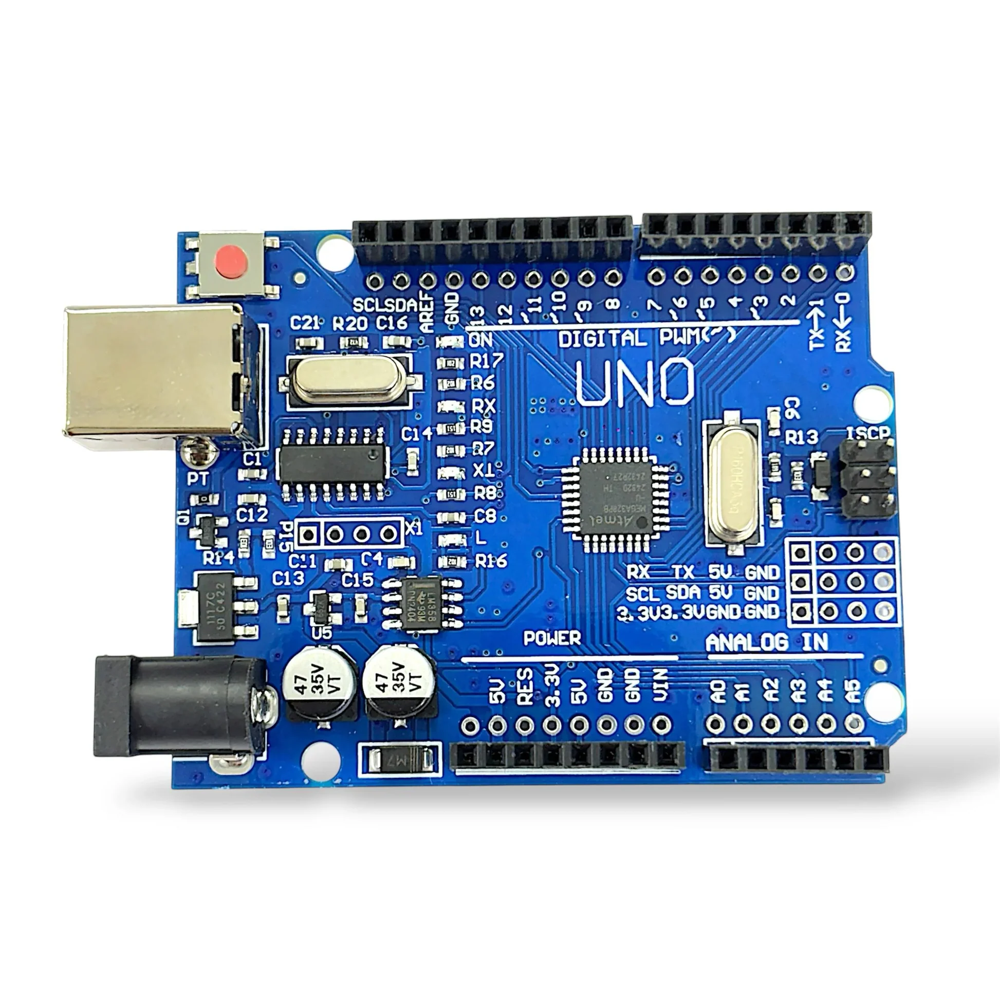
- ## ວິທີການໃຊ້ງານພື້ນຖານ

ການໃຊ້ງານ Arduino Uno ສ່ວນໃຫຍ່ແມ່ນປະກອບດ້ວຍຂັ້ນຕອນຫຼັກໆ ດັ່ງນີ້:

1. **ຕິດຕັ້ງໂປຣແກຣມ Arduino IDE:** ດາວໂຫຼດແລະຕິດຕັ້ງໂປຣແກຣມ **Arduino IDE** ຈາກເວັບໄຊທ໌ທາງການຂອງ Arduino. ໂປຣແກຣມນີ້ເປັນເຄື່ອງມືສຳລັບຂຽນ, ກວດສອບ, ແລະອັບໂຫຼດໂຄ້ດໃສ່ແຜງວົງຈອນ.
    
2. **ເຊື່ອມຕໍ່ແຜງວົງຈອນ:** ໃຊ້ສາຍ **USB** ເຊື່ອມຕໍ່ແຜງ **Arduino Uno** ເຂົ້າກັບຄອມພິວເຕີຂອງທ່ານ.
    
3. **ຂຽນໂຄ້ດ (Sketch):** ເປີດໂປຣແກຣມ Arduino IDE ຂຶ້ນມາ. ໂຄ້ດພື້ນຖານຈະມີສອງສ່ວນຫຼັກຄື:
    
    - `void setup()`: ສ່ວນທີ່ເຮັດວຽກພຽງຄັ້ງດຽວເມື່ອແຜງວົງຈອນເລີ່ມຕົ້ນ, ໃຊ້ສຳລັບການຕັ້ງຄ່າເບື້ອງຕົ້ນ.
        
    - `void loop()`: ສ່ວນທີ່ເຮັດວຽກຊ້ຳໆ ໄປເລື້ອຍໆ, ເປັນສ່ວນຫຼັກສຳລັບຄຳສັ່ງທີ່ຕ້ອງການໃຫ້ເຮັດວຽກຕໍ່ເນື່ອງ.
        
4. **ເລືອກແຜງວົງຈອນແລະພອດ:** ໃນເມນູ **Tools** ຂອງ Arduino IDE, ໃຫ້ເລືອກ **Board** ເປັນ **Arduino Uno** ແລະເລືອກ **Port** ທີ່ຖືກຕ້ອງທີ່ເຊື່ອມຕໍ່ກັບແຜງວົງຈອນຂອງທ່ານ.
    
5. **ອັບໂຫຼດໂຄ້ດ:** ຄລິກທີ່ປຸ່ມ **Upload** (ປຸ່ມລູກສອນຂວາ) ໃນ Arduino IDE. ໂປຣແກຣມຈະກວດສອບຄວາມຖືກຕ້ອງຂອງໂຄ້ດແລະສົ່ງໂຄ້ດນັ້ນໄປຍັງແຜງ Arduino Uno. ຫຼັງຈາກອັບໂຫຼດສຳເລັດ, ໂຄ້ດຈະເລີ່ມເຮັດວຽກທັນທີ.
### ຕົວຢ່າງໂຄງການງ່າຍໆ (LED ກະພິບ)

ໂຄງການທຳອິດທີ່ນິຍົມເຮັດຄືການຄວບຄຸມ **LED** ທີ່ຢູ່ເທິງແຜງວົງຈອນໃຫ້ກະພິບ (Blink). ໂຄ້ດຕົວຢ່າງນີ້ຈະເຮັດໃຫ້ໄຟ LED ທີ່ຕໍ່ກັບຂາ 13 ຂອງ Arduino ຕິດແລະດັບສະຫຼັບກັນທຸກໆ 1 ວິນາທີ.

## 2.Breadboard
 2**Breadboard (ເບຣດບອດ)** ແມ່ນແຜງວົງຈອນທົດລອງທີ່ຖືກອອກແບບມາເພື່ອສ້າງວົງຈອນເອເລັກໂຕຣນິກແບບຊົ່ວຄາວ **ໂດຍບໍ່ຕ້ອງບັດກຣີ (solder)**. ມັນເປັນເຄື່ອງມືທີ່ນິຍົມໃຊ້ຫຼາຍສຳລັບຜູ້ເລີ່ມຕົ້ນ, ນັກສຶກສາ, ແລະນັກພັດທະນາ ເພື່ອທົດລອງແນວຄິດວົງຈອນ ຫຼື ທົດສອບສ່ວນປະກອບຕ່າງໆ ໄດ້ຢ່າງວ່ອງໄວແລະສາມາດນຳກັບມາໃຊ້ໃໝ່ໄດ້.
## ໂຄງສ້າງ ແລະ ວິທີເຊື່ອມຕໍ່ພາຍໃນ

ໂຄງສ້າງພາຍໃນຂອງ Breadboard ແມ່ນປະກອບດ້ວຍແຖວຂອງ **ແຜ່ນໂລຫະຕົວນຳໄຟຟ້າ** ທີ່ເຊື່ອມຕໍ່ຮູຕ່າງໆ ເຂົ້າກັນ.

1. **ສ່ວນຫຼັກ (Terminal Strip):**
    
    - ເປັນພື້ນທີ່ສ່ວນໃຫຍ່ຂອງແຜງວົງຈອນ.
        
    - **ຮູຕ່າງໆ ໃນແນວນອນ 5 ຮູ ຈະເຊື່ອມຕໍ່ກັນທາງໄຟຟ້າ.**
        
    - ມີຮ່ອງແຍກກາງ (Ravine) ເພື່ອປ້ອງກັນບໍ່ໃຫ້ຂາຂອງຊິບ IC (Integrated Circuit) ຖືກເຊື່ອມຕໍ່ກັນເອງໂດຍກົງ, ດັ່ງນັ້ນເມື່ອສຽບຊິບ IC ຕ້ອງວາງຄ່ອມຮ່ອງກາງ.
        
2. **ແຖບສາຍໄຟຟ້າ/ສາຍດິນ (Bus Strip/Power Rail):**
    
    - ຢູ່ດ້ານຂ້າງຂອງແຜງວົງຈອນ, ມັກຈະມີສີ **ແດງ** ($\mathbf{+}$ ໄຟບວກ) ແລະ **ສີຟ້າ/ດຳ** ($\mathbf{-}$ ສາຍດິນ/ກຣາວ).
        
    - **ຮູທັງໝົດໃນແນວຕັ້ງ (ຕາມລວງຍາວ) ຂອງແຖບນີ້ຈະເຊື່ອມຕໍ່ກັນ.**
        
    - ໃຊ້ສຳລັບການຈ່າຍໄຟຟ້າ (+Vcc) ແລະ ສາຍດິນ (GND) ໃຫ້ກັບສ່ວນປະກອບທັງໝົດໃນວົງຈອນຢ່າງສະດວກ.
    
    ## ວິທີການໃຊ້ງານພື້ນຖານ

1. **ການຈັດວາງສ່ວນປະກອບ (Components):**
    
    - **ຕົວຕ້ານທານ, ໄຟ LED, ຫຼືສາຍໄຟ (Jumper Wires):** ສຽບຂາຂອງສ່ວນປະກອບເຫຼົ່ານັ້ນເຂົ້າໄປໃນຮູທີ່ຕ້ອງການເຊື່ອມຕໍ່. ໃຫ້ແນ່ໃຈວ່າຂາຂອງສ່ວນປະກອບຕ່າງໆ ທີ່ຕ້ອງການໃຫ້ເຊື່ອມຕໍ່ກັນ ຕ້ອງຢູ່ໃນ **ແຖວນອນ** ດຽວກັນ (ໃນສ່ວນຫຼັກ).
        
    - **ຊິບ IC (ເຊັ່ນ: ATmega328P ຂອງ Arduino):** ຕ້ອງສຽບຄ່ອມຮ່ອງກາງຂອງ Breadboard ເພື່ອບໍ່ໃຫ້ຂາຂອງຊິບ IC ສອງຝັ່ງເຊື່ອມຕໍ່ກັນເອງ.
        
2. **ການຈ່າຍໄຟ:**
    
    - ເຊື່ອມຕໍ່ສາຍໄຟຈາກແຫຼ່ງຈ່າຍໄຟ (ເຊັ່ນ: ຈາກບອດ Arduino, ຫຼື Power Supply) ເຂົ້າໄປໃນແຖບສາຍໄຟຟ້າ/ສາຍດິນ (Bus Strip) ດ້ານຂ້າງ. ໂດຍທົ່ວໄປ:
        
        - ສາຍໄຟບວກ (+) ຕໍ່ໃສ່ແຖວ **ສີແດງ** ($\mathbf{+}$).
            
        - ສາຍດິນ (-) ຕໍ່ໃສ່ແຖວ **ສີຟ້າ/ດຳ** ($\mathbf{-}$).
            
    - ໃຊ້ສາຍ Jumper Wires ຕໍ່ຈາກແຖບສາຍໄຟຟ້າ/ສາຍດິນ ເຂົ້າໄປຍັງສ່ວນຫຼັກ ເພື່ອຈ່າຍໄຟໃຫ້ກັບວົງຈອນທີ່ທ່ານສ້າງ.
        
3. **ການເຊື່ອມຕໍ່:**
    
    - ໃຊ້ **ສາຍ Jumper Wires ແບບແກນດ່ຽວ (Solid Core)** ເພື່ອເຊື່ອມຕໍ່ຮູຕ່າງໆ ທີ່ຢູ່ຄົນລະແຖວ/ຄົນລະແຖບ ເຂົ້າກັນ ເພື່ອເຮັດໃຫ້ວົງຈອນຄົບສົມບູນ.
        
4. **ຂໍ້ຄວນລະວັງ:**
    
    - ໃຫ້ກວດສອບການເຊື່ອມຕໍ່ວົງຈອນໃຫ້ຖືກຕ້ອງກ່ອນທີ່ຈະເປີດໄຟຟ້າ.
        
    - Breadboard ໃຊ້ສຳລັບວົງຈອນແຮງດັນຕ່ຳ (Low Voltage) ເທົ່ານັ້ນ.
### 3.USB cable
1*ສາຍ USB (Universal Serial Bus Cable)** ແມ່ນສາຍໄຟທີ່ໃຊ້ສຳລັບ **ເຊື່ອມຕໍ່** ອຸປະກອນຕ່າງໆ ເຂົ້າກັບຄອມພິວເຕີ ຫຼື ເຄື່ອງຊາດ ເພື່ອ **ສົ່ງຂໍ້ມູນ** (ເຊັ່ນ: ໂອນຮູບ, ເອກະສານ) ແລະ **ຈ່າຍໄຟ** (ສຳລັບສາກແບັດເຕີຣີ ຫຼື ໃຫ້ພະລັງງານ).
ມັນເປັນມາດຕະຖານການເຊື່ອມຕໍ່ທີ່ນິຍົມໃຊ້ຫຼາຍທີ່ສຸດໃນອຸປະກອນເອເລັກໂຕຣນິກສ່ວນໃຫຍ່ໃນປະຈຸບັນ.
## ປະເພດຂອງຫົວສຽບ USB ທີ່ພົບເຫັນເລື້ອຍໆ

ສາຍ USB ມີຫຼາຍປະເພດ, ເຊິ່ງກຳນົດຕາມຮູບຮ່າງຂອງຫົວສຽບ (Connector Type) ແລະ ມາດຕະຖານຄວາມໄວໃນການສົ່ງຂໍ້ມູນ (ເຊັ່ນ: USB 2.0, 3.0, 3.1, 4.0). ປະເພດຫົວສຽບຫຼັກໆ ມີດັ່ງນີ້:

- **USB Type-A:** ເປັນຫົວສຽບຮູບສີ່ຫຼ່ຽມທີ່ພົບເຫັນຫຼາຍທີ່ສຸດໃນຄອມພິວເຕີ (PC, Laptop) ແລະຫົວສາກໄຟ.
    
- **USB Type-B:** ຫົວສຽບຮູບສີ່ຫຼ່ຽມທີ່ມີຂ້າງຕັດ, ມັກໃຊ້ກັບເຄື່ອງພິມ (Printer) ຫຼືອຸປະກອນຂະໜາດໃຫຍ່.
    
- **Micro USB:** ເປັນຫົວສຽບຂະໜາດນ້ອຍລຸ້ນເກົ່າ, ມັກໃຊ້ກັບໂທລະສັບສະມາດໂຟນ, ແທັບເລັດ, ແລະກ້ອງຖ່າຍຮູບ.
    
- **Mini USB:** ເປັນຫົວສຽບທີ່ເກົ່າກວ່າ Micro USB, ພົບເຫັນໜ້ອຍລົງໃນປັດຈຸບັນ.
    
- **USB Type-C:** ເປັນຫົວສຽບລຸ້ນໃໝ່ຫຼ້າສຸດ, ມີຂະໜາດນ້ອຍ, **ສາມາດສຽບໄດ້ທັງສອງດ້ານ** (reversible), ແລະສາມາດຮອງຮັບການສົ່ງຂໍ້ມູນ ແລະ ການຈ່າຍໄຟຟ້າໄດ້ໃນອັດຕາທີ່ສູງຂຶ້ນ (ເຊັ່ນ: ສາກແລັບທັອບໄດ້).
- 

## ວິທີການໃຊ້ງານ

1. **ກວດສອບປະເພດຫົວສຽບ:** ກວດເບິ່ງປະເພດຫົວສຽບຂອງທັງສອງອຸປະກອນທີ່ທ່ານຕ້ອງການເຊື່ອມຕໍ່. ຕົວຢ່າງ: ຖ້າທ່ານຕ້ອງການສາກໂທລະສັບລຸ້ນເກົ່າກັບຫົວສາກ USB-A, ທ່ານຕ້ອງໃຊ້ສາຍທີ່ມີ **USB Type-A** ຢູ່ປາຍໜຶ່ງ ແລະ **Micro USB** ຢູ່ປາຍອີກເບື້ອງໜຶ່ງ.
    
2. **ສຽບສາຍ:**
    
    - **ສຳລັບການສົ່ງຂໍ້ມູນ:** ສຽບປາຍສາຍຂ້າງໜຶ່ງ (ມັກຈະເປັນ Type-A) ເຂົ້າກັບ **ພອດ USB ຂອງຄອມພິວເຕີ** ແລະ ສຽບປາຍອີກຂ້າງໜຶ່ງເຂົ້າກັບອຸປະກອນຂອງທ່ານ (ເຊັ່ນ: ກ້ອງຖ່າຍຮູບ, ໂທລະສັບ).
        
    - **ສຳລັບການສາກໄຟ:** ສຽບປາຍສາຍຂ້າງໜຶ່ງ (ມັກຈະເປັນ Type-A ຫຼື Type-C) ເຂົ້າກັບ **Adapter ໄຟຟ້າ** ຫຼື **Power Bank** ແລະ ສຽບປາຍອີກຂ້າງໜຶ່ງເຂົ້າກັບອຸປະກອນຂອງທ່ານ.
        
3. **ການຈັດການຂໍ້ມູນ/ໄຟຟ້າ:** ຫຼັງຈາກສຽບສຳເລັດ, ອຸປະກອນຂອງທ່ານຈະເລີ່ມສາກໄຟອັດຕະໂນມັດ, ຫຼືຄອມພິວເຕີຈະກວດພົບອຸປະກອນຂອງທ່ານ ເພື່ອໃຫ້ທ່ານສາມາດໂອນຂໍ້ມູນໄດ້.
#### 🧵 Wiring & Connectors
## 1. Jumper wires (male-to-male)
1**Jumper Wires (Male-to-Male)** ແມ່ນສາຍໄຟທີ່ມີ **ຫົວສຽບແບບຊາຍ (Male Pin)** ຢູ່ທັງສອງສົ້ນ, ເຊິ່ງໃຊ້ເພື່ອ **ເຊື່ອມຕໍ່** ສ່ວນປະກອບເອເລັກໂຕຣນິກ ຫຼື ແຜງວົງຈອນຕ່າງໆ ເຂົ້າກັນແບບຊົ່ວຄາວ ໃນລະຫວ່າງການທົດລອງວົງຈອນ.

ມັນຖືກນຳໃຊ້ເປັນພິເສດກັບ **Breadboards** (ແຜງວົງຈອນທົດລອງ) ແລະ **Arduino** ເພາະມັນບໍ່ຕ້ອງໃຊ້ການບັດກຣີ ແລະສາມາດຖອດອອກໄດ້ງ່າຍ.
## -ວິທີການໃຊ້ງານ Jumper Wires

Jumper wires ຖືກໃຊ້ເພື່ອສ້າງການເຊື່ອມຕໍ່ທາງໄຟຟ້າໃນວົງຈອນທົດລອງ.
### 1. ການເຊື່ອມຕໍ່ສັນຍານ ແລະ ໄຟຟ້າ

- **Breadboard:** ໃຊ້ເພື່ອເຊື່ອມຕໍ່ຮູຕ່າງໆ ໃນ Breadboard ທີ່ບໍ່ໄດ້ເຊື່ອມຕໍ່ກັນພາຍໃນ. ຕົວຢ່າງ:
    
    - ເຊື່ອມຕໍ່ສາຍໄຟບວກ (+) ຈາກ **Power Rail** (ແຖບສາຍໄຟຟ້າ) ໄປຫາສ່ວນປະກອບເຊັ່ນ: **Resistor** ຫຼື **LED** ໃນສ່ວນຫຼັກຂອງ Breadboard.
        
    - ເຊື່ອມຕໍ່ສາຍດິນ (-) ຈາກ Power Rail ໄປຫາ **GND** (ສາຍດິນ) ຂອງສ່ວນປະກອບ.
        
- **Arduino:** ໃຊ້ເພື່ອເຊື່ອມຕໍ່ຂາຕ່າງໆ ຂອງບອດ Arduino (ເຊັ່ນ: ຂາ Digital I/O, Analog Input, 5V, GND) ເຂົ້າກັບຮູຕ່າງໆ ໃນ Breadboard.

### 2. ຫຼັກການເຊື່ອມຕໍ່

- **ການຖ່າຍໂອນສັນຍານ:** ສາຍໄຟເຮັດໜ້າທີ່ເປັນທາງຜ່ານໃຫ້ກັບກະແສໄຟຟ້າ ແລະສັນຍານຕ່າງໆ. ທ່ານຕ້ອງສຽບປາຍສາຍໄຟຊາຍ (Male Pin) ເຂົ້າໄປໃນ **ຮູ (Hole)** ຂອງ Breadboard, ບອດ Arduino, ຫຼື **Headers** (ຊ່ອງສຽບ) ຂອງໂມດູນເຊັນເຊີ.
### 3. ເຄັດລັບໃນການໃຊ້ງານ

- **ຄວາມເປັນລະບຽບ:** ໃຊ້ສາຍໄຟສີຕ່າງໆ ເພື່ອຊ່ວຍຈຳແນກສາຍໄຟປະເພດຕ່າງໆ:
    
    - **ສີແດງ:** ໃຊ້ສະເພາະສຳລັບສາຍໄຟບວກ ($+\text{Vcc}$ ຫຼື $+5\text{V}$).
        
    - **ສີດຳ ຫຼື ສີຟ້າ:** ໃຊ້ສະເພາະສຳລັບສາຍດິນ (GND).
        
    - **ສີອື່ນໆ:** ໃຊ້ສຳລັບສາຍສັນຍານ (Signal).
        
- **ຄວາມຍາວ:** ພະຍາຍາມເລືອກສາຍໄຟທີ່ມີຄວາມຍາວພຽງພໍທີ່ຈະເຊື່ອມຕໍ່ໄດ້ຢ່າງສຳເລັດ ແຕ່ບໍ່ຍາວຈົນເກີນໄປ ເພື່ອໃຫ້ວົງຈອນເບິ່ງເປັນລະບຽບ ແລະຫຼີກລ້ຽງຄວາມຜິດພາດ.
## ປະເພດຂອງ Jumper Wires ອື່ນໆ

ນອກຈາກ **Male-to-Male** (ຫົວຊາຍທັງສອງຂ້າງ), Jumper Wires ຍັງມີປະເພດອື່ນໆ ອີກ:

- **Male-to-Female:** ມີຫົວຊາຍຢູ່ສົ້ນໜຶ່ງ ແລະ ຫົວສຽບແບບຍິງ (Female Socket) ຢູ່ອີກສົ້ນໜຶ່ງ. ໃຊ້ເພື່ອເຊື່ອມຕໍ່ກັບ **ຂາ (Pin)** ທີ່ຍືື່ນອອກມາຈາກອຸປະກອນອື່ນ.
    
- **Female-to-Female:** ມີຫົວສຽບແບບຍິງຢູ່ທັງສອງສົ້ນ. ໃຊ້ເພື່ອເຊື່ອມຕໍ່ **ຂາ** ຂອງສອງອຸປະກອນເຂົ້າກັນໂດຍກົງ,
## 2. Jumper wires (male-to-female)
2**Jumper Wires (Male-to-Female)** ແມ່ນສາຍໄຟທີ່ມີ **ຫົວສຽບແບບຊາຍ (Male Pin)** ຢູ່ສົ້ນໜຶ່ງ ແລະ **ຫົວສຽບແບບຍິງ (Female Socket)** ຢູ່ອີກສົ້ນໜຶ່ງ. ສາຍປະເພດນີ້ຖືກອອກແບບມາເພື່ອ **ເຊື່ອມຕໍ່** ຂາໂປຣເຈັກເຕີ (pin) ທີ່ຍື່ນອອກມາ ຂອງອຸປະກອນ ຫຼື ແຜງວົງຈອນຕ່າງໆ ເຂົ້າກັບ **ຮູ (hole)** ຂອງ Breadboard ຫຼື Header Pin ຂອງບອດອື່ນ.

ມັນໃຊ້ຢ່າງກວ້າງຂວາງໃນໂຄງການ Arduino ແລະເອເລັກໂຕຣນິກ ເພື່ອສ້າງການເຊື່ອມຕໍ່ແບບຍືດຫຍຸ່ນໂດຍບໍ່ຕ້ອງບັດກຣີ.
## ວິທີການໃຊ້ງານ Jumper Wires (Male-to-Female)

ສາຍ Male-to-Female ແມ່ນໃຊ້ເພື່ອຂະຫຍາຍ ຫຼື ເຊື່ອມຕໍ່ຂາ Pin ຂອງອຸປະກອນຕ່າງໆ ເຂົ້າກັນ.
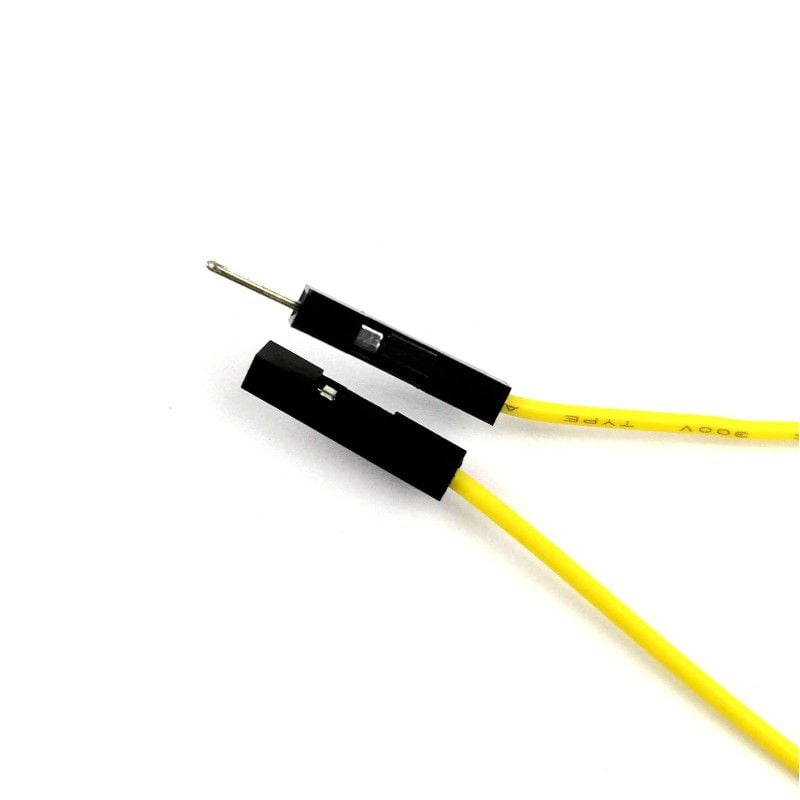

### 1. ການເຊື່ອມຕໍ່ກັບ Header Pins ຂອງອຸປະກອນ

**ການນຳໃຊ້ຫຼັກຄື:** ເຊື່ອມຕໍ່ **ຫົວສຽບແບບຍິງ (Female Socket)** ເຂົ້າກັບ **ຂາໂປຣເຈັກເຕີ (Male Pin)** ທີ່ຍື່ນອອກມາຈາກໂມດູນ, ເຊັນເຊີ, ຫຼືບອດຄອມພິວເຕີຂະໜາດນ້ອຍ (ເຊັ່ນ: Raspberry Pi, ຫຼື NodeMCU).

- **ຂັ້ນຕອນທີ 1:** ສຽບ **ຫົວສຽບແບບຍິງ** ຂອງສາຍ Jumper Wire ເຂົ້າກັບ **ຂາ Pin** ຂອງເຊັນເຊີ (ຕົວຢ່າງ: ໂມດູນເຊັນເຊີອຸນຫະພູມ DHT11).
    
- **ຂັ້ນຕອນທີ 2:** ສຽບ **ຫົວສຽບແບບຊາຍ** ຂອງສາຍ Jumper Wire ເຂົ້າກັບ **ຮູ** ຂອງ Breadboard ຫຼື **ຮູ** ຂອງບອດ Arduino ໂດຍກົງ.
    
### 2. ການເຊື່ອມຕໍ່ກັບ Breadboard

- **ຈາກ Pin ຂອງບອດ → ຫາ Breadboard:** ໃຊ້ຫົວສຽບແບບຍິງສຽບໃສ່ **ຂາ Pin** ຂອງບອດ Arduino (ເຊັ່ນ: ຂາ $5\text{V}$, GND, ຫຼື Digital I/O) ແລະໃຊ້ຫົວສຽບແບບຊາຍສຽບໃສ່ **ຮູ** ຂອງ Breadboard. ວິທີນີ້ເຮັດໃຫ້ທ່ານສາມາດສົ່ງໄຟຟ້າ ຫຼື ສັນຍານຈາກ Arduino ໄປຍັງ Breadboard ເພື່ອສ້າງວົງຈອນໄດ້.
    
### 3. ເຄັດລັບການໃຊ້ງານ

- **ການຈັດລະບຽບສາຍ:** ໃຊ້ສີສັນຂອງສາຍໄຟມາຊ່ວຍຈຳແນກສາຍ:
    
    - **ສີແດງ** ➡️ ສຳລັບໄຟບວກ ($+\text{Vcc}$).
        
    - **ສີດຳ/ສີຟ້າ** ➡️ ສຳລັບສາຍດິນ (GND).
        
    - **ສີອື່ນໆ** ➡️ ສຳລັບສາຍສັນຍານ.
        
- **ຫຼີກລ່ຽງການດຶງ:** ເວລາຖອດສາຍ, ຄວນຈັບບໍລິເວນຫົວສຽບບໍ່ແມ່ນດຶງທີ່ສາຍໄຟ ເພື່ອປ້ອງກັນບໍ່ໃຫ້ສາຍຂາດຈາກຫົວສຽບ.
## 3. Jumper wires (male-to-female)
3**Jumper Wires (Female-to-Female)** ແມ່ນສາຍໄຟທີ່ມີ **ຫົວສຽບແບບຍິງ (Female Socket)** ຢູ່ທັງສອງສົ້ນ. ມັນຖືກໃຊ້ເພື່ອເຊື່ອມຕໍ່ລະຫວ່າງ **ຂາໂປຣເຈັກເຕີ (Male Pins)** ສອງອັນ ຫຼື ລະຫວ່າງ **ຂາ Pins** ຂອງໂມດູນສອງອັນເຂົ້າກັນ.
## ວິທີການໃຊ້ງານ Jumper Wires (Female-to-Female)

ສາຍ Female-to-Female ແມ່ນໃຊ້ເມື່ອທ່ານຕ້ອງການເຊື່ອມຕໍ່ອຸປະກອນທີ່ລ້ວນແຕ່ມີ **ຂາ Pin ທີ່ຍື່ນອອກມາ (Male Pins)**.
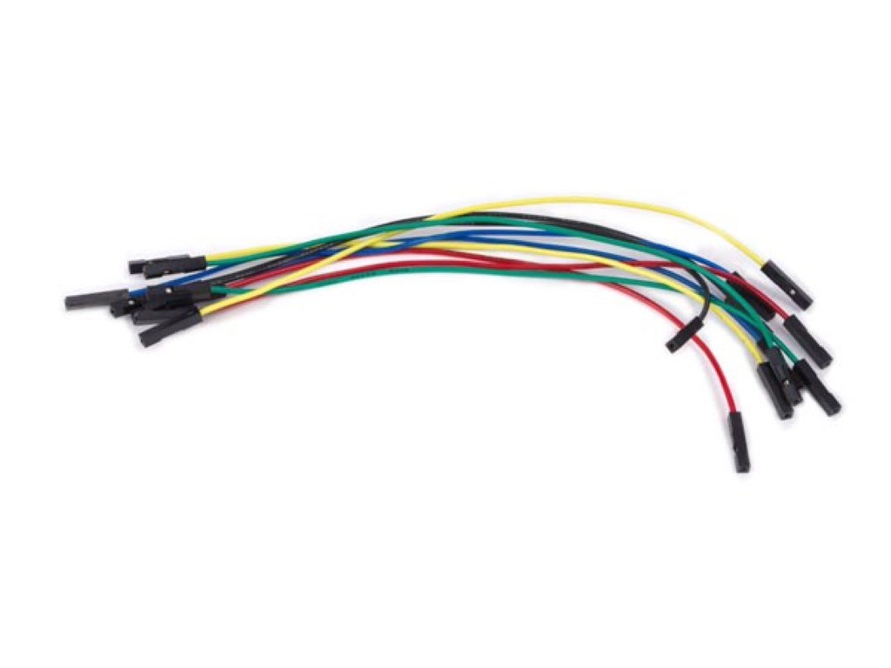

### 1. ການເຊື່ອມຕໍ່ລະຫວ່າງບອດ ຫຼື ໂມດູນ

**ການນຳໃຊ້ຫຼັກຄື:** ການເຊື່ອມຕໍ່ໂດຍກົງລະຫວ່າງ **ສອງບອດຄອມພິວເຕີຂະໜາດນ້ອຍ** ຫຼື **ສອງໂມດູນເຊັນເຊີ** ໂດຍຜ່ານ Header Pins ຂອງພວກມັນ.

- **ຕົວຢ່າງ:** ເຊື່ອມຕໍ່ຂາ **GPIO** (General-Purpose Input/Output) ຂອງ **Raspberry Pi** (ເຊິ່ງມີ Male Pins) ເຂົ້າກັບຂາ **I2C** ຂອງ **ໂມດູນຈໍ LCD** (ເຊິ່ງມັກມີ Male Pins).
    
    - **ຂັ້ນຕອນທີ 1:** ສຽບ **ຫົວສຽບແບບຍິງ** ຂອງສາຍ Jumper Wire ເຂົ້າກັບ **ຂາ Pin** ຂອງໂມດູນທີໜຶ່ງ (ເຊັ່ນ: $5\text{V}$ Pin ຂອງ Pi).
        
    - **ຂັ້ນຕອນທີ 2:** ສຽບ **ຫົວສຽບແບບຍິງ** ອີກສົ້ນໜຶ່ງເຂົ້າກັບ **ຂາ Pin** ຂອງໂມດູນທີສອງ (ເຊັ່ນ: $\text{VCC}$ Pin ຂອງໂມດູນ LCD).
        

### 2. ການເຊື່ອມຕໍ່ອຸປະກອນກັບສາຍ Breadboard Male Pins

ບາງຄັ້ງ, ທ່ານອາດໃຊ້ສາຍ Female-to-Female ເພື່ອຕໍ່ສາຍຈາກເຊັນເຊີທີ່ເປັນແບບ **Male Pins** ໄປຍັງສາຍ **Male-to-Male** ທີ່ສຽບຢູ່ໃນ Breadboard, ເພື່ອເປັນການຂະຫຍາຍສາຍ. ແຕ່ໂດຍທົ່ວໄປ, ມັນແມ່ນການເຊື່ອມຕໍ່ຈາກ **Pin ຫາ Pin**.

### 3. ເຄັດລັບການໃຊ້ງານ

- **ກວດສອບ Pin:** ໃຫ້ແນ່ໃຈວ່າໄດ້ສຽບຫົວສຽບແບບຍິງເຂົ້າກັບ Pin ທີ່ຖືກຕ້ອງຂອງອຸປະກອນທັງສອງຝັ່ງ. ການສຽບຜິດອາດເຮັດໃຫ້ເກີດການລັດວົງຈອນ (short circuit) ຫຼື ເຮັດໃຫ້ອຸປະກອນເສຍຫາຍໄດ້.
    
- **ໃຊ້ສາຍສັ້ນ:** ເລືອກໃຊ້ສາຍທີ່ສັ້ນພຽງພໍ ເພື່ອໃຫ້ວົງຈອນມີຄວາມສັ້ນກະທັດຮັດ ແລະ ຫຼຸດຜ່ອນສິ່ງລົບກວນຂອງສັນຍານ.

### 4. 9V Battery Connector
**9V Battery Connector** (ອຸປະກອນເຊື່ອມຕໍ່ແບັດເຕີຣີ 9V) ແມ່ນສາຍທີ່ມີ **ຫົວສຽບ** ອອກແບບມາເພື່ອຕໍ່ເຂົ້າກັບຂົ້ວຂອງແບັດເຕີຣີ **9V** (ແບັດເຕີຣີຮູບສີ່ຫຼ່ຽມ). ໂດຍທົ່ວໄປ, ສາຍນີ້ຈະມີສອງສີ: **ສີແດງ** ສຳລັບຂົ້ວ **ບວກ ($\mathbf{+}$)** ແລະ **ສີດຳ** ສຳລັບຂົ້ວ **ລົບ ($\mathbf{-}$)**.

ຈຸດປະສົງຫຼັກຂອງມັນແມ່ນເພື່ອໃຊ້ເປັນແຫຼ່ງຈ່າຍໄຟຟ້າເຄື່ອນທີ່ໃຫ້ກັບວົງຈອນ ຫຼື ແຜງຄວບຄຸມຕ່າງໆ ເຊັ່ນ: **Arduino**.
## ວິທີການໃຊ້ງານ 9V Battery Connector

Battery Connector ແມ່ນເຄື່ອງມືທີ່ງ່າຍດາຍ, ແຕ່ໃຊ້ຢ່າງມີປະສິດທິພາບເພື່ອຈ່າຍໄຟໃຫ້ກັບໂຄງການເອເລັກໂຕຣນິກ
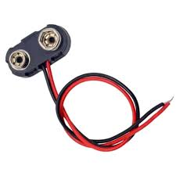
### 1. ການເຊື່ອມຕໍ່ກັບແບັດເຕີຣີ

1. **ເຊື່ອມຕໍ່ຫົວສຽບ:** ເອົາຫົວສຽບຂອງ Connector ໄປສຽບໃສ່ **ຂົ້ວ** ຂອງແບັດເຕີຣີ 9V. ຫົວສຽບນີ້ຖືກອອກແບບມາເພື່ອໃຫ້ເຂົ້າກັນໄດ້ພໍດີ.
    
2. **ກວດສອບການເຊື່ອມຕໍ່:** ໃຫ້ແນ່ໃຈວ່າການເຊື່ອມຕໍ່ແໜ້ນດີ. ສີຂອງສາຍໄຟໃນ Connector (ສີແດງ/ສີດຳ) ຈະກົງກັນກັບຂົ້ວ $\mathbf{+}/\mathbf{-}$ ຂອງແບັດເຕີຣີ.
    

### 2. ການຈ່າຍໄຟໃຫ້ກັບ Arduino ຫຼື Breadboard

ສາຍ Battery Connector ສ່ວນໃຫຍ່ທີ່ໃຊ້ກັບ Arduino ຈະມີ **ຫົວສຽບສຳລັບຕໍ່ກັບ Power Jack** ໂດຍກົງ ຫຼື **ສາຍປາຍເປືອຍ** ທີ່ສາມາດນຳໄປຕໍ່ກັບ Breadboard ໄດ້.

#### ກ. ການໃຊ້ກັບ Arduino Uno (ຜ່ານ Power Jack)

ຖ້າ Connector ຂອງທ່ານມີຫົວສຽບເປັນ **DC Barrel Jack** (ຫົວສຽບມົນໆ):

- ສຽບຫົວ Jack ນີ້ເຂົ້າກັບ **Power Jack** (ຊ່ອງສຽບໄຟ) ທີ່ຢູ່ເທິງແຜງ Arduino Uno.
    
- ແບັດເຕີຣີ 9V ຈະຈ່າຍໄຟໃຫ້ກັບບອດ Arduino ໂດຍກົງ. (ໝາຍເຫດ: ຕ້ອງເຊື່ອມຕໍ່ແບັດເຕີຣີກັບ Jack ເທົ່ານັ້ນ, ບໍ່ຄວນສຽບສາຍ USB ເຂົ້າກັບຄອມພິວເຕີໃນເວລາດຽວກັນ).
    
#### ຂ. ການໃຊ້ກັບ Breadboard (ແບບປາຍສາຍເປືອຍ)

ຖ້າ Connector ຂອງທ່ານມີປາຍສາຍໄຟເປືອຍ:

- ສຽບສາຍ **ສີແດງ** ເຂົ້າໄປໃນຮູທີ່ເຊື່ອມຕໍ່ກັບ **ສາຍໄຟບວກ ($\mathbf{+}$)** ຂອງ Breadboard (Power Rail ສີແດງ).
    
- ສຽບສາຍ **ສີດຳ** ເຂົ້າໄປໃນຮູທີ່ເຊື່ອມຕໍ່ກັບ **ສາຍດິນ ($\mathbf{-}$)** ຂອງ Breadboard (Power Rail ສີຟ້າ/ດຳ).
    
- ຈາກນັ້ນ, ທ່ານສາມາດໃຊ້ Jumper Wires ເພື່ອຈ່າຍໄຟຈາກ Power Rail ນີ້ໄປຍັງອຸປະກອນອື່ນໃນວົງຈອນຂອງທ່ານໄດ້.
### 💡 Basic Components
1
**(Light Emitting Diodes)** ຄືອຸປະກອນເອເລັກໂຕຣນິກຊະນິດໜຶ່ງທີ່ປ່ອຍແສງອອກມາເມື່ອກະແສໄຟຟ້າໄຫຼຜ່ານມັນ. ມັນຖືກໃຊ້ເປັນຕົວຊີ້ບອກ ຫຼືເປັນແຫຼ່ງກຳເນີດແສງສະຫວ່າງໃນໂຄງການເອເລັກໂຕຣນິກຕ່າງໆ.

ລາຍການທີ່ທ່ານກ່າວເຖິງ ($5$ ສີແດງ, $5$ ສີເຫຼືອງ, $5$ ສີຟ້າ, ແລະ $1$ RGB) ແມ່ນ **ຊຸດຂອງຫຼອດ LED ປະເພດຕ່າງໆ** ທີ່ນິຍົມໃຊ້ໃນຊຸດທົດລອງກັບ Arduino.
## 1. LED ສີດ່ຽວ (Single-Color LEDs)

ປະກອບມີ **ສີແດງ ($5$), ສີເຫຼືອງ ($5$), ແລະ ສີຟ້າ ($5$)**.

### ຄຸນລັກສະນະ:

- **ມີສອງຂາ (Pins):**
    
    - **ຂາຍາວ (Anode, $\mathbf{+}$):** ຂົ້ວບວກ. ຕ້ອງເຊື່ອມຕໍ່ກັບໄຟບວກ ($+\text{Vcc}$).
        
    - **ຂາສັ້ນ (Cathode, $\mathbf{-}$):** ຂົ້ວລົບ. ຕ້ອງເຊື່ອມຕໍ່ກັບສາຍດິນ (GND).
        
- **ຕ້ອງໃຊ້ຕົວຕ້ານທານ (Resistor):** ຕ້ອງຕໍ່ອະນຸກົມກັບ LED ເພື່ອ **ຈຳກັດກະແສໄຟຟ້າ** ທີ່ໄຫຼຜ່ານ LED. ຖ້າບໍ່ມີຕົວຕ້ານທານ, LED ຈະເສຍຫາຍທັນທີ (ໄໝ້). ໂດຍທົ່ວໄປ, ຕົວຕ້ານທານຂະໜາດ $220\Omega$ ຫຼື $330\Omega$ ແມ່ນໃຊ້ຢ່າງປອດໄພກັບແຮງດັນ $5\text{V}$ ຂອງ Arduino.
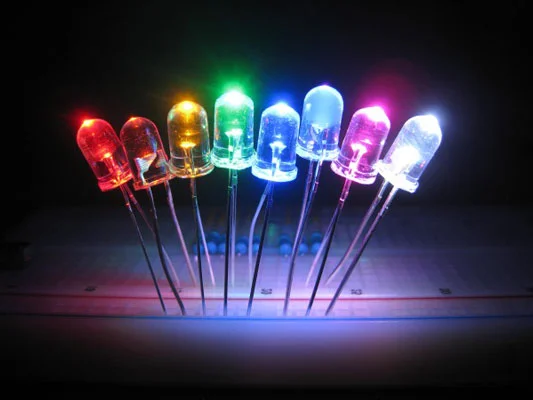
### ວິທີໃຊ້:

1. ຕໍ່ຂາສັ້ນ ($\mathbf{-}$) ຂອງ LED ເຂົ້າກັບສາຍດິນ (GND) ຂອງ Breadboard.
    
2. ຕໍ່ຂາຍາວ ($\mathbf{+}$) ຂອງ LED ເຂົ້າກັບຂາໃດໜຶ່ງຂອງ **ຕົວຕ້ານທານ**.
    
3. ຕໍ່ຂາອີກເບື້ອງໜຶ່ງຂອງຕົວຕ້ານທານ ເຂົ້າກັບຂາ **Digital I/O** ຂອງບອດ Arduino (ເຊັ່ນ: ຂາ $13$ ຫຼື ຂາອື່ນໆ).
    
4. ຂຽນໂຄ້ດ Arduino ເພື່ອຕັ້ງຂາ Digital ໃຫ້ເປັນ {HIGH} (ສົ່ງໄຟ $5\text{V}$) ເພື່ອໃຫ້ LED ຕິດ, ແລະ $\text{LOW}$ (ສົ່ງໄຟ $0\text{V}$) ເພື່ອໃຫ້ LED ດັບ.
## 2.RGB LED

ປະກອບມີ **$1$ ຫຼອດ RGB LED**. RGB ຫຍໍ້ມາຈາກ **Red, Green, Blue** (ແດງ, ຂຽວ, ນ້ຳເງິນ). ມັນເປັນ LED ດຽວທີ່ປະກອບດ້ວຍ **ສາມຫຼອດ LED ສີຕ່າງກັນ** ຢູ່ພາຍໃນ.

###ຄຸນລັກສະນະ:

- **ມີສີ່ຂາ (Pins):**
    
    - ຂາສຳລັບຄວບຄຸມຄວາມສະຫວ່າງຂອງ **ສີແດງ (R)**.
        
    - ຂາສຳລັບຄວບຄຸມຄວາມສະຫວ່າງຂອງ **ສີຂຽວ (G)**.
        
    - ຂາສຳລັບຄວບຄຸມຄວາມສະຫວ່າງຂອງ **ສີຟ້າ (B)**.
        
    - ຂາທົ່ວໄປ (Common Pin) ເຊິ່ງອາດຈະເປັນ **ຂົ້ວບວກທົ່ວໄປ (Common Anode)** ຫຼື **ຂົ້ວລົບທົ່ວໄປ (Common Cathode)**.
        
- **ຄວາມສາມາດ:** ໂດຍການປັບຄວາມສະຫວ່າງຂອງສີພື້ນຖານທັງສາມສີ (R, G, B), ທ່ານສາມາດ **ປະສົມສີ** ໄດ້ຫຼາຍພັນສີ (ເຊັ່ນ: ສີແດງ + ສີຂຽວ = ສີເຫຼືອງ)
    
### ວິທີໃຊ້ (ໃຊ້ກັບ Arduino):

1. **ຕ້ອງໃຊ້ຕົວຕ້ານທານ 3 ອັນ:** ຕໍ່ຕົວຕ້ານທານ ($220\Omega$ ຫຼື $330\Omega$) ອະນຸກົມກັບຂາ R, G, ແລະ B ແຕ່ລະຂາ.
    
2. **ເຊື່ອມຕໍ່ຂາສີ:** ຕໍ່ຂາ R, G, ແລະ B (ຜ່ານຕົວຕ້ານທານ) ເຂົ້າກັບຂາ **PWM (Pulse Width Modulation)** ຂອງ Arduino (ຂາທີ່ມີເຄື່ອງໝາຍ $\sim$ ເຊັ່ນ: $3, 5, 6, 9, 10, 11$).
    
3. **ເຊື່ອມຕໍ່ຂາທົ່ວໄປ:**
    
    - ຖ້າເປັນ **Common Cathode** (ຂົ້ວລົບທົ່ວໄປ): ຕໍ່ຂາທົ່ວໄປເຂົ້າກັບ **GND** ຂອງ Arduino.
        
    - ຖ້າເປັນ **Common Anode** (ຂົ້ວບວກທົ່ວໄປ): ຕໍ່ຂາທົ່ວໄປເຂົ້າກັບ **$5\text{V}$** ຂອງ Arduino.
        
4. **ຄວບຄຸມດ້ວຍໂຄ້ດ:** ໃຊ້ຄຳສັ່ງ **`analogWrite()`** ຂອງ Arduino ເພື່ອປັບລະດັບຄວາມສະຫວ່າງຂອງແຕ່ລະສີ (ຄ່າຕັ້ງແຕ່ $0$ ຫາ $255$) ເພື່ອສ້າງສີປະສົມຕ່າງໆ.
## 2,GB module
##### **2 RGB Module**   ຄືໂມດູນເອເລັກໂຕຣນິກຂະໜາດນ້ອຍທີ່ມີ **ຫຼອດ RGB LED** ຕິດຢູ່. ຫຼອດ RGB LED ປະກອບດ້ວຍຫຼອດ LED ສີພື້ນຖານ $3$ ສີຄື: **ແດງ (Red)**, **ຂຽວ (Green)**, ແລະ **ນ້ຳເງິນ (Blue)**. ໂດຍການຄວບຄຸມຄວາມສະຫວ່າງຂອງແຕ່ລະສີ, ໂມດູນນີ້ສາມາດ **ປະສົມສີ** ໄດ້ຫຼາຍພັນສີ (Color Mixing).

ໂມດູນ RGB ຖືກອອກແບບມາເພື່ອໃຫ້ງ່າຍຕໍ່ການເຊື່ອມຕໍ່ກັບບອດໄມໂຄຣຄອນໂທຣນເລີ ເຊັ່ນ: Arduino.
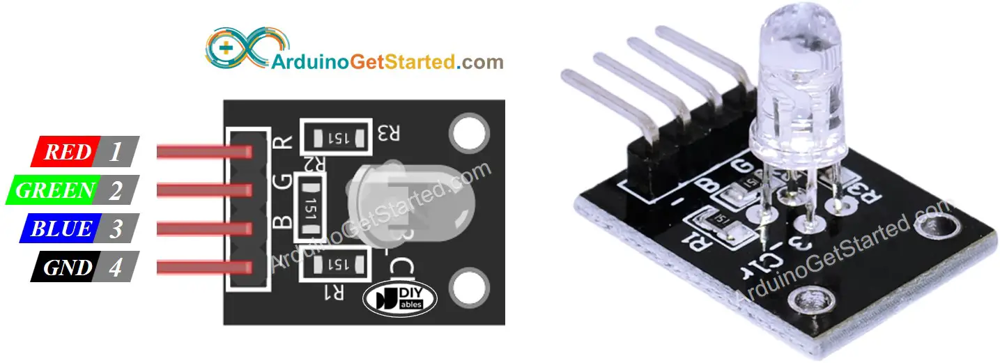
## ວິທີການໃຊ້ງານ RGB Module

ໂມດູນ RGB ສ່ວນຫຼາຍຈະມີ $4$ Pin ທີ່ໃຊ້ໃນການເຊື່ອມຕໍ່:

1. **GND ($\mathbf{-}$):** ສາຍດິນ (Ground).
    
2. **R:** ຂາຄວບຄຸມສີແດງ (Red).
    
3. **G:** ຂາຄວບຄຸມສີຂຽວ (Green).
    
4. **B:** ຂາຄວບຄຸມສີຟ້າ (Blue).
### 1. ການເຊື່ອມຕໍ່ກັບ Arduino

ເພື່ອໃຫ້ສາມາດປະສົມສີໄດ້, ທ່ານຕ້ອງຄວບຄຸມຄວາມສະຫວ່າງຂອງແຕ່ລະສີ (R, G, B) ດ້ວຍວິທີ **PWM (Pulse Width Modulation)**.

1. **Pin GND:** ເຊື່ອມຕໍ່ຂາ **GND** ຂອງໂມດູນ ເຂົ້າກັບຂາ **GND** ຂອງບອດ Arduino.
    
2. **Pin ສີ (R, G, B):** ເຊື່ອມຕໍ່ຂາ $\mathbf{R}$, $\mathbf{G}$, ແລະ $\mathbf{B}$ ຂອງໂມດູນ ເຂົ້າກັບຂາ **PWM Digital I/O** ຂອງບອດ Arduino (ຂາທີ່ມີເຄື່ອງໝາຍ $\sim$, ເຊັ່ນ: $3, 5, 6, 9, 10, 11$).
### 2. ການຂຽນໂຄ້ດເພື່ອປະສົມສີ (Arduino Code)

ທ່ານໃຊ້ຄຳສັ່ງ `analogWrite()` ເພື່ອປັບຄວາມສະຫວ່າງຂອງແຕ່ລະສີ, ໂດຍມີຄ່າລະດັບຄວາມສະຫວ່າງຕັ້ງແຕ່ $0$ (ດັບ) ຫາ $255$ (ສະຫວ່າງສຸດ).
## 3. Resistors (220Ω, 1kΩ, 10kΩ)

**Resistors (ຕົວຕ້ານທານ)** ຄືອຸປະກອນເອເລັກໂຕຣນິກພື້ນຖານທີ່ສຸດ ເຊິ່ງມີໜ້າທີ່ຫຼັກໃນການ **ກີດຂວາງ ຫຼື ຫຼຸດຜ່ອນການໄຫຼຂອງກະແສໄຟຟ້າ** ໃນວົງຈອນ. ຄ່າຄວາມຕ້ານທານຖືກວັດແທກເປັນ **ໂອມ ($\Omega$)**.

ຕົວຢ່າງທີ່ທ່ານກ່າວເຖິງ ($220\Omega$, $1\text{k}\Omega$, $10\text{k}\Omega$) ແມ່ນຄ່າຄວາມຕ້ານທານທີ່ນິຍົມໃຊ້ໃນໂຄງການເອເລັກໂຕຣນິກທົ່ວໄປ, ໂດຍສະເພາະກັບ Arduino.
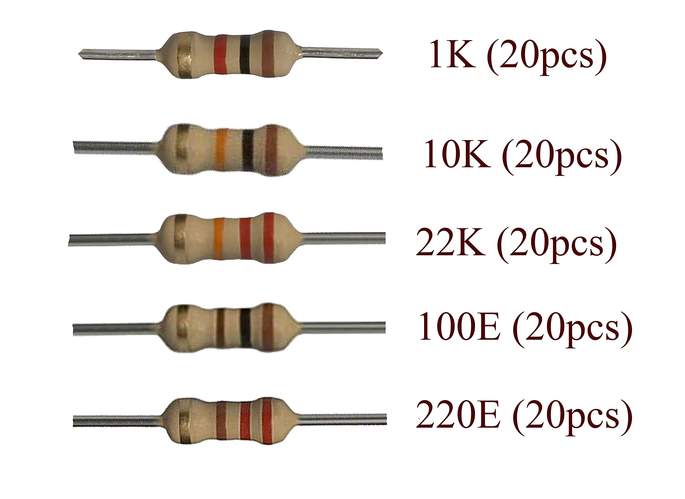
## ໜ້າທີ່ຫຼັກຂອງຕົວຕ້ານທານ

1. **ປ້ອງກັນການເສຍຫາຍ (Limit Current):** ປ້ອງກັນບໍ່ໃຫ້ກະແສໄຟຟ້າຫຼາຍເກີນໄປໄຫຼເຂົ້າໄປໃນສ່ວນປະກອບທີ່ອ່ອນໄຫວ ເຊັ່ນ: LED, ຊິບ IC, ຫຼື Microcontroller.
    
2. **ແບ່ງແຮງດັນ (Voltage Division):** ສາມາດໃຊ້ຮ່ວມກັບຕົວຕ້ານທານອື່ນໆ ເພື່ອຫຼຸດຜ່ອນແຮງດັນໄຟຟ້າລົງໃນລະດັບທີ່ຕ້ອງການ.
    
3. **ກຳນົດສັນຍານ (Pull-up/Pull-down):** ໃຊ້ເພື່ອກຳນົດສະຖານະໄຟຟ້າເລີ່ມຕົ້ນຂອງສາຍສັນຍານ (ເຊັ່ນ: ກັບປຸ່ມກົດ) ໃຫ້ແນ່ນອນ.
## ວິທີການໃຊ້ງານ

### 1. ໃຊ້ $220\Omega$ ຫຼື $330\Omega$ (ຈຳກັດກະແສໄຟຟ້າສຳລັບ LED)

**$220\Omega$** ແມ່ນຄ່ານິຍົມທີ່ສຸດໃນການໃຊ້ເພື່ອ **ຈຳກັດກະແສໄຟຟ້າ** ເມື່ອຕໍ່ກັບຫຼອດ **LED** ໃນວົງຈອນທີ່ໃຊ້ແຮງດັນ $5\text{V}$ (ເຊັ່ນ: ຈາກ Arduino).

- **ວິທີຕໍ່:** ຕ້ອງຕໍ່ຕົວຕ້ານທານ **ອະນຸກົມ** (In Series) ກັບຂາໃດໜຶ່ງຂອງ LED.
    
- **ເຫດຜົນ:** ຖ້າທ່ານຕໍ່ LED ເຂົ້າກັບ $5\text{V}$ ໂດຍກົງ, ກະແສໄຟຟ້າຈະໄຫຼຫຼາຍເກີນໄປ ເຮັດໃຫ້ LED ໄໝ້. ຕົວຕ້ານທານຈະຊ່ວຍຫຼຸດຜ່ອນກະແສໄຟຟ້າລົງໃນລະດັບທີ່ປອດໄພ (ປະມານ $10-20\text{mA}$).
### 2. ໃຊ້ $1\text{k}\Omega$ (1,000 ໂອມ) ແລະ $10\text{k}\Omega$ (10,000 ໂອມ)

ຄ່າເຫຼົ່ານີ້ຖືກນຳໃຊ້ຢ່າງກວ້າງຂວາງໃນການກຳນົດສັນຍານໃຫ້ກັບ Pin ຂອງ Microcontroller.
#### ກ. Pull-up Resistor (ຕໍ່ຂຶ້ນ)

ໃຊ້ເພື່ອເຊື່ອມຕໍ່ສາຍສັນຍານຂອງປຸ່ມກົດ (Button) ເຂົ້າກັບ **ແຮງດັນໄຟບວກ ($+\text{Vcc}$)**.

- **ໜ້າທີ່:** ເຮັດໃຫ້ Pin ສັນຍານມີສະຖານະເລີ່ມຕົ້ນເປັນ **HIGH** ໂດຍຄ່າເລີ່ມຕົ້ນ.
    
- **ວິທີຕໍ່:** ຕົວຕ້ານທານຕໍ່ຈາກ $5\text{V}$ ໄປຫາ Pin ຂອງ Arduino, ແລະປຸ່ມກົດຕໍ່ຈາກ Pin ໄປຫາ $\text{GND}$. ເມື່ອກົດປຸ່ມ, Pin ຈະປ່ຽນເປັນ **LOW**.
#### ຂ. Pull-down Resistor (ຕໍ່ລົງ)

ໃຊ້ເພື່ອເຊື່ອມຕໍ່ສາຍສັນຍານຂອງປຸ່ມກົດເຂົ້າກັບ **ສາຍດິນ ($\text{GND}$)**.

- **ໜ້າທີ່:** ເຮັດໃຫ້ Pin ສັນຍານມີສະຖານະເລີ່ມຕົ້ນເປັນ **LOW** ໂດຍຄ່າເລີ່ມຕົ້ນ.
    
- **ວິທີຕໍ່:** ຕົວຕ້ານທານຕໍ່ຈາກ Pin ຂອງ Arduino ໄປຫາ $\text{GND}$, ແລະປຸ່ມກົດຕໍ່ຈາກ $5\text{V}$ ໄປຫາ Pin. ເມື່ອກົດປຸ່ມ, Pin ຈະປ່ຽນເປັນ **HIGH**.
**ສຳລັບການຕໍ່ LED:** $V$ ໃນສົມຜົນແມ່ນ: $\text{ແຮງດັນໄຟເຂົ້າ} - \text{ແຮງດັນຕົກຄ່ອມ LED}$.
## 4. Push Buttons (x4 with Lids ) 
**Push Buttons (ປຸ່ມກົດ)** ແມ່ນອຸປະກອນປ່ຽນ (switch) ທີ່ໃຊ້ເພື່ອຄວບຄຸມການໄຫຼຂອງກະແສໄຟຟ້າຊົ່ວຄາວ. ມັນເຮັດວຽກໂດຍການ **ເຊື່ອມຕໍ່** ວົງຈອນເມື່ອທ່ານກົດມັນ ແລະ **ຕັດ** ວົງຈອນເມື່ອທ່ານປ່ອຍມື. ປຸ່ມກົດທີ່ມາພ້ອມກັບຝາປິດ (Lids) ແມ່ນໃຊ້ເພື່ອຄວາມສະດວກໃນການກົດ ແລະການຈັດສີເພື່ອຈຳແນກຟັງຊັນຕ່າງໆ.
## ວິທີການເຮັດວຽກພື້ນຖານ

ປຸ່ມກົດທີ່ໃຊ້ໃນການທົດລອງເອເລັກໂຕຣນິກສ່ວນໃຫຍ່ (ເຊັ່ນ: $4$ ຂາ) ແມ່ນປົກກະຕິແລ້ວແມ່ນແບບ **Momentary Switch** ໝາຍຄວາມວ່າ:

- **ສະຖານະປົກກະຕິ:** ວົງຈອນ **ເປີດ** (Open), ບໍ່ມີກະແສໄຟຟ້າໄຫຼຜ່ານ.
    
- **ເມື່ອກົດ:** ວົງຈອນ **ປິດ** (Closed), ກະແສໄຟຟ້າໄຫຼຜ່ານ.
### ໂຄງສ້າງ ແລະ ການເຊື່ອມຕໍ່

ປຸ່ມກົດທີ່ມີ $4$ ຂາ ແມ່ນຖືກອອກແບບມາເພື່ອສຽບເຂົ້າກັບ Breadboard ໄດ້ຢ່າງສະດວກ. ພາຍໃນ, ຂາຂອງປຸ່ມກົດຈະເຊື່ອມຕໍ່ກັນເປັນຄູ່:

- **ຄູ່ທີ 1:** ຂາທີ່ຢູ່ດ້ານໜຶ່ງຂອງປຸ່ມກົດຈະເຊື່ອມຕໍ່ກັນຕະຫຼອດເວລາ.
    
- **ຄູ່ທີ 2:** ຂາທີ່ຢູ່ອີກດ້ານໜຶ່ງຂອງປຸ່ມກົດຈະເຊື່ອມຕໍ່ກັນຕະຫຼອດເວລາ.
    
- **ການເຊື່ອມຕໍ່ຂ້າມ:** ຂາທັງສອງຄູ່ຈະ **ເຊື່ອມຕໍ່ກັນ** ກໍຕໍ່ເມື່ອປຸ່ມຖືກ **ກົດ** ເທົ່ານັ້ນ.

## ວິທີການໃຊ້ງານກັບ Breadboard ແລະ Arduino

ປຸ່ມກົດຖືກໃຊ້ເປັນອິນພຸດ (Input) ເພື່ອສົ່ງສັນຍານໃຫ້ກັບໄມໂຄຣຄອນໂທຣນເລີ (ເຊັ່ນ: Arduino) ເພື່ອເຮັດວຽກໃດໜຶ່ງ.
### 1. ການຕໍ່ວົງຈອນ (Pull-down Configuration)

ການຕໍ່ແບບ **Pull-down** ຖືກໃຊ້ເພື່ອຮັບປະກັນວ່າ Pin ຂອງ Arduino ຈະມີສະຖານະ **LOW** ທີ່ແນ່ນອນເມື່ອປຸ່ມບໍ່ໄດ້ຖືກກົດ.

1. **ເຊື່ອມຕໍ່ໄຟ:** ເຊື່ອມຕໍ່ຂາໜຶ່ງຂອງປຸ່ມກົດເຂົ້າກັບ **$5\text{V}$** ຂອງ Arduino.
    
2. **ເຊື່ອມຕໍ່ກັບ Arduino Pin:** ເຊື່ອມຕໍ່ຂາທີ່ຢູ່ດ້ານດຽວກັນ (ຫຼືດ້ານກົງກັນຂ້າມ) ຂອງປຸ່ມກົດເຂົ້າກັບ **Digital I/O Pin** ຂອງ Arduino (ເຊັ່ນ: Pin 2).
    
3. **ຕໍ່ Pull-down Resistor:**
    
    - ເຊື່ອມຕໍ່ **ຕົວຕ້ານທານ ($10\text{k}\Omega$ ມັກຖືກໃຊ້)** ຈາກ Pin ດຽວກັນທີ່ຕໍ່ເຂົ້າ Arduino Pin ໄປຫາ **GND** ຂອງ Arduino.
        
    - **ໜ້າທີ່ຂອງຕົວຕ້ານທານ:** ດຶງແຮງດັນລົງສູ່ $0\text{V}$ ເມື່ອປຸ່ມບໍ່ໄດ້ກົດ.
        
4. **ຜົນລັບ:**
    
    - **ປຸ່ມບໍ່ກົດ:** Arduino Pin ອ່ານຄ່າເປັນ **LOW** ($0\text{V}$).
        
    - **ປຸ່ມຖືກກົດ:** Arduino Pin ອ່ານຄ່າເປັນ **HIGH** ($5\text{V}$).
## 5. Potentiometer (5kΩ) 
**Potentiometer (ໂພເທນຊິໂອເມເຕີ)** ແມ່ນຕົວຕ້ານທານທີ່ສາມາດ **ປັບຄ່າໄດ້**. ມັນຖືກໃຊ້ເພື່ອ **ຄວບຄຸມແຮງດັນໄຟຟ້າ** ທີ່ອອກໄປໃນວົງຈອນ ຫຼືໃຊ້ເປັນອິນພຸດ (Input) ເພື່ອປັບຄ່າຕົວເລກໃນໂຄງການໄມໂຄຣຄອນໂທຣນເລີ ເຊັ່ນ: Arduino.
ຄ່າ **$5\text{k}\Omega$** ໝາຍຄວາມວ່າຄ່າຄວາມຕ້ານທານສູງສຸດຂອງມັນແມ່ນ $5,000$ ໂອມ.
## ໂຄງສ້າງ ແລະ ວິທີການເຮັດວຽກ

ໂພເທນຊິໂອເມເຕີສ່ວນໃຫຍ່ທີ່ໃຊ້ໃນການທົດລອງເອເລັກໂຕຣນິກຈະມີ **ສາມຂາ (Pins)**:

1. **ຂາ 1 (Fixed End):** ເຊື່ອມຕໍ່ກັບປາຍສຸດຂອງແຖບຄວາມຕ້ານທານ.
    
2. **ຂາ 2 (Wiper):** ເປັນຂາທີ່ **ເຄື່ອນທີ່ໄດ້** ແລະຈະຖືກເຊື່ອມຕໍ່ກັບແຖບຄວາມຕ້ານທານໃນຈຸດໃດໜຶ່ງ ຕາມການໝູນຂອງລູກບິດ. ຂານີ້ແມ່ນຂາ Output ຂອງແຮງດັນທີ່ປັບໄດ້.

3. **ຂາ 3 (Fixed End):** ເຊື່ອມຕໍ່ກັບປາຍສຸດອີກດ້ານໜຶ່ງຂອງແຖບຄວາມຕ້ານທານ.

**ຫຼັກການເຮັດວຽກ:** ເມື່ອທ່ານໝູນລູກບິດ, ຂາ Wiper (ຂາ 2) ຈະເຄື່ອນທີ່, ເຮັດໃຫ້ຄວາມຕ້ານທານລະຫວ່າງຂາ 1 ແລະ ຂາ 2 ປ່ຽນໄປ, ແລະຄວາມຕ້ານທານລະຫວ່າງຂາ 2 ແລະ ຂາ 3 ກໍປ່ຽນໄປເຊັ່ນກັນ.
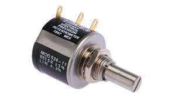

## ວິທີການໃຊ້ງານກັບ Arduino

ໂພເທນຊິໂອເມເຕີຖືກໃຊ້ເປັນຕົວແບ່ງແຮງດັນ ເພື່ອສ້າງແຮງດັນ Output ທີ່ແຕກຕ່າງກັນ ($0\text{V}$ ຫາ $5\text{V}$) ເຊິ່ງສາມາດອ່ານໄດ້ໂດຍຂາ **Analog Input** ຂອງ Arduino.

### 1. ການເຊື່ອມຕໍ່ວົງຈອນ

1. **ຂາ 1 (Fixed End):** ເຊື່ອມຕໍ່ເຂົ້າກັບ **GND** (ສາຍດິນ) ຂອງ Arduino.
    
2. **ຂາ 3 (Fixed End):** ເຊື່ອມຕໍ່ເຂົ້າກັບ **$5\text{V}$** ຂອງ Arduino.
    
3. **ຂາ 2 (Wiper/Output):** ເຊື່ອມຕໍ່ເຂົ້າກັບຂາ **Analog Input** ຂອງ Arduino (ເຊັ່ນ: $\mathbf{\text{A}0}$).
### 2. ການຂຽນໂຄ້ດເພື່ອອ່ານຄ່າ (Arduino Code)

ເມື່ອໝູນລູກບິດ, ແຮງດັນທີ່ອອກຈາກຂາ 2 ຈະປ່ຽນແປງ, ແລະ Arduino ຈະແປງແຮງດັນນີ້ເປັນຄ່າຕົວເລກ.
### ການນຳໃຊ້ຕົວຈິງ:

- **ຄວບຄຸມຄວາມສະຫວ່າງ:** ໃຊ້ຄ່າທີ່ອ່ານໄດ້ຈາກ Potentiometer ($0$ ຫາ $1023$) ໄປປັບຄວາມສະຫວ່າງຂອງ LED ໂດຍໃຊ້ຟັງຊັນ `analogWrite()` (ປັບຄ່າຈາກ $0$ ຫາ $255$).
    
- **ປັບຄວາມໄວ:** ໃຊ້ຄ່າທີ່ອ່ານໄດ້ເພື່ອປັບຄວາມໄວຂອງມໍເຕີ ຫຼື ອັດຕາການໜ່ວງເວລາ (`delay`) ໃນໂຄງການ.
## 6. Active Buzzer
**Active Buzzer (ລຳໂພງຂະໜາດນ້ອຍແບບ Active)** ແມ່ນອຸປະກອນທີ່ໃຊ້ສຳລັບ **ຜະລິດສຽງ** ຫຼື **ສັນຍານເຕືອນ** ໃນວົງຈອນເອເລັກໂຕຣນິກ. ມັນເປັນອຸປະກອນທີ່ມີວົງຈອນກຳເນີດຄວາມຖີ່ (Oscillator) ທີ່ສ້າງສຽງໄວ້ໃນຕົວແລ້ວ.

## ຄວາມແຕກຕ່າງ ແລະ ວິທີການໃຊ້ງານ

Buzzer ມີສອງປະເພດຄື: **Active** ແລະ **Passive**.

| **ລັກສະນະ**          | **Active Buzzer**                                 | **Passive Buzzer**                                                                           |     |
| -------------------- | ------------------------------------------------- | -------------------------------------------------------------------------------------------- | --- |
| **ການຜະລິດສຽງ**      | ຜະລິດສຽງຄົງທີ່ ຫຼື ສຽງເຕືອນທັນທີເມື່ອໄດ້ຮັບໄຟຟ້າ. | ບໍ່ມີວົງຈອນສ້າງສຽງໃນຕົວ. ຕ້ອງໄດ້ຮັບຄື້ນສັນຍານຄວາມຖີ່ປ່ຽນແປງ (PWM) ເພື່ອສ້າງສຽງທີ່ແຕກຕ່າງກັນ. |     |
| **ຄວາມງ່າຍໃນການໃຊ້** | ໃຊ້ງານງ່າຍທີ່ສຸດ. ຕໍ່ໄຟຟ້າກໍມີສຽງເລີຍ.            | ໃຊ້ງານສັບສົນກວ່າເລັກນ້ອຍ, ຕ້ອງຂຽນໂຄ້ດເພື່ອສ້າງສຽງ (ເຊັ່ນ: ໂຄ້ດສຽງເພງ).                       |     |
| **ລາຄາ**             | ມັກຈະແພງກວ່າ Passive Buzzer.                      | ມັກຈະຖືກກວ່າ Active Buzzer.                                                                  |     |
|                      |                                                   |                                                                                              |     |
## ວິທີການໃຊ້ Active Buzzer ກັບ Arduino

Active Buzzer ຖືກໃຊ້ຢ່າງງ່າຍດາຍເພື່ອໃຫ້ສັນຍານເຕືອນແບບ "ປີບ" ຫຼື "ຕີດ" ທັນທີ.

### 1. ການເຊື່ອມຕໍ່ວົງຈອນ

Active Buzzer ສ່ວນຫຼາຍຈະມີສອງຂາຄື: **ຂາບວກ ($\mathbf{+}$)** ແລະ **ຂາລົບ ($\mathbf{-}$)** ຫຼື $\text{GND}$.

1. **ຂາລົບ ($\mathbf{-}$):** ເຊື່ອມຕໍ່ເຂົ້າກັບຂາ **GND** (ສາຍດິນ) ຂອງບອດ Arduino.
    
2. **ຂາບວກ ($\mathbf{+}$):** ເຊື່ອມຕໍ່ເຂົ້າກັບຂາ **Digital I/O Pin** ຂອງບອດ Arduino (ເຊັ່ນ: Pin 8).
    

- **ໝາຍເຫດ:** ທ່ານສາມາດຕໍ່ Active Buzzer ໂດຍກົງກັບຂາ Digital Pin ຂອງ Arduino ໄດ້ໂດຍບໍ່ຕ້ອງໃຊ້ຕົວຕ້ານທານ (Resistor), ເນື່ອງຈາກມັນມີວົງຈອນທີ່ຈຳກັດກະແສໄຟຟ້າໃນຕົວແລ້ວ.
### 2. ການຂຽນໂຄ້ດເພື່ອສ້າງສຽງ (Arduino Code)

ທ່ານພຽງແຕ່ສົ່ງສັນຍານ $\text{HIGH}$ ($5\text{V}$) ເພື່ອໃຫ້ມັນດັງ, ແລະ $\text{LOW}$ ($0\text{V}$) ເພື່ອໃຫ້ມັນຢຸດດັງ.Active Buzzer ເໝາະສົມທີ່ສຸດສຳລັບການແຈ້ງເຕືອນແບບງ່າຍດາຍ ເຊັ່ນ: ເມື່ອເຊັນເຊີກວດພົບວັດຖຸ, ຫຼືເມື່ອປຸ່ມກົດຖືກກົດ.
## 7. Passive Buzzer
**Passive Buzzer (ລຳໂພງຂະໜາດນ້ອຍແບບ Passive)** ແມ່ນອຸປະກອນທີ່ໃຊ້ສ້າງສຽງໃນວົງຈອນເອເລັກໂຕຣນິກ, ແຕ່ **ບໍ່ມີວົງຈອນກຳເນີດຄວາມຖີ່ (Oscillator) ໃນຕົວ** ຄືກັບ Active Buzzer. ມັນເຮັດວຽກຄືກັບລຳໂພງຂະໜາດນ້ອຍ ເຊິ່ງຕ້ອງການ **ສັນຍານຄື້ນທີ່ມີຄວາມຖີ່ປ່ຽນແປງ (PWM)** ຈາກໄມໂຄຣຄອນໂທຣນເລີ (ເຊັ່ນ: Arduino) ເພື່ອໃຫ້ມັນສ້າງສຽງດົນຕີ, ສຽງແຈ້ງເຕືອນ, ຫຼື ສຽງທີ່ມີໂຕນທີ່ແຕກຕ່າງກັນໄດ້. 🎶

## ວິທີການໃຊ້ງານ Passive Buzzer ກັບ Arduino

Passive Buzzer ໃຊ້ຄວາມສາມາດໃນການປ່ອຍສັນຍານຄື້ນ (PWM) ຂອງ Arduino ເພື່ອສ້າງສຽງ. ໂດຍທົ່ວໄປ, ມັນມີສອງຂາຄື: ຂາບວກ ($\mathbf{+}$) ແລະ ຂາລົບ ($\mathbf{-}$) ຫຼື $\text{GND}$.
### 1. ການເຊື່ອມຕໍ່ວົງຈອນ

1. **ຂາລົບ ($\mathbf{-}$):** ເຊື່ອມຕໍ່ເຂົ້າກັບຂາ **GND** (ສາຍດິນ) ຂອງບອດ Arduino.
    
2. **ຂາບວກ ($\mathbf{+}$):** ເຊື່ອມຕໍ່ເຂົ້າກັບຂາ **Digital I/O Pin** ຂອງບອດ Arduino (ເຊັ່ນ: Pin 8).
    

- **ໝາຍເຫດ:** ບໍ່ຈຳເປັນຕ້ອງໃຊ້ຕົວຕ້ານທານ (Resistor) ສໍາລັບການເຊື່ອມຕໍ່ແບບນີ້ ເພາະຄວາມຕ້ານທານພາຍໃນຂອງ Buzzer ຈະຈຳກັດກະແສໄຟຟ້າໃນລະດັບທີ່ເໝາະສົມ.
### 2. ການຂຽນໂຄ້ດເພື່ອສ້າງສຽງ (Arduino Code)

ທ່ານໃຊ້ຟັງຊັນ **`tone()`** ຂອງ Arduino ເພື່ອບອກໃຫ້ Pin ປ່ອຍສັນຍານຄື້ນທີ່ມີຄວາມຖີ່ສະເພາະ (ເປັນ $\text{Hertz}$, $\text{Hz}$) ອອກມາ. ຄວາມຖີ່ທີ່ແຕກຕ່າງກັນຈະສ້າງສຽງໂຕນທີ່ແຕກຕ່າງກັນ.
### ປະໂຫຍດຫຼັກ
ປະໂຫຍດຫຼັກຂອງ Passive Buzzer ແມ່ນຄວາມສາມາດໃນການ **ປ່ຽນໂຕນສຽງ** ໄດ້. ນັກພັດທະນາສາມາດໃຊ້ຄຸນສົມບັດນີ້ເພື່ອ:

- ສ້າງສຽງດົນຕີຫຼືເພງງ່າຍໆ.
    
- ສ້າງສັນຍານເຕືອນທີ່ມີລະດັບສຽງຕ່າງໆ ເພື່ອບົ່ງບອກສະຖານະທີ່ແຕກຕ່າງກັນ.
## 📟 Displays & Output

##  1. 16x2 LCD display

**16x2 LCD Display** ແມ່ນຈໍສະແດງຜົນຂໍ້ຄວາມແບບຜລຶກແຫຼວ (Liquid Crystal Display) ຂະໜາດນ້ອຍ ທີ່ສາມາດສະແດງໄດ້ **16 ຕົວອັກສອນຕໍ່ແຖວ** ແລະ ມີ **2 ແຖວ**. ມັນເປັນອຸປະກອນທີ່ນິຍົມໃຊ້ຫຼາຍໃນໂຄງການເອເລັກໂຕຣນິກ ເພື່ອສະແດງຂໍ້ມູນເຊັ່ນ: ຂໍ້ຄວາມ, ຄ່າຕົວເລກຂອງເຊັນເຊີ, ຫຼື ສະຖານະຂອງລະບົບ.
## ວິທີການໃຊ້ງານ 16x2 LCD Display

ຈໍ LCD 16x2 ສາມາດຄວບຄຸມໄດ້ໂດຍໃຊ້ **ໂມດູນ I2C** ຫຼື **ຕໍ່ສາຍໂດຍກົງ** (Parallel Connection). ການໃຊ້ໂມດູນ I2C ແມ່ນນິຍົມທີ່ສຸດເພາະມັນເຮັດໃຫ້ການຕໍ່ສາຍງ່າຍຂຶ້ນຫຼາຍ.

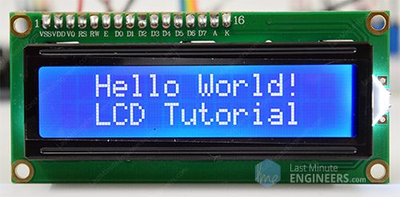

### 1. ການໃຊ້ງານແບບ I2C (ວິທີທີ່ແນະນຳ)

ການໃຊ້ໂມດູນ I2C ທີ່ຕິດຢູ່ດ້ານຫຼັງຂອງ LCD ຊ່ວຍຫຼຸດຈຳນວນສາຍທີ່ຕ້ອງຕໍ່ຈາກ $16$ ສາຍລົງເຫຼືອພຽງ $4$ ສາຍ, ເຮັດໃຫ້ວົງຈອນສະອາດຂຶ້ນ.

#### 1.1. ການເຊື່ອມຕໍ່ສາຍ

|**Pin ຂອງ LCD I2C Module**|**Pin ຂອງ Arduino**|**ໜ້າທີ່**|
|---|---|---|
|**GND**|$\text{GND}$|ສາຍດິນ ($\mathbf{-}$)|
|**VCC**|$5\text{V}$|ໄຟບວກ ($\mathbf{+}$)|
|**SDA** (Serial Data Line)|$\text{A4}$ (ໃນ Uno)|ສາຍສົ່ງຂໍ້ມູນ I2C|
|**SCL** (Serial Clock Line)|$\text{A5}$ (ໃນ Uno)|ສາຍໂມງ I2C|

#### 1.2. ການຂຽນໂຄ້ດ (Arduino Code)

1. **ຕິດຕັ້ງ Library:** ທ່ານຈຳເປັນຕ້ອງຕິດຕັ້ງ Library **`LiquidCrystal_I2C`** ໃນ Arduino IDE ຂອງທ່ານກ່ອນ.
    
2. **ຂຽນໂຄ້ດ:** ໃຊ້ Library ເພື່ອສື່ສານ ແລະ ສົ່ງຂໍ້ຄວາມໄປສະແດງຜົນ.
### ຟັງຊັນການໃຊ້ງານທີ່ສຳຄັນ

- **`lcd.clear()`:** ລຶບຂໍ້ຄວາມທັງໝົດໃນຈໍ.
    
- **`lcd.print("Text")`:** ສະແດງຂໍ້ຄວາມ.
    
- **`lcd.setCursor(col, row)`:** ຕັ້ງຕຳແໜ່ງທີ່ຈະສະແດງຂໍ້ຄວາມ, ໂດຍທີ່ $col$ ແມ່ນຫຼັກ ($0$ ຫາ $15$) ແລະ $row$ ແມ່ນແຖວ ($0$ ຫາ $1$).
    
- **ປຸ່ມປັບ Contrast:** ໂມດູນ I2C ມີ **Potentiometer** ຂະໜາດນ້ອຍຢູ່ດ້ານຫຼັງ ເຊິ່ງທ່ານຕ້ອງໃຊ້ໄຂຄວງໝູນເພື່ອປັບຄວາມຊັດເຈນຂອງຕົວອັກສອນໃນຄັ້ງທຳອິດທີ່ໃຊ້ງານ.
## 2. I2C Serial Adapter board module 
**I2C Serial Adapter Board Module** ແມ່ນແຜງວົງຈອນຂະໜາດນ້ອຍທີ່ຖືກອອກແບບມາເພື່ອປ່ຽນການເຊື່ອມຕໍ່ແບບ **Parallel (ຂະໜານ)** ຂອງຈໍສະແດງຜົນ LCD (ເຊັ່ນ: $16\times2$ ຫຼື $20\times4$) ໃຫ້ເປັນການເຊື່ອມຕໍ່ແບບ **Serial (ລຽນລຳດັບ)** ໂດຍໃຊ້ໂປຣໂຕຄໍ I2C (Inter-Integrated Circuit)
ໜ້າທີ່ຫຼັກຂອງມັນແມ່ນເພື່ອ **ຫຼຸດຜ່ອນຈຳນວນສາຍໄຟ** ທີ່ຈຳເປັນໃນການຄວບຄຸມຈໍ LCD ຈາກປະມານ $10-12$ ສາຍ ລົງເຫຼືອພຽງ **$4$ ສາຍ** ເທົ່ານັ້ນ, ເຊິ່ງຊ່ວຍປະຢັດ Digital I/O Pin ຂອງໄມໂຄຣຄອນໂທຣນເລີ (ເຊັ່ນ: Arduino).
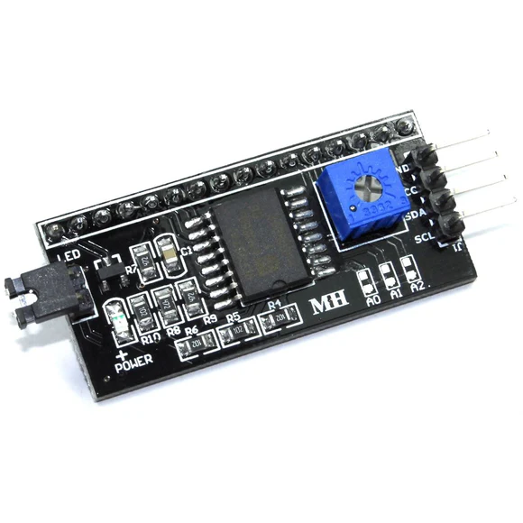
## ວິທີການໃຊ້ງານ

ໂມດູນ I2C ນີ້ຈະຖືກບັດກຣີ (solder) ຕິດເຂົ້າກັບດ້ານຫຼັງຂອງຈໍ LCD.
### 1. ການເຊື່ອມຕໍ່ສາຍໄຟ (4 ສາຍ)
ການໃຊ້ງານໂມດູນນີ້ງ່າຍຫຼາຍ ເພາະມັນຕ້ອງການພຽງ 4 ສາຍເພື່ອເຊື່ອມຕໍ່ກັບ Arduino:

| **Pin ຂອງ I2C Module**      | **Pin ຂອງ Arduino Uno**           | **ໜ້າທີ່**            |
| --------------------------- | --------------------------------- | --------------------- |
| **GND**                     | $\text{GND}$                      | ສາຍດິນ ($\mathbf{-}$) |
| **VCC**                     | $5\text{V}$                       | ໄຟບວກ ($\mathbf{+}$)  |
| **SDA** (Serial Data Line)  | $\mathbf{\text{A4}}$ (Analog Pin) | ສາຍສົ່ງຂໍ້ມູນ I2C     |
| **SCL** (Serial Clock Line) | $\mathbf{\text{A5}}$ (Analog Pin) | ສາຍໂມງ I2C            |
|                             |                                   |                       |

### 2. ຂັ້ນຕອນການໃຊ້ງານ ແລະ ການຕັ້ງຄ່າ

#### ກ. ການຕິດຕັ້ງ Library

ທ່ານຕ້ອງຕິດຕັ້ງ **`LiquidCrystal_I2C`** Library ໃນ Arduino IDE ເພື່ອໃຫ້ສາມາດໃຊ້ຄຳສັ່ງຄວບຄຸມຈໍ LCD ໄດ້ຢ່າງງ່າຍດາຍຜ່ານ I2C.
#### ຂ. ການກຳນົດທີ່ຢູ່ I2C (Address)

ໂມດູນ I2C ແຕ່ລະອັນມີ **ທີ່ຢູ່ (Address)** ທີ່ແຕກຕ່າງກັນເພື່ອໃຫ້ Arduino ສາມາດຮູ້ໄດ້ວ່າຄວນສື່ສານກັບອຸປະກອນໃດ.

- ທີ່ຢູ່ທີ່ນິຍົມໃຊ້ຫຼາຍທີ່ສຸດແມ່ນ **`0x27`** ຫຼື **`0x3F`**.
    
- ທ່ານຄວນກວດສອບທີ່ຢູ່ຂອງໂມດູນຂອງທ່ານ ຫຼື ໃຊ້ໂຄ້ດສະແກນ I2C ເພື່ອຊອກຫາທີ່ຢູ່ທີ່ຖືກຕ້ອງກ່ອນທີ່ຈະໃຊ້ງານ.
#### ຄ. ການປັບຄວາມຊັດເຈນ (Contrast)

ໂມດູນ I2C ມີ **Potentiometer** ຂະໜາດນ້ອຍ (ເປັນປຸ່ມໝູນ) ຕິດຢູ່.

- ເມື່ອເປີດໄຟຟ້າຄັ້ງທຳອິດ, ທ່ານອາດຈະເຫັນພຽງແຕ່ແຖບສີຟ້າ (Backlight) ແຕ່ບໍ່ເຫັນຕົວອັກສອນ.
    
- ທ່ານຕ້ອງໃຊ້ **ໄຂຄວງຂະໜາດນ້ອຍ** ໝູນ Potentiometer ນີ້ຄ່ອຍໆ ເພື່ອປັບລະດັບຄວາມຊັດເຈນຂອງຕົວອັກສອນຈົນກວ່າທ່ານຈະເຫັນຂໍ້ຄວາມຢ່າງຊັດເຈນ.
    
#### ງ. ການຄວບຄຸມດ້ວຍໂຄ້ດ (Arduino)
ເມື່ອຮູ້ທີ່ຢູ່ແລ້ວສາມາດເລີ່ມຕົ້ນການຄວບຄຸມ LCD ໄດ້.
# 3. 7-segment display (Common Cathode +)
**7-Segment Display** ແມ່ນອຸປະກອນສະແດງຜົນທີ່ໃຊ້ໃນການສະແດງຕົວເລກ (0 ຫາ 9) ຫຼືຕົວອັກສອນບາງໂຕ. ມັນປະກອບດ້ວຍ **7 ຫຼອດ LED** (ເຊິ່ງເອີ້ນວ່າ "segments") ຈັດຮຽງກັນເປັນຮູບສີ່ຫຼ່ຽມ ແລະມີ $1$ ຫຼອດສຳລັບຈຸດທົດສະນິຍົມ ($\text{DP}$). ໂດຍການເປີດ/ປິດຫຼອດ LED ແຕ່ລະອັນໃນການປະສົມປະສານທີ່ແຕກຕ່າງກັນ, ມັນສາມາດສ້າງເປັນຕົວເລກໄດ້.
## ຄວາມໝາຍຂອງ (Common Cathode)

$7$-Segment Display ມີ $2$ ປະເພດຄື: $\text{Common Anode}$ ແລະ $\text{Common Cathode}$.

**Common Cathode (CC):**

- **Cathode (ຂົ້ວລົບ):** ຂົ້ວລົບ ($\mathbf{-}$) ຂອງຫຼອດ LED ທັງ $7$ ອັນ (ແລະ $DP$) ແມ່ນຖືກເຊື່ອມຕໍ່ເຂົ້າກັນພາຍໃນ ເປັນຂາ **ທົ່ວໄປ (Common Pin)**.
    
- **ຫຼັກການເຮັດວຽກ:** ເພື່ອໃຫ້ Segment (ຫຼອດ LED) ຕິດ, ທ່ານຕ້ອງເຊື່ອມຕໍ່ຂາທົ່ວໄປ ($\text{Common Pin}$) ເຂົ້າກັບ **GND** (ສາຍດິນ) ແລະສົ່ງສັນຍານ **$\text{HIGH}$ ($5\text{V}$)** ໄປຫາຂາ $\text{Anode}$ ຂອງ Segment ນັ້ນໆ.

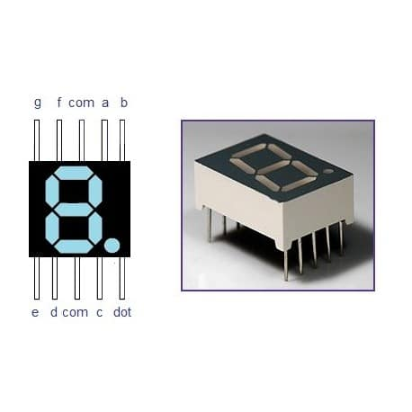
- ## ວິທີການໃຊ້ງານ (Common Cathode) ກັບ Arduino

### 1. ການເຊື່ອມຕໍ່ວົງຈອນ

ການຄວບຄຸມ $7$-Segment Display ຕ້ອງການຂາ Digital I/O ຂອງ Arduino $7$ ຂາ (ສຳລັບ Segment $\text{a}$ ຫາ $\text{g}$).

1. **ຂາທົ່ວໄປ (Common Pin):** ເຊື່ອມຕໍ່ຂາ $\text{Common Cathode}$ ເຂົ້າກັບ **GND** ຂອງ Arduino.
    
2. **Segment Pins:**
    
    - ເຊື່ອມຕໍ່ຂາ $\text{Anode}$ ຂອງ Segment ແຕ່ລະອັນ ($\text{a}, \text{b}, \text{c}, \text{d}, \text{e}, \text{f}, \text{g}$) ເຂົ້າກັບຂາ **Digital I/O** ຂອງ Arduino (ເຊັ່ນ: Pin $2$ ຫາ Pin $8$).
        
    - **ຕົວຕ້ານທານ:** **ສຳຄັນທີ່ສຸດ!** ຕ້ອງຕໍ່ **ຕົວຕ້ານທານ ($220\Omega$ ຫຼື $330\Omega$)** **ອະນຸກົມ** ລະຫວ່າງຂາ $\text{Anode}$ ຂອງແຕ່ລະ Segment ກັບ Pin ຂອງ Arduino ເພື່ອປ້ອງກັນບໍ່ໃຫ້ຫຼອດ LED ໄໝ້.
        

### 2. ການຂຽນໂຄ້ດເພື່ອສະແດງຕົວເລກ (Arduino Code)

ເພື່ອສະແດງຕົວເລກ, ທ່ານຕ້ອງກຳນົດວ່າ Segment ໃດຄວນເປີດ ($\text{HIGH}$) ແລະ Segment ໃດຄວນປິດ ($\text{LOW}$).

|**ຕົວເລກ**|**Segment ທີ່ຕ້ອງ HIGH**|
|---|---|
|0|$\text{a}, \text{b}, \text{c}, \text{d}, \text{e}, \text{f}$|
|1|$\text{b}, \text{c}$|
|2|$\text{a}, \text{b}, \text{d}, \text{e}, \text{g}$|
|...|...|

 # 4-Digit 7-Segment Display 
 **4-Digit 7-Segment Display** ແມ່ນອຸປະກອນສະແດງຜົນທີ່ປະກອບດ້ວຍ **ສີ່ໜ່ວຍ (digits) ຂອງ 7-Segment Display** ທີ່ຈັດວາງຕໍ່ກັນ. ມັນຖືກໃຊ້ເພື່ອສະແດງຕົວເລກໄດ້ເຖິງສີ່ຫຼັກ (ເຊັ່ນ: $0000$ ເຖິງ $9999$), ເຊິ່ງເໝາະສຳລັບໂຄງການທີ່ຕ້ອງການສະແດງເວລາ, ນັບຈຳນວນ, ຫຼື ວັດແທກຄ່າຕ່າງໆ.
 
## ຫຼັກການເຮັດວຽກ

ຈໍສະແດງຜົນ $4$-Digit $7$-Segment ບໍ່ໄດ້ໃຊ້ສາຍໄຟເຖິງ $28$ ສາຍ ($4 \times 7$) ເພື່ອຄວບຄຸມມັນ. ແທນທີ່ຈະ, ມັນໃຊ້ເຕັກນິກທີ່ເອີ້ນວ່າ **Multiplexing**.

1. **Segments (a-g):** ຫຼອດ $\text{LED}$ ທີ່ເປັນ Segment ຕ່າງໆ (a, b, c, d, e, f, g) ຂອງທັງ $4$ ຫຼັກແມ່ນຖືກ **ເຊື່ອມຕໍ່ກັນ** (ເຊັ່ນ: $\text{Segment a}$ ຂອງຫຼັກທີ $1$ ເຊື່ອມຕໍ່ກັບ $\text{Segment a}$ ຂອງຫຼັກທີ $2$, ແລະອື່ນໆ).
    
2. **Common Pins (ຫຼັກ):** ແຕ່ລະຫຼັກມີຂາ $\text{Common Pin}$ ຂອງຕົນເອງ (ຄື $\text{Cathode}$ ຫຼື $\text{Anode}$) ເຊິ່ງໃຊ້ຄວບຄຸມວ່າຫຼັກໃດຈະ **ເປີດໃຊ້ງານ** ໃນເວລາໃດໜຶ່ງ.
    

**Multiplexing:** ໄມໂຄຣຄອນໂທຣນເລີ (ເຊັ່ນ: Arduino) ຈະສະແດງຕົວເລກທີ່ຕ້ອງການເທື່ອລະຫຼັກຢ່າງໄວວາ (ເຊັ່ນ: ສະແດງເລກ $1$ ໃສ່ຫຼັກທີ $1$, ແລ້ວປິດ, ແລ້ວສະແດງເລກ $2$ ໃສ່ຫຼັກທີ $2$, ແລ້ວປິດ, ...). ການສະຫຼັບໄປມາຢ່າງໄວວານີ້ເຮັດໃຫ້ຕາຂອງຄົນເຮົາເຫັນພາບທີ່ຕໍ່ເນື່ອງຄືກັບວ່າທັງ $4$ ຫຼັກສະແດງພ້ອມກັນຕະຫຼອດເວລາ.

ຈໍສະແດງຜົນ $4$-Digit $7$-Segment ບໍ່ໄດ້ໃຊ້ສາຍໄຟເຖິງ $28$ ສາຍ ($4 \times 7$) ເພື່ອຄວບຄຸມມັນ. ແທນທີ່ຈະ, ມັນໃຊ້ເຕັກນິກທີ່ເອີ້ນວ່າ **Multiplexing**.

1. **Segments (a-g):** ຫຼອດ $\text{LED}$ ທີ່ເປັນ Segment ຕ່າງໆ (a, b, c, d, e, f, g) ຂອງທັງ $4$ ຫຼັກແມ່ນຖືກ **ເຊື່ອມຕໍ່ກັນ** (ເຊັ່ນ: $\text{Segment a}$ ຂອງຫຼັກທີ $1$ ເຊື່ອມຕໍ່ກັບ $\text{Segment a}$ ຂອງຫຼັກທີ $2$, ແລະອື່ນໆ).
    
2. **Common Pins (ຫຼັກ):** ແຕ່ລະຫຼັກມີຂາ $\text{Common Pin}$ ຂອງຕົນເອງ (ຄື $\text{Cathode}$ ຫຼື $\text{Anode}$) ເຊິ່ງໃຊ້ຄວບຄຸມວ່າຫຼັກໃດຈະ **ເປີດໃຊ້ງານ** ໃນເວລາໃດໜຶ່ງ.
    

**Multiplexing:** ໄມໂຄຣຄອນໂທຣນເລີ (ເຊັ່ນ: Arduino) ຈະສະແດງຕົວເລກທີ່ຕ້ອງການເທື່ອລະຫຼັກຢ່າງໄວວາ (ເຊັ່ນ: ສະແດງເລກ $1$ ໃສ່ຫຼັກທີ $1$, ແລ້ວປິດ, ແລ້ວສະແດງເລກ $2$ ໃສ່ຫຼັກທີ $2$, ແລ້ວປິດ, ...). ການສະຫຼັບໄປມາຢ່າງໄວວານີ້ເຮັດໃຫ້ຕາຂອງຄົນເຮົາເຫັນພາບທີ່ຕໍ່ເນື່ອງຄືກັບວ່າທັງ $4$ ຫຼັກສະແດງພ້ອມກັນຕະຫຼອດເວລາ.
## ວິທີການໃຊ້ງານ

ເນື່ອງຈາກ $4$-Digit $7$-Segment Display ມີສາຍເຊື່ອມຕໍ່ຫຼາຍ (ປະມານ $12$ ສາຍ), ມັນມັກຈະຖືກໃຊ້ຄູ່ກັບ **Shift Register** (ເຊັ່ນ: $74\text{HC}595$) ຫຼື **IC Driver ສະເພາະ** (ເຊັ່ນ: $\text{TM}1637$) ເພື່ອຫຼຸດຜ່ອນການໃຊ້ $\text{Digital Pin}$ ຂອງ Arduino ລົງ.

### 1. ໃຊ້ IC Driver (ເຊັ່ນ: TM1637 Module)

ການໃຊ້ໂມດູນທີ່ມາພ້ອມກັບ IC Driver ແມ່ນວິທີທີ່ງ່າຍ ແລະນິຍົມທີ່ສຸດ. ໂມດູນ $\text{TM}1637$ ຕ້ອງການພຽງ $4$ ສາຍເທົ່ານັ້ນ:

| **Pin ຂອງ TM1637 Module** | **Pin ຂອງ Arduino**                   | **ໜ້າທີ່**            |     |
| ------------------------- | ------------------------------------- | --------------------- | --- |
| **GND**                   | $\text{GND}$                          | ສາຍດິນ ($\mathbf{-}$) |     |
| **VCC**                   | $5\text{V}$                           | ໄຟບວກ ($\mathbf{+}$)  |     |
| **DIO** (Data)            | $\text{Digital Pin}$ (ເຊັ່ນ: Pin $2$) | ສາຍສົ່ງຂໍ້ມູນ         |     |
| **CLK** (Clock)           | $\text{Digital Pin}$ (ເຊັ່ນ: Pin $3$) | ສາຍໂມງ                |     |
## 4-Digit 7-Segment Display 

- **7-Segment Display:** ແມ່ນອຸປະກອນທີ່ມີ **7 ສ່ວນ (segments)** ທີ່ເປັນຮູບຊົງຄືຕົວເລກ "8", ໂດຍມີສ່ວນເສີມອີກອັນໜຶ່ງສຳລັບຈຸດທົດສະນິຍົມ (Decimal Point - DP). ແຕ່ລະສ່ວນແມ່ນໄຟ LED (Light-Emitting Diode) ທີ່ສາມາດເປີດຫຼືປິດໄດ້ຢ່າງເປັນອິດສະລະເພື່ອສ້າງເປັນຕົວເລກ (0-9).
    
- **4-Digit:** ໝາຍເຖິງການເອົາ **ສີ່ (4)** ຈໍ 7-segment ມາຕໍ່ເຂົ້າກັນເພື່ອສະແດງຜົນເປັນຕົວເລກສີ່ຫຼັກ, ເຊັ່ນ: 1234.
    
- **ການເຊື່ອມຕໍ່ແບບ Multiplexing:** ເພື່ອຫຼຸດຜ່ອນຈຳນວນສາຍທີ່ໃຊ້ໃນການຄວບຄຸມ, ຈໍ 4 ຫຼັກນີ້ມັກຈະໃຊ້ເຕັກນິກທີ່ເອີ້ນວ່າ **Multiplexing**. ນັ້ນຄື:
    
    - ທຸກໆຈໍ 7-segment ທັງສີ່ຫຼັກຈະໃຊ້ **ສາຍຄວບຄຸມສ່ວນ (segment pins)** ຊຸດດຽວກັນ (A ຫາ G ແລະ DP).
        
    - ມັນມີ **ສາຍຄວບຄຸມຫຼັກ (digit pins)** ຕື່ມອີກ 4 ສາຍ (D1, D2, D3, D4) ເພື່ອຄວບຄຸມວ່າຈະເປີດໃຊ້ງານຫຼັກໃດ.

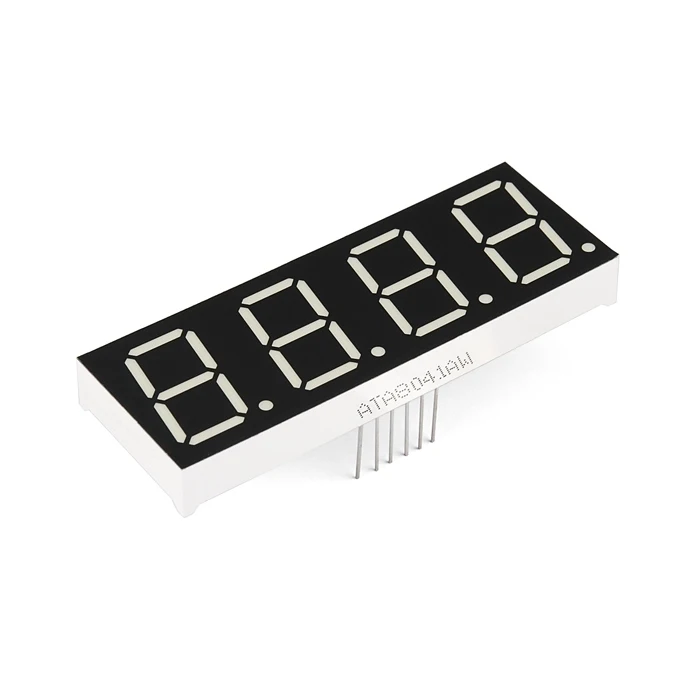

## ວິທີການໃຊ້ງານ

ວິທີການນໍາໃຊ້ຈໍ 4-Digit 7-Segment Display ສ່ວນໃຫຍ່ແມ່ນອີງໃສ່ເຕັກນິກ **Time-Multiplexing** ເພື່ອໃຫ້ມັນເບິ່ງຄືວ່າທັງສີ່ຫຼັກສະແດງຜົນພ້ອມກັນ:

1. **ການເຊື່ອມຕໍ່:** ເຊື່ອມຕໍ່ສາຍຄວບຄຸມສ່ວນ (Segment Pins A-G, DP) ແລະສາຍຄວບຄຸມຫຼັກ (Digit Pins D1-D4) ເຂົ້າກັບ microcontroller (ເຊັ່ນ: Arduino). ທ່ານຄວນໃຊ້ຕົວຕ້ານທານ (Resistors) ເພື່ອຈຳກັດກະແສໄຟຟ້າ.
    
2. **ຫຼັກການ Multiplexing:**
    
    - ເປີດໃຊ້ງານຫຼັກທີ 1 (ເຊັ່ນ: ຕັ້ງ Pin D1 ໃຫ້ຢູ່ໃນສະຖານະທີ່ຖືກຕ້ອງຕາມປະເພດຂອງຈໍເຊັ່ນ: Common Cathode ຫຼື Common Anode).
        
    - ສົ່ງຂໍ້ມູນຕົວເລກທີ່ຕ້ອງການສະແດງໃສ່ຫຼັກທີ 1 (ເຊັ່ນ: ຕົວເລກ '1') ໄປຍັງສາຍຄວບຄຸມສ່ວນ (Segment Pins).
        
    - ປິດຫຼັກທີ 1.
        
    - ເປີດໃຊ້ງານຫຼັກທີ 2 (Pin D2).
        
    - ສົ່ງຂໍ້ມູນຕົວເລກສຳລັບຫຼັກທີ 2 (ເຊັ່ນ: ຕົວເລກ '2') ໄປຍັງສາຍຄວບຄຸມສ່ວນ.
        
    - ເຮັດຂັ້ນຕອນດຽວກັນນີ້ສຳລັບຫຼັກທີ 3 ແລະ 4.
        
3. **ຄວາມໄວ:** ຂະບວນການເປີດ/ປິດຫຼັກ ແລະການສະແດງຂໍ້ມູນນີ້ຈະຕ້ອງເກີດຂຶ້ນຊໍ້າໆກັນຢ່າງວ່ອງໄວ (ປົກກະຕິແລ້ວຫຼາຍກວ່າ 100 ເທື່ອຕໍ່ວິນາທີ). ຍ້ອນວ່າຕາຂອງຄົນເຮົາມີຄຸນສົມບັດ **Persistence of Vision** (ການຄົງຕົວຂອງພາບ) ຈຶ່ງເຮັດໃຫ້ເບິ່ງຄືວ່າທັງສີ່ຫຼັກສະແດງຜົນຄົງທີ່ພ້ອມກັນ, ໂດຍບໍ່ມີການກະພິບ.
    

**💡 ຕົວຢ່າງການນຳໃຊ້:** ຖືກນໍາໃຊ້ຢ່າງກວ້າງຂວາງໃນໂມງດີຈີຕອລ, ເຄື່ອງຄິດໄລ່, ແມັດວັດແທກເອເລັກໂຕຣນິກ ແລະອຸປະກອນອື່ນໆທີ່ສະແດງຂໍ້ມູນຕົວເລກ.

ການນຳໃຊ້ 4 ຫຼັກ 7-segment display ດ້ວຍ Arduino ຈະສອນໃຫ້ທ່ານເຂົ້າໃຈກ່ຽວກັບການເຊື່ອມຕໍ່ ແລະ ຫຼັກການເຮັດວຽກຂອງມັນ.
## 8x8 Dot Matrix display

**8x8 Dot Matrix Display** ແມ່ນອຸປະກອນສະແດງຜົນທີ່ປະກອບດ້ວຍ **ໄຟ LED (Light-Emitting Diodes) ຈຳນວນ 64 ໜ່ວຍ** ຖືກຈັດລຽງເປັນຕາໜ່າງ **8 ແຖວ (Rows) ແລະ 8 ຖັນ (Columns)** ເພື່ອສະແດງຕົວອັກສອນ, ຕົວເລກ, ຫຼືຮູບພາບງ່າຍໆ.

- **ໂຄງສ້າງ:** ມັນເປັນແຜງສີ່ຫຼ່ຽມທີ່ພາຍໃນບັນຈຸໄຟ LED 8x8, ເຮັດໃຫ້ມີຄວາມລະອຽດທັງໝົດ 64 ພິກເຊວ.
    
- **ຫຼັກການເຊື່ອມຕໍ່:** ແຕ່ລະ LED ຈະມີການເຊື່ອມຕໍ່ເປັນແຖວແລະຖັນ.
    
    - **ແຖວ (Rows):** ປົກກະຕິຈະເຊື່ອມຕໍ່ກັບ **Anode (ຂົ້ວບວກ)** ຮ່ວມກັນ (Common Anode) ຫຼື **Cathode (ຂົ້ວລົບ)** ຮ່ວມກັນ (Common Cathode).
        
    - **ຖັນ (Columns):** ເຊື່ອມຕໍ່ກັບຂົ້ວທີ່ກົງກັນຂ້າມຂອງໄຟ LED.
        
- **ການຄວບຄຸມ:** ເພື່ອເປີດໄຟ LED ດວງໃດໜຶ່ງ, ຕ້ອງໃຫ້ກະແສໄຟຟ້າໄຫຼຜ່ານມັນ ໂດຍການປ້ອນໄຟໃຫ້ກັບແຖວ ແລະ ຖັນທີ່ຖືກຕ້ອງ. ຍ້ອນມີ LED ເຖິງ 64 ດວງ, ຈຶ່ງມີສາຍທັງໝົດ 16 ສາຍ (8 ແຖວ + 8 ຖັນ) ເພື່ອຄວບຄຸມມັນໂດຍກົງ.

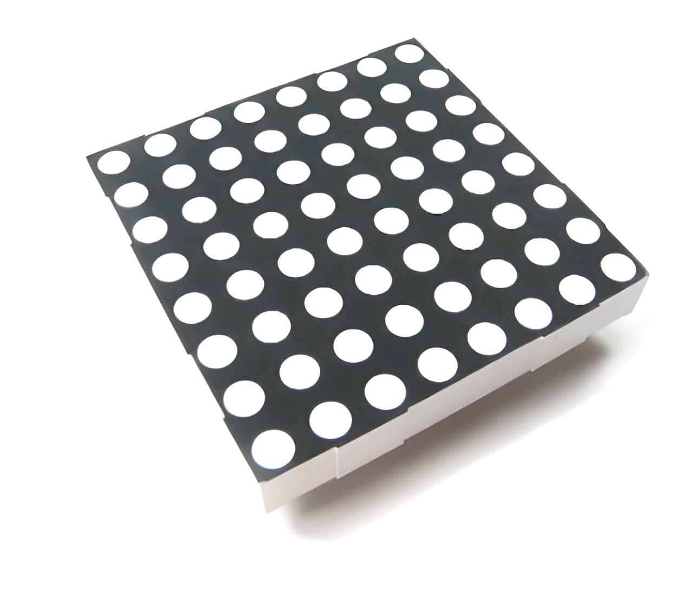
## ວິທີການໃຊ້ງານ

ເນື່ອງຈາກຈໍ 8x8 Dot Matrix ມີສາຍຄວບຄຸມຫຼາຍ (16 ສາຍ), ການໃຊ້ງານຈຶ່ງມີສອງວິທີຫຼັກ:

### 1. ການໃຊ້ງານໂດຍກົງ (Multiplexing/Scanning)

- **ຫຼັກການ:** ຄືກັບ 7-Segment Display, ມັນໃຊ້ເຕັກນິກ **Multiplexing** ທີ່ຕ້ອງເປີດໄຟ LED ຕາມແຖວ ຫຼື ຖັນເທື່ອລະອັນຢ່າງວ່ອງໄວ.
    
    - **ຂັ້ນຕອນ:** ປ້ອນຂໍ້ມູນຮູບພາບສຳລັບແຖວທີ 1 ໄປຍັງຖັນ, ຈາກນັ້ນເປີດໄຟແຖວທີ 1. ປິດແຖວທີ 1, ປ້ອນຂໍ້ມູນສຳລັບແຖວທີ 2, ແລ້ວເປີດໄຟແຖວທີ 2. ເຮັດແບບນີ້ຊ້ຳໆກັນດ້ວຍຄວາມໄວສູງ (ຫຼາຍກວ່າ 100 Hz).
        
- **ຂໍ້ເສຍ:** ໃຊ້ Pins ຂອງ Microcontroller (ເຊັ່ນ Arduino) ຫຼາຍເກີນໄປ (16 Pins), ແລະເຮັດໃຫ້ໂຄງສ້າງລະຫັດສັບສົນ.
    
- **ຂໍ້ດີ:** ບໍ່ຕ້ອງໃຊ້ IC ຄວບຄຸມເພີ່ມ.
    

### 2. ການໃຊ້ງານຜ່ານ IC ຄວບຄຸມ (Driver IC) ✨ **(ວິທີທີ່ນິຍົມທີ່ສຸດ)**

- **IC ທີ່ໃຊ້:** **MAX7219** ແມ່ນ Driver IC ທີ່ໃຊ້ກັນທົ່ວໄປທີ່ສຸດ.
    
- **ຫຼັກການ:** IC MAX7219 ຈະຈັດການກັບຂະບວນການ Multiplexing ທັງໝົດ.
    
    - Microcontroller (ເຊັ່ນ: Arduino) ຈະຕິດຕໍ່ກັບ MAX7219 ດ້ວຍການສື່ສານແບບ **Serial** (ພຽງແຕ່ 3-4 Pins ເທົ່ານັ້ນ: Data In, Clock, Chip Select).
        
    - MAX7219 ຈະຮັບຂໍ້ມູນເປັນ Byte (8 ບິດ) ສໍາລັບແຕ່ລະແຖວຫຼືຖັນ ແລະເກັບຮັກສາມັນໄວ້ໃນໜ່ວຍຄວາມຈຳພາຍໃນ (Register).
        
    - IC ຈະດໍາເນີນການສະແກນ (Scanning) ແຖວ/ຖັນໂດຍອັດຕະໂນມັດດ້ວຍຄວາມໄວສູງ, ເຮັດໃຫ້ຈໍສະແດງຜົນໄດ້ຄົງທີ່ໂດຍບໍ່ມີການກະພິບ.
        
- **ຂໍ້ດີ:** ໃຊ້ Pins ຂອງ Microcontroller ໜ້ອຍລົງຫຼາຍ, ຫຼຸດຜ່ອນຄວາມສັບສົນຂອງລະຫັດ.
    
- **ການນຳໃຊ້:** ໂດຍທົ່ວໄປແລ້ວ, ມັກຈະໃຊ້ Library (ເຊັ່ນ: `LedControl` ໃນ Arduino) ເພື່ອຄວບຄຸມ MAX7219 ໄດ້ງ່າຍຂຶ້ນ.
## 📡 Sensors & Input Modules
## 1, Temperature and humidity sensor (DHT11)  
**DHT11 (Temperature and Humidity Sensor)** ແມ່ນເຊັນເຊີເອເລັກໂຕຣນິກທີ່ໃຊ້ໃນການວັດແທກອຸນຫະພູມ (Temperature) ແລະ ຄວາມຊື້ນສຳພັດ (Relative Humidity) ຂອງອາກາດອ້ອມຂ້າງ

**ໜ້າທີ່:** ມັນຖືກອອກແບບມາເພື່ອໃຫ້ຄ່າອຸນຫະພູມເປັນອົງສາເຊນຊຽດ ($\text{°C}$) ແລະຄ່າຄວາມຊື້ນເປັນເປີເຊັນ ($\text{%}$) ອອກມາໃນຮູບແບບ **Digital** ຜ່ານສາຍສັນຍານພຽງສາຍດຽວ (Single-wire protocol).
ໂຄງສ້າງພາຍໃນ:

- ເຊັນເຊີຄວາມຊື້ນ:ໃຊ້ຫຼັກການຂອງການປ່ຽນແປງຄ່າໄຟຟ້າ (Resistance) ຂອງໂພລິເມີຣ໌ (Polymer) ທີ່ລະອຽດອ່ອນຕໍ່ຄວາມຊື້ນ.
    
- ຊັນເຊີອຸນຫະພູມ:ໃຊ້ລNTC Thermistor ເພື່ອວັດແທກອຸນຫະພູມ.
    
Microcontroller:ມີຊິບຂະໜາດນ້ອຍຢູ່ພາຍໃນເພື່ອແປງຄ່າ Analog ທີ່ວັດແທກໄດ້ໃຫ້ເປັນຄ່າ Digital ແລະສົ່ງອອກມາຕາມຮູບແບບທີ່ກຳນົດໄວ້.
ໂຄງສ້າງພາຍໃນ:

- ເຊັນເຊີຄວາມຊື້ນ: ໃຊ້ຫຼັກການຂອງການປ່ຽນແປງຄ່າໄຟຟ້າ (Resistance) ຂອງໂພລິເມີຣ໌ (Polymer) ທີ່ລະອຽດອ່ອນຕໍ່ຄວາມຊື້ນ.
    
- ເຊັນເຊີອຸນຫະພູມ: ໃຊ້ NTC Thermistor ເພື່ອວັດແທກອຸນຫະພູມ.
    
-Microcontroller: ມີຊິບຂະໜາດນ້ອຍຢູ່ພາຍໃນເພື່ອແປງຄ່າ Analog ທີ່ວັດແທກໄດ້ໃຫ້ເປັນຄ່າ Digital ແລະສົ່ງອອກມາຕາມຮູບແບບທີ່ກຳນົດໄວ້

## 2,## LM35 Temperature Sensor 

**LM35 Temperature Sensor** ແມ່ນເຊັນເຊີວັດແທກອຸນຫະພູມແບບວົງຈອນລວມ (Integrated Circuit - IC) ທີ່ມີຄວາມຊັດເຈນສູງ ແລະຖືກປັບທຽບຄ່າ (Calibrated) ມາແລ້ວໃນໂຮງງານ ເຊິ່ງມັນໃຫ້ຄ່າ **ແຮງດັນໄຟຟ້າ Analog** ທີ່ເປັນອັດຕາສ່ວນໂດຍກົງກັບອຸນຫະພູມໃນອົງສາ
- **ໜ້າທີ່ຫຼັກ:** ວັດແທກອຸນຫະພູມອາກາດອ້ອມຂ້າງ ແລະສົ່ງຄ່າອອກມາເປັນ **ແຮງດັນໄຟຟ້າ Analog**.
    
- **ຄຸນລັກສະນະສຳຄັນ:**
    
    - **ການປັບທຽບຄ່າ:** ຖືກປັບທຽບໂດຍກົງໃນອົງສາເຊນຊຽດ, ບໍ່ຈຳເປັນຕ້ອງມີການຄຳນວນທີ່ສັບຊ້ອນຄືເຊັນເຊີທີ່ປັບທຽບໃນ Kelvin.
        
    - **ຄວາມໄວ:** ມີອັດຕາສ່ວນການປ່ຽນແປງຄົງທີ່ຄື: **$10\text{mV}$ ຕໍ່ $1\text{°C}$**.
        
        - ຕົວຢ່າງ: ຖ້າອຸນຫະພູມແມ່ນ 1$25\text{°C}$, ແຮງດັນອອກຈະເປັນ 2$25\text{°C} \times 10\text{mV}/\text{°C} = 250\text{mV}$ (ຫຼື 3$0.25\text{V}$).4
            
    - **ຊ່ວງອຸນຫະພູມ:** ສາມາດວັດແທກໄດ້ຕັ້ງແຕ່ 5$-55\text{°C}$ ເຖິງ 6$+150\text{°C}$.7
        
    - **ຄວາມຊັດເຈນ:** ມີຄວາມຊັດເຈນປະມານ 8$\pm 0.5\text{°C}$ ຢູ່ທີ່ອຸນຫະພູມຫ້ອງ.9
        
- **Pinout:** ໂດຍທົ່ວໄປມາໃນຊອງແບບ **TO-92** ທີ່ມີ 3 ຂາ (ເບິ່ງຈາກດ້ານໜ້າທີ່ຮາບພຽງ):
    
    - **Pin 1 (ຊ້າຍ):** **+Vs** (ແຮງດັນໄຟຟ້າເຂົ້າ: 10$4\text{V}$ ຫາ 11$30\text{V}$)12
        
    - **Pin 2 (ກາງ):** 13**$\text{V}_{\text{OUT}}$** (ແຮງດັນໄຟຟ້າອອກ, ເປັນຄ່າອຸນຫະພູມ)14
        
    - **Pin 3 (ຂວາ):** **GND** (ສາຍດິນ/ຂົ້ວລົບ)15
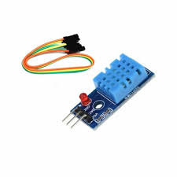
## ວິທີການໃຊ້ງານກັບ Arduino

LM35 ເປັນທີ່ນິຍົມໃນການໃຊ້ງານກັບ Microcontroller ເຊັ່ນ **Arduino** ເນື່ອງຈາກຄວາມງ່າຍໃນການອ່ານຄ່າຜ່ານ Pin Analog.

### 1. ການເຊື່ອມຕໍ່ສາຍ (Wiring)

1. **Pin 1 (+Vs):** ເຊື່ອມຕໍ່ກັບ $\mathbf{+5\text{V}}$ ຂອງ Arduino.
    
2. **Pin 3 (GND):** ເຊື່ອມຕໍ່ກັບ **GND** ຂອງ Arduino.16
    
3. **Pin 2 (17$\text{V}_{\text{OUT}}$):** ເຊື່ອມຕໍ່ກັບ **Analog Input Pin** ຂອງ Arduino (ເຊັ່ນ: 18$\mathbf{\text{A0}}$).19
### 2. ການຂຽນໂປຣແກຣມ (Arduino Code)
ໂຄງສ້າງຫຼັກຄື: **ອ່ານຄ່າ Analog** ຈາກເຊັນເຊີ ແລ້ວນຳຄ່ານັ້ນມາ **ຄຳນວນ** ເພື່ອປ່ຽນເປັນອຸນຫະພູມອົງສາເຊນຊຽດ.

## -2LM35 Temperature Sensor
**LM35** ແມ່ນ **ເຊັນເຊີວັດອຸນຫະພູມແບບວົງຈອນລວມ (Integrated-Circuit Temperature Sensor)** ທີ່ມີຄວາມຊັດເຈນສູງ. ມັນໄດ້ຖືກອອກແບບມາເພື່ອວັດແທກອຸນຫະພູມ ແລະໃຫ້ຄ່າສັນຍານອອກເປັນ **ແຮງດັນໄຟຟ້າ (Analog Voltage)** ທີ່ **ເປັນເສັ້ນຊື່ (Linearly proportional)** ກັບອຸນຫະພູມໃນຫົວໜ່ວຍ **ອົງສາເຊນຊີອຸສ ($^\circ$C)**.

---

### 🔥 **ຈຸດເດັ່ນຂອງ LM35**

|**ຄຸນລັກສະນະ**|**ລາຍລະອຽດ**|
|---|---|
|**Calibration**|ຖືກປັບທຽບໂດຍກົງເປັນອົງສາເຊນຊີອຸສ ($^\circ$C) ຈາກໂຮງງານຜະລິດ, ບໍ່ຈຳເປັນຕ້ອງປັບແຕ່ງພາຍນອກ.|
|**Scale Factor**|ມີອັດຕາສ່ວນຄົງທີ່ຄື: **$10\text{ mV}$ ຕໍ່ $1^\circ\text{C}$** ($\text{0.01 V/}^\circ\text{C}$).|
|**Output**|ແຮງດັນໄຟຟ້າອອກທີ່ $\text{0 V}$ ແມ່ນເທົ່າກັບ $\text{0}^\circ\text{C}$. ($25^\circ\text{C} = 250\text{ mV}$).|
|**Operating Range**|ສາມາດວັດແທກໄດ້ຕັ້ງແຕ່ $-\text{55}^\circ\text{C}$ ຫາ $+\text{150}^\circ\text{C}$ (ຂຶ້ນກັບລຸ້ນ).|
|**Supply Voltage**|ສາມາດໃຊ້ແຮງດັນສະໜອງໄດ້ $\text{4 V}$ ຫາ $\text{30 V}$.|

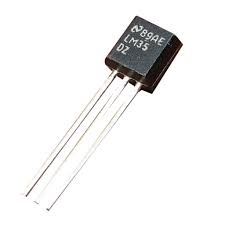

### 💡 **ວິທີການໃຊ້ງານ (ເຊື່ອມຕໍ່ກັບ Arduino UNO)**

LM35 ມັກຖືກໃຊ້ຮ່ວມກັບໄມໂຄຣຄອນໂທຣເລີ ເຊັ່ນ **Arduino** ເພື່ອອ່ານຄ່າອຸນຫະພູມ. ມັນມີ 3 ຂາ (Pins) ເປັນສ່ວນໃຫຍ່ໃນຮູບແບບ TO-92 (ຄືກັບທຣານຊິສເຕີ):

#### **1. ການເຊື່ອມຕໍ່ສາຍໄຟ (Wiring)**

|**LM35 Pin (ເມື່ອດ້ານແປໜ້າເຂົ້າຫາເຮົາ)**|**ໜ້າທີ່**|**ເຊື່ອມຕໍ່ກັບ Arduino UNO**|
|---|---|---|
|**Pin 1 (Vcc)**|ແຮງດັນສະໜອງໄຟ|**$5\text{V}$**|
|**Pin 2 (Vout)**|ແຮງດັນສັນຍານອອກ (Analog)|**Analog Pin (ເຊັ່ນ: A0)**|
|**Pin 3 (GND)**|ສາຍດິນ (Ground)|**GND**|

#### **2. ການຂຽນໂປຣແກຣມ (Arduino Code)**

ເນື່ອງຈາກ Arduino ຕ້ອງປ່ຽນແປງຄ່າແຮງດັນອອກແບບ Analog ຂອງ LM35 ໃຫ້ເປັນຄ່າ Digital (ADC Value) ກ່ອນ, ຫຼັງຈາກນັ້ນຈຶ່ງປ່ຽນຄ່າ Digital ກັບຄືນເປັນອຸນຫະພູມ ($^\circ$C).

$$\text{Temperature} \left(^\circ\text{C}\right) = \frac{\text{ADC Reading}}{\text{1024}} \times \frac{\text{V}_\text{ref} \text{ (Voltage)} \times 100}{\text{1}}$$

- **ADC Reading:** ຄ່າທີ່ອ່ານໄດ້ຈາກ **analogRead()** (ມີຄ່າ 1$0$ ຫາ 2$1023$).3
    
- **$V_\text{ref}$:** ແຮງດັນອ້າງອີງຂອງ Arduino, ໂດຍທົ່ວໄປແມ່ນ $5.0 \text{ V}$.
    
- **100:** ຄ່າຕົວຄູນເພາະວ່າ LM35 ແມ່ນ $10 \text{ mV/}^\circ\text{C}$ ຫຼື $0.01 \text{ V/}^\circ\text{C}$ (ເຊິ່ງເທົ່າກັບ $\times 100$ ເພື່ອປ່ຽນຈາກ $\text{V}$ ເປັນ $^\circ\text{C}$).

# 3, Tilt sensor (x2) 
**Tilt Sensor (ເຊັນເຊີກວດຈັບການອຽງ)** ແມ່ນອຸປະກອນທີ່ໃຊ້ໃນການກວດຈັບທິດທາງ ຫຼື ມຸມອຽງຂອງວັດຖຸ, ຫຼືເວົ້າງ່າຍໆຄື: ມັນກວດຈັບວ່າວັດຖຸໜຶ່ງໆນັ້ນ **ຕັ້ງຊື່** ຫຼື **ອຽງ** ຢູ່ໃນຕຳແໜ່ງໃດໜຶ່ງ.
ມັນເຮັດວຽກຄ້າຍຄືກັບສະວິດ (Switch) ງ່າຍໆ ເຊິ່ງຈະປິດ (ON) ຫຼື ເປີດ (OFF) ວົງຈອນເມື່ອມຸມຂອງມັນປ່ຽນໄປ. ໂດຍທົ່ວໄປ, ເຊັນເຊີນີ້ຈະສົ່ງ **ສັນຍານ Digital** ອອກມາ.

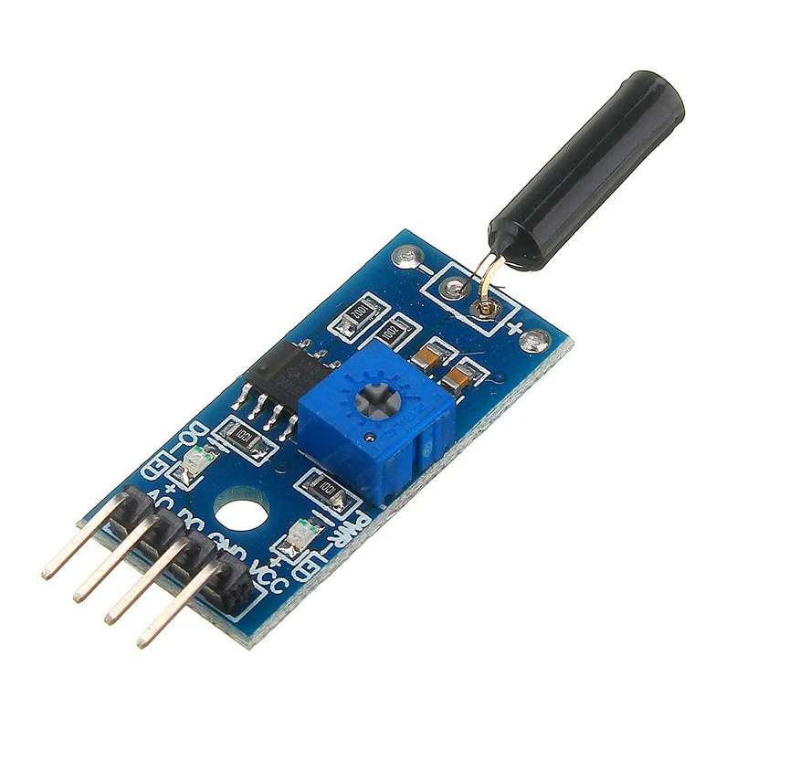
## ຫຼັກການເຮັດວຽກຂອງ Tilt Sensor

ເຊັນເຊີອຽງທີ່ນິຍົມໃຊ້ໃນໂຄງການເອເລັກໂຕຣນິກ (ເຊັ່ນ: $x2$ ຫຼືລຸ້ນ SW-520D) ມັກຈະໃຊ້ຫຼັກການຂອງ **ລູກກົມນ້ອຍ ຫຼື ນ້ຳບາຫຼອດ** ຢູ່ໃນທໍ່:

1. **ໂຄງສ້າງ:** ມັນປະກອບດ້ວຍທໍ່ ຫຼື ເປືອກທີ່ບັນຈຸວັດສະດຸທີ່ນຳໄຟຟ້າໄດ້ (ເຊັ່ນ: ລູກກົມໂລຫະນ້ອຍໆ ຫຼື ນ້ຳບາຫຼອດ) ແລະ ມີຂົ້ວໄຟຟ້າສອງອັນ.
    
2. **ຕັ້ງຊື່ (Upright Position):** ເມື່ອເຊັນເຊີຕັ້ງຊື່, ລູກກົມໂລຫະນ້ອຍໆຈະຢູ່ຫ່າງຈາກຂົ້ວໄຟຟ້າ, ເຮັດໃຫ້ວົງຈອນ **ເປີດ (OFF)**.
    
3. **ອຽງ (Tilted Position):** ເມື່ອເຊັນເຊີຖືກອຽງໄປໃນທິດທາງໃດໜຶ່ງ, ແຮງໂນ້ມຖ່ວງຈະດຶງລູກກົມໂລຫະໃຫ້ສຳຜັດກັບຂົ້ວໄຟຟ້າ, ເຮັດໃຫ້ວົງຈອນ **ປິດ (ON)**.
    

ດັ່ງນັ້ນ, ຜົນລັບທີ່ໄດ້ຈາກ Tilt Sensor ຈຶ່ງເປັນພຽງແຕ່: **1 (ON/ອຽງ)** ຫຼື **0 (OFF/ຕັ້ງຊື່)**.
## ວິທີການໃຊ້ງານກັບ Arduino

ເຊັນເຊີອຽງນີ້ແມ່ນໃຊ້ງານງ່າຍຫຼາຍ ເພາະມັນເປັນອຸປະກອນ Digital.

### 1. ການເຊື່ອມຕໍ່ສາຍ (Wiring)

ເຊັນເຊີອຽງສ່ວນຫຼາຍຈະມີ 3 Pins (VCC, GND, ແລະ Digital Out) ເມື່ອມາໃນຮູບແບບຂອງ Module:

|**Pin ຂອງ Module**|**ໜ້າທີ່**|**ເຊື່ອມຕໍ່ກັບ Arduino**|
|---|---|---|
|**VCC** (ຫຼື +)|ແຮງດັນໄຟຟ້າເຂົ້າ|$\mathbf{+5\text{V}}$|
|**GND** (ຫຼື -)|ສາຍດິນ/ຂົ້ວລົບ|**GND**|
|**D0** (Digital Out)|ສັນຍານອອກ Digital|**Digital Pin ໃດກໍໄດ້** (ເຊັ່ນ: Pin 7)|

### 2. ການຂຽນໂປຣແກຣມ (Arduino Code)

ເຮົາຈະອ່ານຄ່າຈາກ Digital Pin ທີ່ເຊື່ອມຕໍ່ ແລ້ວສະແດງສະຖານະອອກມາ.
### 3. ການທົດສອບ

1. ອັບໂຫຼດ Code ໃສ່ Arduino.
    
2. ເປີດ **Serial Monitor**.
    
3. ວາງເຊັນເຊີໃຫ້ຢູ່ໃນທ່າທີ່ມັນເປີດວົງຈອນ (ເຊັ່ນ: ຕັ້ງຊື່) ແລະສັງເກດຄ່າທີ່ໄດ້.
    
4. ຄ່ອຍໆອຽງເຊັນເຊີໄປໃນທິດທາງທີ່ຕ່າງກັນ ແລະສັງເກດວ່າສະຖານະໃນ Serial Monitor ປ່ຽນຈາກ "Upright" ເປັນ "Tilted" ເມື່ອໃດ.
### 💡 ຕົວຢ່າງການນຳໃຊ້:

ເຊັນເຊີອຽງມັກຖືກໃຊ້ເພື່ອສ້າງ:
- **ລະບົບປຸກ (Alarm):** ເມື່ອກ່ອງໃດໜຶ່ງຖືກອຽງ ຫຼື ຍົກຂຶ້ນ.
    
- **ເຄື່ອງປິດເປີດອັດຕະໂນມັດ:** ເມື່ອໂທລະສັບ ຫຼື ອຸປະກອນຖືກພິກ.
    
- **ຂອງຫຼິ້ນ:** ໃຊ້ຄວບຄຸມທິດທາງໃນເກມແບບງ່າຍໆ.

## -4,Photoresistor (LDRs x3)
**Photoresistor** ຫຍໍ້ມາຈາກ **Light-Dependent Resistor (LDR)** ແມ່ນຕົວຕ້ານທານທີ່ຂຶ້ນກັບແສງ. ມັນເປັນອຸປະກອນທີ່ໃຊ້ໃນການກວດຈັບລະດັບຄວາມສະຫວ່າງຂອງແສງ.

- **ຫຼັກການເຮັດວຽກ:** ຄ່າຄວາມຕ້ານທານ (Resistance) ຂອງມັນຈະປ່ຽນແປງຕາມຄວາມເຂັ້ມຂອງແສງທີ່ມາຕົກໃສ່.
    
    - **ເມື່ອມີແສງຫຼາຍ (Bright Light):** ຄວາມຕ້ານທານຈະ **ຫຼຸດລົງ** (ເຊັນເຊີຈະປ່ອຍໃຫ້ກະແສໄຟຟ້າໄຫຼຜ່ານໄດ້ງ່າຍຂຶ້ນ).
        
    - **ເມື່ອມີແສງໜ້ອຍ/ມືດ (Darkness):** ຄວາມຕ້ານທານຈະ **ເພີ່ມຂຶ້ນ** (ເຊັນເຊີຈະຕ້ານການໄຫຼຂອງກະແສໄຟຟ້າຫຼາຍຂຶ້ນ).
        
- **ວັດສະດຸ:** ໂດຍທົ່ວໄປ, LDR ຜະລິດຈາກ **Cadmium Sulfide (CdS)**.
    
- **ຜົນລັບ:** LDR ເປັນອຸປະກອນ **Analog** ເຊິ່ງໃຫ້ຄ່າຄວາມຕ້ານທານທີ່ປ່ຽນແປງໄປ. ເພື່ອໃຊ້ກັບ Microcontroller (ເຊັ່ນ: Arduino), ຕ້ອງເຊື່ອມຕໍ່ມັນເຂົ້າກັບວົງຈອນທີ່ສາມາດປ່ຽນຄວາມຕ້ານທານນີ້ໃຫ້ເປັນຄ່າແຮງດັນໄຟຟ້າ Analog ທີ່ສາມາດອ່ານໄດ້

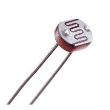
- ## ວິທີການໃຊ້ງານກັບ Arduino

ເນື່ອງຈາກ LDR ແມ່ນຕົວຕ້ານທານ, ມັນບໍ່ສາມາດເຊື່ອມຕໍ່ໂດຍກົງກັບ Pin Analog ຂອງ Arduino ໄດ້. ມັນຕ້ອງຖືກໃຊ້ໃນ **Voltage Divider Circuit (ວົງຈອນແບ່ງແຮງດັນ)** ໂດຍການຕໍ່ລຽນກັບຕົວຕ້ານທານຄົງທີ່ (Fixed Resistor) ອີກອັນໜຶ່ງ.

### 1. ການເຊື່ອມຕໍ່ສາຍ (Wiring)

ທ່ານຕ້ອງການ **ຕົວຕ້ານທານຄົງທີ່** ອັນໜຶ່ງ (ແນະນຳ $10\text{k}\Omega$) ເພື່ອສ້າງວົງຈອນແບ່ງແຮງດັນ.

1. **ເຊື່ອມຕໍ່ LDR ແລະ ຕົວຕ້ານທານຄົງທີ່ແບບລຽນກັນ:**
    
    - ເຊື່ອມຕໍ່ປາຍໜຶ່ງຂອງ LDR ເຂົ້າກັບ $\mathbf{+5\text{V}}$.
        
    - ເຊື່ອມຕໍ່ປາຍທີ່ເຫຼືອຂອງ LDR ເຂົ້າກັບປາຍໜຶ່ງຂອງຕົວຕ້ານທານຄົງທີ່ $10\text{k}\Omega$.
        
    - ເຊື່ອມຕໍ່ປາຍທີ່ເຫຼືອຂອງຕົວຕ້ານທານ $10\text{k}\Omega$ ເຂົ້າກັບ **GND**.
        
2. **ສາຍສັນຍານ:**
    
    - ເຊື່ອມຕໍ່ຈຸດກາງ (ບ່ອນທີ່ LDR ແລະ ຕົວຕ້ານທານຄົງທີ່ເຊື່ອມຕໍ່ກັນ) ເຂົ້າກັບ **Analog Input Pin** ຂອງ Arduino (ເຊັ່ນ: $\mathbf{\text{A0}}$).
    - ### 3. ຕົວຢ່າງການນຳໃຊ້:

LDRs ມັກຖືກໃຊ້ເພື່ອສ້າງ:
- **ໄຟຖະໜົນອັດຕະໂນມັດ:** ໄຟຈະເປີດເອງເມື່ອມັນມືດລົງ ແລະ ປິດເມື່ອມີແສງສະຫວ່າງ.
- **ເຄື່ອງວັດແທກຄວາມສະຫວ່າງ (Light Meter).**
    
- **ລະບົບປຸກທີ່ໃຊ້ແສງ.**
## 5,PIR sensor 

**PIR Sensor** ຫຍໍ້ມາຈາກ **Passive Infrared Sensor** ແມ່ນເຊັນເຊີທີ່ໃຊ້ສຳລັບ **ກວດຈັບການເຄື່ອນໄຫວ (Motion Detection)** ຂອງສິ່ງທີ່ມີຊີວິດ (ເຊັ່ນ: ຄົນ ຫຼື ສັດ) ໂດຍການວັດແທກການປ່ຽນແປງຂອງ **ຄວາມຮ້ອນອິນຟາເຣດ (Infrared Radiation)** ທີ່ປ່ອຍອອກມາຈາກຮ່າງກາຍ.

- **"Passive"** ໝາຍຄວາມວ່າ: ມັນບໍ່ໄດ້ປ່ອຍຄື້ນຄວາມຮ້ອນໃດໆອອກມາເອງ, ແຕ່ມັນພຽງແຕ່ **ຮັບ** ຄື້ນຄວາມຮ້ອນທີ່ມາຈາກສິ່ງແວດລ້ອມເທົ່ານັ້ນ.
    
- **ຫຼັກການເຮັດວຽກ:** ເມື່ອຮ່າງກາຍທີ່ອົບອຸ່ນເຄື່ອນໄຫວເຂົ້າມາໃນພື້ນທີ່ການກວດຈັບຂອງເຊັນເຊີ, ມັນຈະເຮັດໃຫ້ເກີດການປ່ຽນແປງຂອງພະລັງງານອິນຟາເຣດທີ່ເຊັນເຊີຮັບໄດ້. ເຊັນເຊີຈະແປການປ່ຽນແປງນີ້ໃຫ້ເປັນສັນຍານໄຟຟ້າ.
- **ຜົນລັບ:** PIR Sensor ສ່ວນຫຼາຍຈະໃຫ້ຜົນລັບເປັນ **ສັນຍານ Digital** ງ່າຍໆຄື:
    - **HIGH (1):** ມີການເຄື່ອນໄຫວຖືກກວດພົບ.
    - **LOW (0):** ບໍ່ມີການເຄື່ອນໄຫວ.

## ວິທີການໃຊ້ງານກັບ Arduino

PIR Sensor ແມ່ນໃຊ້ງານງ່າຍ ເພາະມັນໃຫ້ຜົນອອກມາເປັນສັນຍານ Digital.1

### 1. ການເຊື່ອມຕໍ່ສາຍ (Wiring)

PIR Sensor Module ໂດຍທົ່ວໄປມີ 3 Pins ທີ່ເຊື່ອມຕໍ່ກັບ Microcontroller (ເຊັ່ນ: Arduino):

|**Pin ຂອງ PIR Module**|**ໜ້າທີ່**|**ເຊື່ອມຕໍ່ກັບ Arduino**|
|---|---|---|
|**VCC**|ແຮງດັນໄຟຟ້າເຂົ້າ|$\mathbf{+5\text{V}}$|
|**GND**|ສາຍດິນ/ຂົ້ວລົບ|**GND**|
|**OUT** (ຫຼື SIG)|ສັນຍານອອກ Digital|**Digital Pin ໃດກໍໄດ້** (ເຊັ່ນ: Pin 2)|

### 2. ການປັບຄ່າເຊັນເຊີ (Adjustments)

PIR Sensor Modules ສ່ວນຫຼາຍຈະມີ **2 Potentiometers** (ຕົວຕ້ານທານທີ່ປັບຄ່າໄດ້) ແລະ **Jumper Cap** (ໂຕສຽບປັບໂໝດ) ຢູ່ດ້ານຫຼັງ ເພື່ອຄວບຄຸມການເຮັດວຽກ:

1. **Sensitivity (ຄວາມໄວໃນການກວດຈັບ):** ໃຊ້ປັບໄລຍະທາງໃນການກວດຈັບການເຄື່ອນໄຫວ (ປົກກະຕິ $3\text{m}$ ຫາ $7\text{m}$).
    
2. **Time Delay (ໄລຍະເວລາຄ້າງ):** ໃຊ້ປັບໄລຍະເວລາທີ່ສັນຍານ $\text{HIGH}$ ຈະຍັງຄົງຢູ່ຫຼັງຈາກກວດພົບການເຄື່ອນໄຫວ (ປົກກະຕິ $5$ ວິນາທີ ຫາ $5$ ນາທີ).
    
3. **Trigger Mode (ໂໝດການເຮັດວຽກ):** ປັບດ້ວຍ Jumper Cap:
    
    - **Retriggering (H):** ຖ້າມີການເຄື່ອນໄຫວໃໝ່ຖືກກວດພົບໃນຂະນະທີ່ຍັງຢູ່ໃນໄລຍະເວລາ 2$\text{HIGH}$ ເກົ່າ, ໄລຍະເວລາ 3$\text{HIGH}$ ຈະຖືກນັບຄືນໃໝ່.4 (ນິຍົມໃຊ້ສຳລັບໄຟອັດຕະໂນມັດ).
        
    - **Non-retriggering (L):** ບໍ່ວ່າຈະມີການເຄື່ອນໄຫວຫຼາຍປານໃດ, ມັນຈະປ່ອຍສັນຍານ $\text{HIGH}$ ພຽງຄັ້ງດຽວຕາມໄລຍະເວລາທີ່ຕັ້ງໄວ້ແລ້ວປ່ຽນກັບໄປ $\text{LOW}$.
## 6,Ultrasonic module  
     **Ultrasonic Module** (ເຊັ່ນ: ລຸ້ນ **HC-SR04**) ແມ່ນເຊັນເຊີທີ່ໃຊ້ໃນການ **ວັດແທກໄລຍະທາງ (Distance)** ຈາກຕົວເຊັນເຊີໄປຫາວັດຖຸທີ່ຢູ່ທາງໜ້າ. ມັນເຮັດວຽກໂດຍການສົ່ງຄື້ນສຽງຄວາມຖີ່ສູງ (Ultrasonic Sound Waves) ອອກໄປ, ເຊິ່ງເປັນຄື້ນທີ່ຫູຄົນບໍ່ສາມາດໄດ້ຍິນ, ແລະ ວັດແທກເວລາທີ່ຄື້ນສຽງນັ້ນ **ກະທົບກັບວັດຖຸແລ້ວສະທ້ອນກັບຄືນ** ມາຫາຕົວຮັບ.

- **ຫຼັກການເຮັດວຽກ:**
    
    1. **ສົ່ງຄື້ນ:** ຕົວສົ່ງ (Transmitter, ຫຼື **Trig** Pin) ຈະປ່ອຍຄື້ນສຽງ Ultrasonic ອອກໄປ.
        
    2. **ຮັບຄື້ນ:** ຄື້ນສຽງກະທົບກັບວັດຖຸແລ້ວສະທ້ອນກັບຄືນມາຫາຕົວຮັບ (Receiver, ຫຼື **Echo** Pin).
        
    3. **ຄຳນວນ:** Microcontroller ຈະວັດແທກ **ໄລຍະເວລາ** ທີ່ຄື້ນສຽງເດີນທາງໄປ-ກັບ. ຫຼັງຈາກນັ້ນ, ໄລຍະທາງຈະຖືກຄຳນວນໂດຍໃຊ້ສູດ

    
## ວິທີການໃຊ້ງານກັບ Arduino

Ultrasonic Module ໃຊ້ $4$ Pins ໃນການເຮັດວຽກ:

### 1. ການເຊື່ອມຕໍ່ສາຍ (Wiring)

|**Pin ຂອງ Module**|**ໜ້າທີ່**|**ເຊື່ອມຕໍ່ກັບ Arduino**|
|---|---|---|
|**VCC**|ແຮງດັນໄຟຟ້າເຂົ້າ|$\mathbf{+5\text{V}}$|
|**GND**|ສາຍດິນ/ຂົ້ວລົບ|**GND**|
|**Trig**|ສົ່ງສັນຍານຄື້ນສຽງອອກ|$\mathbf{\text{Digital Pin ໃດກໍໄດ້}}$ (ເຊັ່ນ: Pin 9)|
|**Echo**|ຮັບສັນຍານຄື້ນສຽງສະທ້ອນ|$\mathbf{\text{Digital Pin ໃດກໍໄດ້}}$ (ເຊັ່ນ: Pin 10)|

### 2. ການຂຽນໂປຣແກຣມ (Arduino Code)

ໃນ Code ຕ້ອງມີ $2$ ພາກສ່ວນຫຼັກຄື: **ການສົ່ງສັນຍານ Trigger** ແລະ **ການວັດແທກເວລາ (Pulse)**.

1. **ການສົ່ງ Trigger:** ສົ່ງສັນຍານ $\text{HIGH}$ ໄປທີ່ **Trig Pin** ເປັນເວລາສັ້ນໆ (ເຊັ່ນ: $10\mu\text{s}$) ເພື່ອໃຫ້ເຊັນເຊີປ່ອຍຄື້ນສຽງ.
    
2. **ການວັດແທກ Pulse:** ໃຊ້ຟັງຊັນ `pulseIn()` ເພື່ອວັດແທກໄລຍະເວລາທີ່ **Echo Pin** ປ່ຽນສະຖານະຈາກ $\text{LOW}$ ເປັນ $\text{HIGH}$ ແລະກັບມາເປັນ $\text{LOW}$ (ນີ້ຄືເວລາເດີນທາງຂອງຄື້ນ).

     ## 7,Sound sensor 
 **Sound Sensor** (**ເຊັນເຊີສຽງ**) ແມ່ນອຸປະກອນທີ່ເຮັດໜ້າທີ່**ກວດຈັບສຽງ**ໃນສະພາບແວດລ້ອມອ້ອມຂ້າງ. ມັນຈະປ່ຽນແປງສັນຍານສຽງ (ເຊັ່ນ: ການສັ່ນສະເທືອນຂອງຄື້ນສຽງ) ໃຫ້ເປັນ**ສັນຍານໄຟຟ້າ** (ທັງແບບອານາລັອກ ຫຼື ດິຈິຕອລ) ເພື່ອນຳໄປໃຊ້ໃນລະບົບຄວບຄຸມຕ່າງໆ.
 
## ວິທີການໃຊ້ງານທົ່ວໄປ

ການໃຊ້ງານ **Sound Sensor** ຈະຂຶ້ນຢູ່ກັບປະເພດຂອງເຊັນເຊີ ແລະ ໂຄງການທີ່ນໍາໄປໃຊ້, ແຕ່ຫຼັກການພື້ນຖານມີດັ່ງນີ້:

### 1. ການຮັບສັນຍານສຽງ

- **ເຊັນເຊີ** (ມັກຈະເປັນໄມໂຄຣໂຟນ) ຈະຮັບຄື້ນສຽງ.
    
- ສັນຍານທີ່ໄດ້ຈະຖືກ**ຂະຫຍາຍສຽງ** (Amplifier) ໃຫ້ມີຄວາມແຮງຂຶ້ນເພື່ອໃຫ້ວົງຈອນສາມາດອ່ານໄດ້.
    

### 2. ການປັບຄວາມໄວ (Sensitivity)

- Sound Sensor ບາງລຸ້ນມີຕົວຕ້ານທານທີ່ສາມາດ**ປັບຄ່າໄດ້** (Potentiometer) ຢູ່ເທິງບອດ.
    
- ທ່ານສາມາດໃຊ້ໄຂຄວງ ຫຼື ນິ້ວມືໝູນປັບເພື່ອ**ເພີ່ມ ຫຼື ຫຼຸດຄວາມໄວ**ໃນການກວດຈັບສຽງ. ຕົວຢ່າງ: ຖ້າປັບໃຫ້ໄວຂຶ້ນ, ມັນຈະກວດຈັບສຽງທີ່ເບົາຫຼາຍໄດ້.
### 3. ການເຊື່ອມຕໍ່ ແລະ ການຂຽນໂປຣແກຣມ

- ເຊື່ອມຕໍ່ຂາສັນຍານຂອງ Sound Sensor ເຂົ້າກັບແຜງຄວບຄຸມເຊັ່ນ: **Arduino** ຫຼື **KidBright**.
    
- **ສັນຍານ Analog** (ເຊັ່ນ: ວັດລະດັບຄວາມດັງຂອງສຽງ) ຈະຖືກເຊື່ອມຕໍ່ກັບຂາ Analog Input.
    
- **ສັນຍານ Digital** (ເຊັ່ນ: ເກີດສຽງ ຫຼື ບໍ່ເກີດສຽງ) ຈະຖືກເຊື່ອມຕໍ່ກັບຂາ Digital Input.
    
- ຂຽນໂປຣແກຣມເພື່ອກໍານົດວ່າ: **ເມື່ອກວດຈັບສຽງໄດ້** (ເກີນກວ່າລະດັບທີ່ກໍານົດໄວ້), ລະບົບຄວນຈະເຮັດວຽກຫຍັງຕໍ່ໄປ (ເຊັ່ນ: ເປີດໄຟ, ເປີດ/ປິດອຸປະກອນ, ຫຼື ສົ່ງຂໍ້ມູນອອກ)
### ຕົວຢ່າງການນໍາໃຊ້

- **ປຸ່ມເປີດ-ປິດໄຟດ້ວຍສຽງຕົບມື**: ໃຊ້ເຊັນເຊີສຽງແບບ Digital ເພື່ອກວດຈັບສຽງຕົບມື (ເປັນສຽງດັງສັ້ນໆ), ຈາກນັ້ນສັ່ງໃຫ້ເປີດ ຫຼື ປິດໄຟ.
    
- **ເຄື່ອງວັດລະດັບສຽງ**: ໃຊ້ເຊັນເຊີສຽງແບບ Analog ເພື່ອວັດລະດັບຄວາມດັງຂອງສຽງເປັນຄ່າ **ເດຊິເບລ (dB)**.
## 8, -Water sensor  
**Water Sensor** (**ເຊັນເຊີກວດຈັບນໍ້າ**) ແມ່ນອຸປະກອນທີ່ເຮັດໜ້າທີ່ກວດຈັບການມີຢູ່, ລະດັບ, ຫຼື ອັດຕາການໄຫຼຂອງນໍ້າ. ມັນຈະປ່ຽນແປງສະຖານະຂອງນໍ້າທີ່ມັນກວດພົບໃຫ້ເປັນ**ສັນຍານໄຟຟ້າ** (ເຊັ່ນ: 1 ຫຼື 0, ຫຼື ຄ່າອານາລັອກ) ເພື່ອນຳໄປໃຊ້ໃນລະບົບຄວບຄຸມຕ່າງໆ.
ມີຫຼາຍປະເພດຂອງ Water Sensor, ແຕ່ລະປະເພດກໍມີວິທີການໃຊ້ງານທີ່ແຕກຕ່າງກັນ:
 

---

## ປະເພດຂອງ Water Sensor ແລະ ວິທີການໃຊ້ງານ

### 1. Water Level Sensor (ເຊັນເຊີວັດລະດັບນໍ້າ)

- **ໜ້າທີ່:** ໃຊ້ອ່ານລະດັບຄວາມສູງຂອງນໍ້າໃນຖັງ, ອ່າງ, ຫຼື ອ່າງເກັບນໍ້າ.
    
- **ວິທີເຮັດວຽກ (ແບບເອເລັກໂຕຣນິກ):** ປະກອບດ້ວຍແຖບໜ້າສຳຜັດ (ຂົ້ວໄຟຟ້າ) ທີ່ວາງລຽນກັນ. ເມື່ອນໍ້າຂຶ້ນໄປຮອດຈຸດໃດ, ນໍ້າຈະເຮັດໜ້າທີ່ເປັນຕົວນໍາໄຟຟ້າເຊື່ອມຕໍ່ລະຫວ່າງຂົ້ວ, ເຮັດໃຫ້ເກີດການປ່ຽນແປງຂອງສັນຍານໄຟຟ້າ (Analog Output).
    
- **ການເຊື່ອມຕໍ່:** ເຊື່ອມຕໍ່ຂາສັນຍານ (Analog Out) ເຂົ້າກັບແຜງຄວບຄຸມເຊັ່ນ: Arduino ເພື່ອອ່ານຄ່າລະດັບນໍ້າ ແລະ ນຳໄປຕັດສິນໃຈ (ເຊັ່ນ: ເປີດປັ້ມນໍ້າ ຫຼື ສົ່ງສຽງເຕືອນ).
    

### 2. Raindrop/Leak Sensor (ເຊັນເຊີກວດຈັບນໍ້າຝົນ/ນໍ້າຮົ່ວ)

- **ໜ້າທີ່:** ໃຊ້ກວດຈັບນໍ້າຝົນທີ່ຕົກໃສ່ ຫຼື ນໍ້າທີ່ຮົ່ວໄຫຼລົງພື້ນຜິວເຊັນເຊີ.
    
- **ວິທີເຮັດວຽກ:** ມີແຜ່ນວົງຈອນທີ່ມີເສັ້ນສາຍໂລຫະທີ່ຫ່າງກັນເລັກນ້ອຍ. ເມື່ອມີນໍ້າໄຫຼຜ່ານ ເຊັນເຊີຈະເຊື່ອມຕໍ່ສາຍເຫຼົ່ານັ້ນ, ເຮັດໃຫ້ມີການປ່ຽນແປງສັນຍານ (ມັກຈະເປັນ Digital Out).
    
- **ການເຊື່ອມຕໍ່:** ສັນຍານ Digital ຈະຖືກສົ່ງໄປຫາແຜງຄວບຄຸມ.
    
    - **ຕົວຢ່າງການໃຊ້:** ໃຊ້ສຳລັບ **ລະບົບເຕືອນນໍ້າທ่วม/ນໍ້າຮົ່ວ** ຫຼື **ລະບົບເກັບເຄື່ອງຕາກຜ້າອັດຕະໂນມັດ** ເມື່ອຝົນຕົກ.
        

### 3. Water Flow Sensor (ເຊັນເຊີວັດອັດຕາການໄຫຼຂອງນໍ້າ)

- **ໜ້າທີ່:** ວັດແທກວ່າ ນໍ້າໄຫຼຜ່ານທໍ່ດ້ວຍອັດຕາໄວປານໃດ (ເປັນ ລິດ/ນາທີ).
    
- **ວິທີເຮັດວຽກ:** ພາຍໃນມີໃບພັດນ້ອຍໆ. ເມື່ອນໍ້າໄຫຼຜ່ານ, ໃບພັດຈະໝູນ, ແລະ ມີເຊັນເຊີແມ່ເຫຼັກ (Hall Effect Sensor) ນັບຈຳນວນຮອບໝູນນັ້ນ.
    
- **ການເຊື່ອມຕໍ່:** ປ່ຽນຈໍານວນຮອບໝູນໃຫ້ເປັນສັນຍານກຳມະຈອນ (Pulse Signal) ແລ້ວສົ່ງໄປຫາແຜງຄວບຄຸມ ເພື່ອນັບ ແລະ ຄຳນວນຫາອັດຕາການໄຫຼ.
## 9, Flame sensor 
**Flame Sensor** (**ເຊັນເຊີກວດຈັບແປວໄຟ**) ແມ່ນອຸປະກອນທີ່ສຳຄັນທີ່ໃຊ້ໃນລະບົບປ້ອງກັນອັກຄີໄພ ເພື່ອ**ກວດຈັບການມີຢູ່ຂອງແປວໄຟ** ໄດ້ຢ່າງວ່ອງໄວ. ມັນເຮັດວຽກໂດຍການກວດຈັບຄຸນລັກສະນະສະເພາະຂອງແປວໄຟ ເຊັ່ນ:

- **ລັງສີອິນຟຣາເຣດ (IR)**: ຄວາມຮ້ອນທີ່ແຜ່ອອກມາຈາກໄຟ.
    
- **ລັງສີອັລຕຣ້າໄວໂອເລັດ (UV)**: ແສງ UV ທີ່ປ່ອຍອອກມາຈາກການເຜົາໄໝ້.
    
ເມື່ອເຊັນເຊີກວດຈັບຄື້ນແສງ ຫຼື ລັງສີເຫຼົ່ານີ້ໄດ້, ມັນຈະປ່ຽນເປັນສັນຍານໄຟຟ້າ (Analog ຫຼື Digital) ເພື່ອສົ່ງສຽງເຕືອນ ຫຼື ກະຕຸ້ນລະບົບດັບເພີງ.
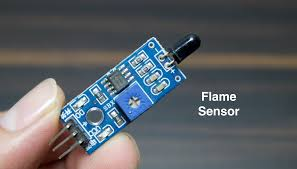

---

## ວິທີການໃຊ້ງານທົ່ວໄປ (ສຳລັບ Flame Sensor Module ພື້ນຖານ)

ສຳລັບໂມດູນ Flame Sensor ຂະໜາດນ້ອຍທີ່ນິຍົມໃຊ້ກັບແຜງຄວບຄຸມເຊັ່ນ **Arduino**, ວິທີການໃຊ້ງານແມ່ນຂ້ອນຂ້າງກົງໄປກົງມາ:

### 1. ການເຊື່ອມຕໍ່ສາຍ

ໂດຍທົ່ວໄປແລ້ວ, ໂມດູນ Flame Sensor ຈະມີຂາເຊື່ອມຕໍ່ຫຼັກໆ ດັ່ງນີ້:

- **VCC:** ເຊື່ອມຕໍ່ກັບແຮງດັນໄຟຟ້າ $3.3 \text{ V}$ ຫາ $5 \text{ V}$ (ຂຶ້ນກັບລຸ້ນ).
    
- **GND:** ເຊື່ອມຕໍ່ກັບສາຍດິນ (Ground).1
    
- **D0 (Digital Output):** ໃຫ້ສັນຍານອອກເປັນ 0 ຫຼື 1 ເພື່ອກວດຈັບວ່າ**ມີແປວໄຟ** ຫຼື **ບໍ່ມີແປວໄຟ**. ເຊື່ອມຕໍ່ກັບຂາ Digital Input ຂອງແຜງຄວບຄຸມ.
    
- **A0 (Analog Output):** ໃຫ້ຄ່າຄວາມເຂັ້ມຂອງລັງສີ (ຄວາມດັງ/ຄວາມໃກ້) ຂອງແປວໄຟ. ເຊື່ອມຕໍ່ກັບຂາ Analog Input ຂອງແຜງຄວບຄຸມ.
    
### 2. ການປັບຄວາມໄວ (Sensitivity)

- ໂມດູນສ່ວນໃຫຍ່ມີຕົວຕ້ານທານທີ່ສາມາດ**ປັບຄ່າໄດ້** (Potentiometer) ຢູ່ເທິງບອດ.
    
- ທ່ານສາມາດໃຊ້ໄຂຄວງໝູນປັບເພື່ອ**ກໍານົດຂອບເຂດຄວາມໄວ**ໃນການກວດຈັບ. ຕົວຢ່າງ: ຖ້າປັບໃຫ້ມີຄວາມໄວສູງ, ມັນຈະກວດຈັບແປວໄຟທີ່ຢູ່ໄກ ຫຼື ຫົວແສງອິນຟຣາເຣດທີ່ອ່ອນແອໄດ້ງ່າຍຂຶ້ນ.
    
### 3. ການຂຽນໂປຣແກຣມ

ທ່ານສາມາດໃຊ້ໄດ້ທັງສັນຍານ Digital ຫຼື Analog:

- **ໃຊ້ Digital Output (D0):** ອ່ານຄ່າ $0$ ຫຼື $1$. ເມື່ອເຊັນເຊີກວດຈັບແປວໄຟໄດ້ (ເກີນກວ່າລະດັບທີ່ປັບໄວ້), ມັນຈະສົ່ງສັນຍານ $0$ (Low) ຫຼື $1$ (High) ອອກມາ. ຫຼັງຈາກນັ້ນ, ໂຄງການຈະສັ່ງໃຫ້ເຮັດວຽກເຊັ່ນ: ເປີດສຽງເຕືອນ (Buzzer) ຫຼື ເປີດໄຟ LED.
    
- **ໃຊ້ Analog Output (A0):** ອ່ານຄ່າຕົວເລກ (ເຊັ່ນ: ຈາກ $0$ ຫາ $1023$ ໃນ Arduino) ເພື່ອວັດ**ຄວາມເຂັ້ມຂົ້ນ**ຂອງແປວໄຟ. ຄ່ານີ້ສາມາດໃຊ້ເພື່ອວິເຄາະວ່າໄຟຢູ່ໃກ້ ຫຼື ໄກປານໃດ.
    
### ຕົວຢ່າງການນໍາໃຊ້

- **ລະບົບເຕືອນໄຟໄໝ້ແບບງ່າຍ**: ຕິດຕັ້ງເຊັນເຊີໃກ້ບໍລິເວນທີ່ມີຄວາມສ່ຽງ. ເມື່ອ D0 ປ່ຽນສະຖານະ, ລະບົບຈະສົ່ງສຽງເຕືອນ.
    
- **ຫຸ່ນຍົນດັບເພີງ**: ໃຊ້ເຊັນເຊີ A0 ເພື່ອວັດທິດທາງ ແລະ ຄວາມເຂັ້ມຂອງແປວໄຟ ເພື່ອໃຫ້ຫຸ່ນຍົນເຄື່ອນທີ່ເຂົ້າຫາແປວໄຟເພື່ອດັບເພີງ.
- 
  ## 10, RFID module  
- **RFID Module** (**ໂມດູນ RFID**) ແມ່ນອຸປະກອນທີ່ເຮັດໜ້າທີ່ເປັນ**ເຄື່ອງອ່ານ (Reader)** ໃນລະບົບ **RFID (Radio Frequency Identification)**. ມັນໃຊ້ສັນຍານຄື້ນວິທະຍຸເພື່ອ**ກວດຈັບ, ອ່ານ, ຫຼືຂຽນຂໍ້ມູນ**ໃສ່ປ້າຍເອເລັກໂຕຣນິກທີ່ເອີ້ນວ່າ **RFID Tag** (ເຊັ່ນ: ບັດ, Keycard, ຫຼືປ້າຍ).
ໂມດູນ RFID ຊ່ວຍໃຫ້ສາມາດລະບຸວັດຖຸເປົ້າໝາຍໄດ້ໂດຍອັດຕະໂນມັດ ໂດຍບໍ່ຈຳເປັນຕ້ອງສຳຜັດ ຫຼື ເບິ່ງເຫັນປ້າຍ.
 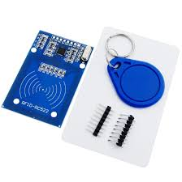
---

## ວິທີການໃຊ້ງານໂມດູນ RFID (ເຊັ່ນ: RC522)

ໂມດູນ RFID ຂະໜາດນ້ອຍເຊັ່ນ: **RC522** ແມ່ນນິຍົມໃຊ້ໃນໂຄງການ DIY ກັບແຜງຄວບຄຸມເຊັ່ນ **Arduino** ເຊິ່ງມີຂັ້ນຕອນການໃຊ້ງານພື້ນຖານດັ່ງນີ້:

### 1. ສ່ວນປະກອບຫຼັກ

- **RFID Module (Reader):** ເຄື່ອງອ່ານທີ່ມີເສົາອາກາດເພື່ອສົ່ງ ແລະ ຮັບສັນຍານຄື້ນວິທະຍຸ.
    
- **RFID Tag (Card/Key Fob):** ປ້າຍເອເລັກໂຕຣນິກທີ່ມີໄມໂຄຣຊິບເພື່ອເກັບຂໍ້ມູນ ID ທີ່ເປັນເອກະລັກ.
    
### 2. ການເຊື່ອມຕໍ່ສາຍ

ໂມດູນ RC522 ມັກຈະໃຊ້ການສື່ສານແບບ **SPI** (Serial Peripheral Interface) ເພື່ອຕິດຕໍ່ກັບແຜງຄວບຄຸມ:

- **VCC:** ເຊື່ອມຕໍ່ກັບແຮງດັນໄຟຟ້າ $3.3 \text{ V}$ ຂອງ Arduino (ບາງໂມດູນຮອງຮັບ $5 \text{ V}$).
    
- **GND:** ເຊື່ອມຕໍ່ກັບສາຍດິນ (Ground).
    
- **SDA (Slave Select) / CS (Chip Select):** ເຊື່ອມຕໍ່ກັບຂາ Digital ທີ່ກຳນົດໄວ້.
    
- **SCK (Serial Clock):** ເຊື່ອມຕໍ່ກັບຂາ SCK ຂອງ SPI (ເຊັ່ນ: ຂາ $13$ ໃນ Arduino UNO).
    
- **MOSI (Master Out Slave In):** ເຊື່ອມຕໍ່ກັບຂາ MOSI ຂອງ SPI (ເຊັ່ນ: ຂາ $11$ ໃນ Arduino UNO).
    
- **MISO (Master In Slave Out):** ເຊື່ອມຕໍ່ກັບຂາ MISO ຂອງ SPI (ເຊັ່ນ: ຂາ $12$ ໃນ Arduino UNO).
    
### 3. ການຂຽນໂປຣແກຣມ

1. **ຕິດຕັ້ງ Library:** ທ່ານຈຳເປັນຕ້ອງຕິດຕັ້ງ Library ທີ່ກ່ຽວຂ້ອງກັບໂມດູນ RFID ຂອງທ່ານ (ເຊັ່ນ: `MFRC522` Library ສຳລັບ RC522) ເຂົ້າໃນໂປຣແກຣມ IDE (ເຊັ່ນ: Arduino IDE).
    
2. **ອ່ານ ID (UID):** ໂປຣແກຣມຈະໃຊ້ຄຳສັ່ງຂອງ Library ເພື່ອໃຫ້ໂມດູນປ່ອຍສັນຍານຄື້ນວິທະຍຸ.
    
3. **ການກວດຈັບ:** ເມື່ອເອົາປ້າຍ RFID ມາແຕະໃສ່ ຫຼື ຢູ່ໃນໄລຍະການອ່ານ, ປ້າຍຈະສົ່ງຂໍ້ມູນ ID ຂອງມັນກັບຄືນ.
    
4. **ປະມວນຜົນ:** ແຜງຄວບຄຸມຈະອ່ານຄ່າ ID ທີ່ໄດ້ຮັບ ແລະ ນຳໄປປຽບທຽບກັບ ID ທີ່ໄດ້ບັນທຶກໄວ້.
    
    - ຖ້າ ID **ກົງກັນ**: ສັ່ງໃຫ້ອຸປະກອນເຮັດວຽກ (ເຊັ່ນ: ເປີດປະຕູ).
        
    - ຖ້າ ID **ບໍ່ກົງກັນ**: ປະຕິເສດການເຂົ້າເຖິງ.
        

### ຕົວຢ່າງການນໍາໃຊ້

- **ລະບົບຄວບຄຸມການເຂົ້າ-ອອກ (Access Control):** ໃຊ້ບັດ RFID ເປັນ Key Card ເພື່ອເປີດປະຕູ ຫຼື ປົດລັອກ.
    
- **ລະບົບນັບຈຳນວນ:** ໃຊ້ຕິດຕາມການໄຫຼເຂົ້າ-ອອກຂອງສິນຄ້າໃນສາງ.
    
- **ລະບົບການຊຳລະເງິນແບບບໍ່ມີການສຳຜັດ (Contactless Payment).**
## 11,- RFID tag

**RFID Tag** (**ປ້າຍ RFID** ຫຼື **Transponder**) ແມ່ນອຸປະກອນເອເລັກໂຕຣນິກຂະໜາດນ້ອຍທີ່ຖືກນຳໄປ**ຕິດ ຫຼື ຝັງ**ໄວ້ກັບວັດຖຸ, ສິນຄ້າ, ສັດ, ຫຼື ບຸກຄົນ ເພື່ອໃຊ້ໃນການ**ເກັບຂໍ້ມູນ ແລະ ລະບຸຕົວຕົນ**ຜ່ານຄື້ນວິທະຍຸ.

ປ້າຍ RFID ປະກອບມີ 2 ສ່ວນຫຼັກ:

1. **ໄມໂຄຣຊິບ (Microchip):** ໃຊ້ເກັບຂໍ້ມູນ, ສ່ວນຫຼາຍແມ່ນລະຫັດ ID ທີ່ເປັນເອກະລັກ.
    
2. **ເສົາອາກາດ (Antenna):** ໃຊ້ສື່ສານກັບເຄື່ອງອ່ານ (RFID Reader) ໂດຍຜ່ານຄື້ນວິທະຍຸ.

---

## ປະເພດຂອງ RFID Tag ແລະ ວິທີການໃຊ້ງານ

RFID Tags ແບ່ງອອກເປັນ 2 ປະເພດຫຼັກຕາມວິທີການໃຊ້ພະລັງງານ:

### 1. Passive RFID Tags (ແທັກບໍ່ມີພະລັງງານໃນຕົວ)

- **ລັກສະນະ:** ບໍ່ມີແບັດເຕີຣີໃນຕົວ, ມີລາຄາຖືກ, ແລະມີຂະໜາດນ້ອຍ.
    
- **ວິທີເຮັດວຽກ:** ມັນຈະໄດ້ຮັບພະລັງງານຈາກຄື້ນວິທະຍຸທີ່ປ່ອຍອອກມາຈາກ **RFID Reader**. ເມື່ອໄດ້ຮັບພະລັງງານແລ້ວ, ມັນຈຶ່ງສາມາດສົ່ງສັນຍານ ID ຂອງຕົນເອງກັບຄືນໄປຫາເຄື່ອງອ່ານໄດ້.
    
- **ການໃຊ້ງານ:** ໃຊ້ຫຼາຍທີ່ສຸດໃນ **Key Card, ບັດນັກຮຽນ, ປ້າຍຕິດຕາມສິນຄ້າ**ໃນຮ້ານຂາຍຍ່ອຍ (ເຊັ່ນ: ປ້າຍປ້ອງກັນການລັກ). ໄລຍະການອ່ານແມ່ນສັ້ນ, ມັກຈະສຳຜັດ ຫຼື ໃກ້ກັບເຄື່ອງອ່ານ.
    

### 2. Active RFID Tags (ແທັກມີພະລັງງານໃນຕົວ)

- **ລັກສະນະ:** ມີແບັດເຕີຣີໃນຕົວ, ມີລາຄາແພງກວ່າ.
    
- **ວິທີເຮັດວຽກ:** ໃຊ້ພະລັງງານຈາກແບັດເຕີຣີຂອງຕົນເອງເພື່ອສົ່ງສັນຍານອອກມາຢ່າງຕໍ່ເນື່ອງ.
    
- **ການໃຊ້ງານ:** ໃຊ້ສຳລັບການ**ຕິດຕາມໃນໄລຍະໄກ** ຫຼື ວັດຖຸທີ່ມີການເຄື່ອນທີ່ໄວ ເຊັ່ນ: **ປ້າຍຈ່າຍຄ່າທາງດ່ວນ (M-Flow) ຫຼື ການຕິດຕາມຕູ້ຄອນເທນເນີຂະໜາດໃຫຍ່**ໃນສາງ. ໄລຍະການອ່ານສາມາດໄກໄດ້ເຖິງຫຼາຍສິບແມັດ.
    

---

## ຂັ້ນຕອນການນຳໃຊ້

RFID Tag ຈະເຮັດວຽກຢູ່ໃນລະບົບທີ່ສົມບູນ ໂດຍມີຂັ້ນຕອນດັ່ງນີ້:

1. **ການບັນທຶກຂໍ້ມູນ (Encoding):** ຂໍ້ມູນ (ເຊັ່ນ: UID) ທີ່ເປັນເອກະລັກຈະຖືກບັນທຶກໄວ້ໃນໄມໂຄຣຊິບຂອງ Tag.
    
2. **ການຕິດປ້າຍ (Attaching):** ນຳ Tag ໄປຕິດໄວ້ກັບວັດຖຸທີ່ຕ້ອງການຕິດຕາມ ຫຼື ລະບຸຕົວຕົນ (ເຊັ່ນ: ຕິດໃສ່ກະເປົາເງິນ, ປ້າຍສິນຄ້າ, ຫຼື ໃສ່ໃນບັດ).
    
3. **ການອ່ານ (Reading):** ເມື່ອ Tag ເຂົ້າສູ່ບໍລິເວນໃກ້ຄຽງຂອງ **RFID Reader** (ໂມດູນ RFID), ເຄື່ອງອ່ານຈະປ່ອຍຄື້ນວິທະຍຸ.
    
4. **ການສົ່ງຂໍ້ມູນ (Data Transfer):** Tag ຈະຕອບສະໜອງໂດຍການສົ່ງຂໍ້ມູນທີ່ບັນທຶກໄວ້ກັບຄືນໄປຫາ Reader.
    
5. **ການປະມວນຜົນ (Processing):** Reader ສົ່ງຂໍ້ມູນ ID ທີ່ໄດ້ຮັບໄປຫາລະບົບຄອມພິວເຕີ ເພື່ອຢັ້ງຢືນ, ບັນທຶກສະຖານທີ່, ຫຼື ສັ່ງໃຫ້ລະບົບເຮັດວຽກຕໍ່ໄປ (ເຊັ່ນ: ເປີດປະຕູ).
## 11.Infrared receiver  
**Infrared Receiver** (**ຕົວຮັບສັນຍານອິນຟຣາເຣດ** ຫຼື **IR Receiver**) ແມ່ນອຸປະກອນເອເລັກໂຕຣນິກທີ່ອອກແບບມາເພື່ອ**ກວດຈັບ ແລະ ຮັບສັນຍານແສງອິນຟຣາເຣດ (IR light)**. ແສງອິນຟຣາເຣດເປັນແສງທີ່ຕາມະນຸດເບິ່ງບໍ່ເຫັນ ເຊິ່ງມັກຖືກໃຊ້ໃນການສື່ສານແບບໄຮ້ສາຍໄລຍະສັ້ນ.

- **ໜ້າທີ່ຫຼັກ:** ຮັບສັນຍານຈາກ **IR Transmitter** (ເຊັ່ນ: ຣີໂໝດຄວບຄຸມໂທລະທັດ ຫຼື ເຄື່ອງປັບອາກາດ) ແລະປ່ຽນສັນຍານແສງທີ່ຖືກເຂົ້າລະຫັດນັ້ນໃຫ້ເປັນ**ສັນຍານໄຟຟ້າດິຈິຕອລ**ທີ່ແຜງຄວບຄຸມສາມາດອ່ານໄດ້.

## ວິທີການໃຊ້ງານ Infrared Receiver Module

ການໃຊ້ງານ IR Receiver ທີ່ພົບເຫັນຫຼາຍທີ່ສຸດແມ່ນການສ້າງລະບົບຄວບຄຸມດ້ວຍຣີໂໝດ ເຊິ່ງມີຂັ້ນຕອນດັ່ງນີ້:

### 1. ການເຊື່ອມຕໍ່ສາຍ

ໂມດູນ IR Receiver ທົ່ວໄປ (ເຊັ່ນ: TSOP38238) ມັກມີ 3 ຂາຄື:

- **VCC:** ເຊື່ອມຕໍ່ກັບແຮງດັນໄຟຟ້າ $3.3 \text{ V}$ ຫາ $5 \text{ V}$.
    
- **GND:** ເຊື່ອມຕໍ່ກັບສາຍດິນ (Ground).
    
- **OUT/Signal:** ເຊື່ອມຕໍ່ກັບຂາ Digital Input ຂອງແຜງຄວບຄຸມ (ເຊັ່ນ: Arduino) ເພື່ອຮັບສັນຍານ.
    

### 2. ການຂຽນໂປຣແກຣມ

1. **ຕິດຕັ້ງ Library:** ທ່ານຈຳເປັນຕ້ອງຕິດຕັ້ງ Library ເພື່ອຊ່ວຍໃນການຖອດລະຫັດສັນຍານ (ເຊັ່ນ: `IRremote` Library). ຣີໂໝດຄວບຄຸມແຕ່ລະຍີ່ຫໍ້ ແລະແຕ່ລະປຸ່ມຈະສົ່ງລະຫັດທີ່ແຕກຕ່າງກັນ.
    
2. **ການຮັບລະຫັດ (Decoding):**
    
    - ຂຽນໂປຣແກຣມເພື່ອໃຫ້ IR Receiver ເລີ່ມຮັບສັນຍານ.
        
    - ເມື່ອກົດປຸ່ມໃດໜຶ່ງເທິງຣີໂໝດ, IR Receiver ຈະສົ່ງຊຸດສັນຍານອອກມາ.
        
    - Library ຈະຖອດລະຫັດສັນຍານນັ້ນອອກມາເປັນ**ລະຫັດຕົວເລກ** (ເຊັ່ນ: $0 \text{xFF20DF0}$) ເຊິ່ງເປັນຕົວແທນຂອງປຸ່ມທີ່ຖືກກົດ.
        
3. **ການຄວບຄຸມ:**
    
    - ໂປຣແກຣມຈະນຳລະຫັດຕົວເລກທີ່ໄດ້ມາໄປປຽບທຽບກັບລະຫັດທີ່ບັນທຶກໄວ້.
        
    - ເມື່ອລະຫັດກົງກັນ, ໂປຣແກຣມຈະສັ່ງໃຫ້ແຜງຄວບຄຸມເຮັດວຽກທີ່ກຳນົດໄວ້ (ເຊັ່ນ: ຖ້າກົດປຸ່ມ '1' (ລະຫັດ $0 \text{xFF20DF0}$), ໃຫ້ເປີດໄຟ LED).
        

### ຕົວຢ່າງການນຳໃຊ້

- **ລະບົບຄວບຄຸມເຄື່ອງໃຊ້ໄຟຟ້າ:** ໃຊ້ຣີໂໝດໂທລະທັດອັນເກົ່າມາຄວບຄຸມອຸປະກອນ DIY ອື່ນໆເຊັ່ນ: ຫຸ່ນຍົນ ຫຼື ລະບົບໄຟໃນເຮືອນ.
    
- **ເຊັນເຊີກວດຈັບວັດຖຸ (IR Obstacle Sensor):** ໃຊ້ IR Receiver ຄູ່ກັບ IR LED (Transmitter) ເພື່ອເປັນລະບົບກວດຈັບສິ່ງກີດຂວາງ. ເມື່ອແສງ IR ຈາກຕົວສົ່ງສະທ້ອນກັບມາຫາຕົວຮັບ, ມັນຈະຮູ້ວ່າ ມີວັດຖຸຢູ່ດ້ານໜ້າ.
## 🎮 Remote & Control

- ## Infrared remote control 
**Infrared Remote Control** (**ຣີໂໝດຄວບຄຸມອິນຟຣາເຣດ**) ແມ່ນອຸປະກອນທີ່ໃຊ້ສຳລັບ**ຄວບຄຸມເຄື່ອງໃຊ້ໄຟຟ້າ**ຕ່າງໆ ແບບໄຮ້ສາຍໃນໄລຍະໃກ້. ມັນເຮັດວຽກໂດຍການປ່ອຍ**ສັນຍານແສງອິນຟຣາເຣດ (IR)** ເຊິ່ງເປັນແສງທີ່ຕາມະນຸດເບິ່ງບໍ່ເຫັນ ເພື່ອສົ່ງຄຳສັ່ງໄປຫາເຄື່ອງຮັບ (IR Receiver) ຢູ່ທີ່ອຸປະກອນເປົ້າໝາຍ.

ລະບົບ IR Remote Control ປະກອບມີ 2 ສ່ວນຫຼັກຄື:

1. **IR Transmitter (ຣີໂໝດ):** ເປັນອຸປະກອນຖືມືທີ່ມີປຸ່ມກົດ. ເມື່ອກົດປຸ່ມ, ມັນຈະປ່ອຍ**ຊຸດສັນຍານແສງ IR ທີ່ຖືກເຂົ້າລະຫັດ** (Code) ເຊິ່ງແຕ່ລະປຸ່ມກໍມີລະຫັດສະເພາະຂອງມັນ.
    
2. **IR Receiver (ຕົວຮັບ):** ຕັ້ງຢູ່ເຄື່ອງໃຊ້ໄຟຟ້າ (ເຊັ່ນ: ໂທລະທັດ, ແອ). ມັນຈະຮັບສັນຍານ IR ທີ່ປ່ອຍອອກມາ ແລະຖອດລະຫັດອອກມາເປັນຄຳສັ່ງ (ເຊັ່ນ: ເພີ່ມສຽງ, ປ່ຽນຊ່ອງ).

---

## ວິທີການໃຊ້ງານ IR Remote Control

ການໃຊ້ງານ IR Remote Control ໂດຍປົກກະຕິແມ່ນຕ້ອງມີການ**ເລັງຣີໂໝດໃຫ້ຊື່ກັບເຄື່ອງຮັບ** ແລະຕ້ອງບໍ່ມີສິ່ງກີດຂວາງລະຫວ່າງກັນ ເພາະແສງ IR ບໍ່ສາມາດແລ່ນຜ່ານຝາ ຫຼື ວັດຖຸທຶບໄດ້.

### 1. ການໃຊ້ກັບເຄື່ອງໃຊ້ໄຟຟ້າທົ່ວໄປ

- **ການເລັງ:** ຖືຣີໂໝດ ແລະ ເລັງໄຟສາຍນ້ອຍໆທີ່ຢູ່ປາຍຣີໂໝດໄປຫາ**ປ່ອງຮັບສັນຍານ IR** ທີ່ຢູ່ເທິງໂທລະທັດ ຫຼື ເຄື່ອງປັບອາກາດຂອງທ່ານ.
    
- **ການກົດປຸ່ມ:** ກົດປຸ່ມທີ່ຕ້ອງການ (ເຊັ່ນ: Power, Volume up).
    
- **ການຕອບສະໜອງ:** ຕົວຮັບ IR ຈະຮັບສັນຍານ, ຖອດລະຫັດ, ແລະສົ່ງຄຳສັ່ງໄປຍັງ CPU ຂອງອຸປະກອນເພື່ອເຮັດວຽກຕາມຄຳສັ່ງນັ້ນ.
    

### 2. ການໃຊ້ກັບລະບົບ Smart Home (IR Universal Remote)

ປັດຈຸບັນມີອຸປະກອນທີ່ເອີ້ນວ່າ **IR Universal Remote** ທີ່ເຊື່ອມຕໍ່ກັບ Wi-Fi ເຊິ່ງຊ່ວຍໃຫ້ທ່ານສາມາດຄວບຄຸມຣີໂໝດ IR ຫຼາຍອັນໄດ້ດ້ວຍໂທລະສັບມືຖື ຫຼື ການສັ່ງດ້ວຍສຽງ.

- **ການກ່າຍລະຫັດ (Learning):** ໃຊ້ອຸປະກອນ Universal Remote ເພື່ອກ່າຍລະຫັດສັນຍານ IR ຈາກຣີໂໝດຕົ້ນສະບັບ (ເຊັ່ນ: ຣີໂໝດແອ).
    
- **ການຄວບຄຸມ:** ທ່ານສາມາດສັ່ງໃຫ້ອຸປະກອນ Universal Remote ປ່ອຍສັນຍານ IR ດັ່ງກ່າວແທນຣີໂໝດຈິງ ຜ່ານແອັບພລິເຄຊັນໃນໂທລະສັບຂອງທ່ານ (ບໍ່ວ່າທ່ານຈະຢູ່ໃສກໍຕາມ, ຂໍພຽງແຕ່ອຸປະກອນນັ້ນເຊື່ອມຕໍ່ອິນເຕີເນັດ).
    

### 3. ການໃຊ້ກັບໂຄງການ DIY (ເຊັ່ນ: Arduino)

ໃນໂຄງການທາງເອເລັກໂຕຣນິກ, ທ່ານສາມາດໃຊ້ **IR Receiver Module** ເພື່ອຮັບລະຫັດຈາກຣີໂໝດອັນໃດກໍໄດ້ ເພື່ອນຳໄປຄວບຄຸມອຸປະກອນທີ່ສ້າງເອງ:

1. **ຮັບລະຫັດ:** ໃຊ້ໂຄງການເພື່ອອ່ານ ແລະ **ບັນທຶກລະຫັດຕົວເລກ**ສະເພາະຂອງແຕ່ລະປຸ່ມທີ່ກົດເທິງຣີໂໝດ.
    
2. **ກຳນົດຄຳສັ່ງ:** ຕັ້ງຄ່າວ່າເມື່ອໄດ້ຮັບລະຫັດນັ້ນ, ໃຫ້ແຜງຄວບຄຸມເຮັດວຽກຫຍັງ (ເຊັ່ນ: ຖ້າໄດ້ຮັບລະຫັດປຸ່ມ 'Play', ໃຫ້ເປີດປັ້ມນໍ້າ).
## Joystick module
**Joystick Module** (**ໂມດູນຈອຍສະຕິກ**) ແມ່ນອຸປະກອນປ້ອນຂໍ້ມູນແບບອານາລັອກທີ່ໃຊ້ສຳລັບການ**ຄວບຄຸມທິດທາງ ແລະ ຕຳແໜ່ງ**ໃນສອງມິຕິ (X ແລະ Y), ຄ້າຍຄືກັບຈອຍເກມ PlayStation 2.

ມັນເປັນອຸປະກອນປ້ອນຂໍ້ມູນທີ່ສະດວກສະບາຍ ເພາະສາມາດໃຫ້ໄດ້ທັງຄ່າຕຳແໜ່ງແບບອານາລັອກ ແລະ ຄ່າປຸ່ມກົດແບບດິຈິຕອລ. ມັນນິຍົມໃຊ້ໃນການຄວບຄຸມຫຸ່ນຍົນ, ແຂນກົນ, ຫຼືສ້າງເກມແບບ DIY.

---

## ສ່ວນປະກອບ ແລະ ວິທີການໃຊ້ງານ (ສຳລັບ PS2 Joystick Module)
ໂມດູນຈອຍສະຕິກທົ່ວໄປເຊັ່ນ: PS2 Joystick Module ຈະມີຂາເຊື່ອມຕໍ່ ແລະຫຼັກການເຮັດວຽກດັ່ງນີ້:
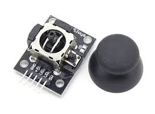
### 1. ຫຼັກການເຮັດວຽກ

ໂມດູນປະກອບດ້ວຍ:
- **ຕົວຕ້ານທານທີ່ປັບຄ່າໄດ້ (Potentiometers) 2 ອັນ:** ໃຊ້ສຳລັບວັດແທກການເຄື່ອນທີ່ຂອງແກນ **X (ຊ້າຍ-ຂວາ)** ແລະ ແກນ **Y (ຂຶ້ນ-ລົງ)**. ມັນຈະໃຫ້**ສັນຍານອອກແບບອານາລັອກ** (ຄ່າລະຫວ່າງ $0$ ຫາ $1023$ ໃນລະບົບ $10$ ບິດ) ທີ່ປ່ຽນແປງໄປຕາມຕຳແໜ່ງຂອງຈອຍ.
    
- **ປຸ່ມກົດ (Push Button/Switch):** ຈະເຮັດວຽກເມື່ອ**ກົດແກນຈອຍສະຕິກລົງໄປກົງໆ**. ມັນຈະໃຫ້**ສັນຍານອອກແບບດິຈິຕອລ** ($0$ ຫຼື $1$).
    

---

### 2. ການເຊື່ອມຕໍ່ສາຍກັບ Arduino

ໂມດູນມັກມີ 5 ຂາ, ເຊິ່ງເຊື່ອມຕໍ່ກັບແຜງຄວບຄຸມ (ເຊັ່ນ: Arduino UNO) ດັ່ງນີ້:

|**ຂາໃນໂມດູນ**|**ຟັງຊັນ**|**ເຊື່ອມຕໍ່ກັບ Arduino**|
|---|---|---|
|**GND**|ສາຍດິນ|GND|
|**VCC**|ໄຟລ້ຽງ|$5 \text{ V}$|
|**VRx**|ແກນ X (ຕຳແໜ່ງ)|ຂາ Analog (ເຊັ່ນ: A0)|
|**VRy**|ແກນ Y (ຕຳແໜ່ງ)|ຂາ Analog (ເຊັ່ນ: A1)|
|**SW**|ປຸ່ມກົດ (Switch)|ຂາ Digital (ເຊັ່ນ: D2)|

---

### 3. ການຂຽນໂປຣແກຣມ

1. **ອ່ານຄ່າຕຳແໜ່ງ (VRx, VRy):**
    
    - ໃຊ້ຄຳສັ່ງ `analogRead()` ເພື່ອອ່ານຄ່າຈາກຂາ A0 ແລະ A1.
        
    - ຄ່າທີ່ໄດ້ຈະເປັນຕົວເລກທີ່ບົ່ງບອກຕຳແໜ່ງ:
        
        - ຕຳແໜ່ງກາງ (ບໍ່ເຄື່ອນທີ່): ປະມານ $512$
            
        - ສຸດທາງໜຶ່ງ (ເຊັ່ນ: ສຸດຊ້າຍ ຫຼື ສຸດລົງ): ປະມານ $0$
            
        - ສຸດທາງກົງກັນຂ້າມ: ປະມານ $1023$
            
2. **ອ່ານຄ່າປຸ່ມກົດ (SW):**
    
    - ໃຊ້ຄຳສັ່ງ `digitalRead()` ເພື່ອອ່ານຄ່າຈາກຂາ D2.
        
    - ໂດຍປົກກະຕິ: ໃຫ້ຄ່າ **HIGH** ເມື່ອບໍ່ໄດ້ກົດ, ແລະໃຫ້ຄ່າ **LOW** ເມື່ອຖືກກົດລົງ.
        
3. **ການນຳໄປໃຊ້:**
    
    - ທ່ານສາມາດນຳຄ່າຕຳແໜ່ງ (X ແລະ Y) ທີ່ໄດ້ມາໄປກຳນົດຄວາມໄວ ຫຼື ທິດທາງຂອງມໍເຕີ, ຫຼືຄວບຄຸມຄ່າຂອງຕົວແປໃນເກມ.
        
    - ທ່ານສາມາດໃຊ້ຄ່າປຸ່ມກົດ (SW) ເພື່ອສັ່ງເປີດ/ປິດຟັງຊັນພິເສດ ເຊັ່ນ: ຢຸດການເຄື່ອນທີ່ ຫຼື ຍິງ.
    ## -4x4 Matrix Keyboard Module 
    **4x4 Matrix Keyboard Module** (**ໂມດູນແປ້ນພິມແບບມາຕຣິກ 4x4**) ແມ່ນອຸປະກອນປ້ອນຂໍ້ມູນແບບກົດປຸ່ມທີ່ປະກອບດ້ວຍ **16 ປຸ່ມ** ຈັດລຽງເປັນຮູບແບບ **4 ແຖວ (Rows) ແລະ 4 ຖັນ (Columns)**. ມັນຖືກອອກແບບມາເພື່ອໃຫ້ສາມາດຮັບຄ່າການກົດປຸ່ມໄດ້ຫຼາຍຄ່າ ໂດຍໃຊ້ຈໍານວນຂາເຊື່ອມຕໍ່ (Pin) ກັບແຜງຄວບຄຸມ (ເຊັ່ນ: Arduino) ໜ້ອຍທີ່ສຸດ.

---

## ຫຼັກການເຮັດວຽກ ແລະ ວິທີການໃຊ້ງານ

ໂມດູນນີ້ໃຊ້ຫຼັກການເຊື່ອມຕໍ່ແບບ **Matrix (ມາຕຣິກ)** ເຊິ່ງຊ່ວຍຫຼຸດຈຳນວນສາຍທີ່ຕ້ອງໃຊ້.
### 1. ຫຼັກການເຮັດວຽກຂອງ Matrix

ແທນທີ່ຈະໃຊ້ສາຍ $16$ ສາຍສຳລັບປຸ່ມ $16$ ປຸ່ມ, ໂມດູນ 4x4 ໃຊ້ພຽງແຕ່ $4$ ສາຍສຳລັບແຖວ ແລະ $4$ ສາຍສຳລັບຖັນ, ລວມເປັນພຽງ **$8$ ສາຍ**ເທົ່ານັ້ນ.

- **ການກວດຈັບປຸ່ມ:** ແຜງຄວບຄຸມຈະເຮັດການ **"Scan" (ສະແກນ)** ຢ່າງວ່ອງໄວ:
    
    1. ມັນຈະສົ່ງສັນຍານອອກໄປເທື່ອລະແຖວ (ເຊັ່ນ: ໃຫ້ແຖວ $1$ ເປັນ **HIGH** ແລ້ວແຖວອື່ນເປັນ **LOW**).
        
    2. ໃນຂະນະດຽວກັນ, ມັນກໍອ່ານຄ່າຈາກທັງ $4$ ຖັນ.
        
    3. ຖ້າມີການກົດປຸ່ມ (ຕົວຢ່າງ: ປຸ່ມທີ່ຢູ່ແຖວ $1$ ແລະ ຖັນ $3$), ສັນຍານ **HIGH** ຈາກແຖວ $1$ ຈະແລ່ນຜ່ານປຸ່ມທີ່ຖືກກົດ ແລະໄປອອກທີ່ຖັນ $3$, ເຮັດໃຫ້ແຜງຄວບຄຸມກວດຈັບໄດ້ວ່າປຸ່ມນັ້ນຖືກກົດ.
### 2. ການເຊື່ອມຕໍ່ສາຍກັບ Arduino

ໂມດູນຈະມີ $8$ ຂາ (ບາງໂມດູນອາດຈະມີ $7$ ຂາ):

- **ຂາ 1 ຫາ 4 (ແຖວ):** ເຊື່ອມຕໍ່ກັບຂາ Digital Output ຂອງ Arduino (ເຊັ່ນ: D8, D9, D10, D11).
    
- **ຂາ 5 ຫາ 8 (ຖັນ):** ເຊື່ອມຕໍ່ກັບຂາ Digital Input ຂອງ Arduino (ເຊັ່ນ: D4, D5, D6, D7).
### 3. ການຂຽນໂປຣແກຣມ

1. **ຕິດຕັ້ງ Library:** ເພື່ອໃຫ້ການອ່ານຄ່າ Matrix ງ່າຍຂຶ້ນ, ທ່ານຄວນໃຊ້ **Keypad Library** ທີ່ຖືກອອກແບບມາສຳລັບ Arduino.
    
2. **ກຳນົດ Keymap:** ໃນໂຄ້ດໂປຣແກຣມ, ທ່ານຕ້ອງກຳນົດວ່າປຸ່ມໃດກົງກັບຕົວອັກສອນ ຫຼື ຕົວເລກໃດ (ເອີ້ນວ່າ **Keymap**), ໂດຍຈັດຮູບແບບໃຫ້ກົງກັບການຈັດລຽງ 4x4 
. 1. **ອ່ານຄ່າ:** Library ຈະຈັດການຂັ້ນຕອນການສະແກນ $4$ ແຖວ ແລະ $4$ ຖັນແທນທ່ານ, ແລະຈະສົ່ງຄ່າທີ່ເປັນ **char** ຂອງປຸ່ມທີ່ຖືກກົດອອກມາ.
    
4 **ປະມວນຜົນ:** ທ່ານສາມາດນຳຕົວອັກສອນທີ່ໄດ້ຮັບໄປໃຊ້ໃນການສ້າງ **ລະບົບປ້ອນລະຫັດ (Password)** ເພື່ອປົດລັອກປະຕູ, ການນຳທາງໃນເມນູ, ຫຼື ການປ້ອນຂໍ້ມູນເຂົ້າໃນໂຄງການຂອງທ່ານ.
### ຕົວຢ່າງການນຳໃຊ້

- **Keypad Lock:** ໃຊ້ສຳລັບການປ້ອນລະຫັດລັບກ່ອນທີ່ຈະເປີດໃຊ້ງານລີເລ ຫຼື ປົດລັອກແມ່ເຫຼັກໄຟຟ້າ.
    
- **ການປ້ອນຄ່າ:** ໃຊ້ເປັນເຄື່ອງປ້ອນຕົວເລກສຳລັບການຕັ້ງຄ່າ ຫຼື ການຄຳນວນໃນໂປຣເຈັກ.
## -Relay module  
**Relay Module** (**ໂມດູນລີເລ**) ແມ່ນແຜງວົງຈອນທີ່ປະກອບດ້ວຍ **ລີເລ (Relay)** ແລະອົງປະກອບເອເລັກໂຕຣນິກທີ່ຈຳເປັນ ເຊັ່ນ: **Diode** ແລະ **Transistor** ເພື່ອຊ່ວຍໃນການຄວບຄຸມລີເລດ້ວຍໄຟຟ້າແຮງດັນຕໍ່າຈາກໄມໂຄຣຄອນໂທນເລີ (ເຊັ່ນ: Arduino ຫຼື Raspberry Pi).

- **ລີເລ (Relay) ແມ່ນຫຍັງ?:** ມັນແມ່ນ **ສະວິດໄຟຟ້າ** ທີ່ໃຊ້ພະລັງງານໄຟຟ້າ (ແຮງດັນຕໍ່າ) ເພື່ອຄວບຄຸມການເປີດ-ປິດວົງຈອນໄຟຟ້າອີກວົງຈອນໜຶ່ງທີ່ມີ**ແຮງດັນ ຫຼື ກະແສໄຟຟ້າສູງກວ່າ**.
    
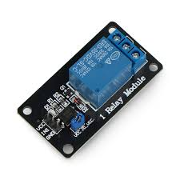
## ຫຼັກການເຮັດວຽກຂອງ Relay Module

Relay Module ເຮັດໜ້າທີ່ເປັນ **ກຳແພງກັນໄຟຟ້າ** ລະຫວ່າງວົງຈອນຄວບຄຸມ (Low Voltage) ກັບວົງຈອນໂຫຼດ (High Voltage).

1. **ວົງຈອນຄວບຄຸມ (Control Circuit):**
    
    - ລີເລຈະມີ **Coil (ຂົດລວດ)** ທີ່ຮັບໄຟຟ້າແຮງດັນຕໍ່າ (ເຊັ່ນ: $5 \text{ VDC}$ ຈາກ Arduino) ຜ່ານຂາ **VCC/GND** ແລະ **IN** ຂອງໂມດູນ.
        
    - ເມື່ອມີການປ້ອນສັນຍານ (ເຊັ່ນ: **HIGH** ຫຼື **LOW**) ເຂົ້າໄປທີ່ຂາ **IN**, ໂມດູນຈະສ້າງສະໜາມແມ່ເຫຼັກ.
        
2. **ວົງຈອນໂຫຼດ (Load Circuit):**
    
    - ສະໜາມແມ່ເຫຼັກທີ່ສ້າງຂຶ້ນຈະດຶງດູດ **Contact (ໜ້າສຳຜັດ)** ພາຍໃນລີເລ ເຮັດໃຫ້ມັນ **ປ່ຽນສະຖານະ** (ຈາກເປີດເປັນປິດ, ຫຼືຈາກປິດເປັນເປີດ), ເຊິ່ງເປັນການຕັດ ຫຼື ຕໍ່ກະແສໄຟຟ້າຂອງໂຫຼດ (ເຊັ່ນ: ໄຟ $220 \text{ VAC}$ ຫຼື ມໍເຕີ $12 \text{ VDC}$).
        

---

## ວິທີການໃຊ້ງານ Relay Module

Relay Module ສ່ວນໃຫຍ່ມີ $2$ ຝັ່ງໃນການເຊື່ອມຕໍ່:

### ຝັ່ງທີ່ 1: ການເຊື່ອມຕໍ່ກັບ Microcontroller (Input)

|**ຂາໃນໂມດູນ**|**ຟັງຊັນ**|**ເຊື່ອມຕໍ່ກັບ Arduino**|
|---|---|---|
|**VCC**|ໄຟລ້ຽງໂມດູນ|$5 \text{ V}$|
|**GND**|ສາຍດິນ|GND|
|**IN**|ສັນຍານຄວບຄຸມ|ຂາ Digital Output|

### ຝັ່ງທີ່ 2: ການເຊື່ອມຕໍ່ກັບໂຫຼດ (Output)

ລີເລມີ $3$ ຂາສຳລັບຕໍ່ກັບອຸປະກອນໄຟຟ້າ:

1. **COM (Common):** ຈຸດເຊື່ອມຕໍ່ຫຼັກທີ່ມາຈາກແຫຼ່ງຈ່າຍໄຟ.
    
2. **NC (Normally Closed):** **ປົກກະຕິປິດ** (ວົງຈອນຕໍ່ກັນ) ເມື່ອລີເລບໍ່ເຮັດວຽກ.
    
3. **NO (Normally Open):** **ປົກກະຕິເປີດ** (ວົງຈອນຕັດກັນ) ເມື່ອລີເລບໍ່ເຮັດວຽກ.
    

**ຂັ້ນຕອນການໃຊ້ງານ:**

1. **ເລືອກຂາສຳລັບໂຫຼດ:**
    
    - ຖ້າທ່ານຕ້ອງການໃຫ້ອຸປະກອນ **ປິດ** ຢູ່ຕະຫຼອດ ແລະ **ເປີດ** ເມື່ອລີເລເຮັດວຽກ: ໃຫ້ຕໍ່ສາຍເຂົ້າກັບຂາ **NO** ແລະ **COM**.
        
    - ຖ້າທ່ານຕ້ອງການໃຫ້ອຸປະກອນ **ເປີດ** ຢູ່ຕະຫຼອດ ແລະ **ປິດ** ເມື່ອລີເລເຮັດວຽກ: ໃຫ້ຕໍ່ສາຍເຂົ້າກັບຂາ **NC** ແລະ **COM**.
        
2. **ຂຽນໂປຣແກຣມ:** ສົ່ງສັນຍານດິຈິຕອລ (HIGH/LOW) ໄປທີ່ຂາ **IN** ເພື່ອສັ່ງໃຫ້ລີເລປ່ຽນສະຖານະ ແລະຄວບຄຸມໂຫຼດ.
### ຕົວຢ່າງການນຳໃຊ້

- **ລະບົບໄຟອັດຕະໂນມັດ:** ໃຊ້ລີເລຄວບຄຸມການເປີດ-ປິດໄຟ $220 \text{ VAC}$ ພາຍໃນເຮືອນຜ່ານ Arduino.
    
- **ການຄວບຄຸມມໍເຕີ:** ໃຊ້ລີເລເພື່ອເປີດ-ປິດມໍເຕີປັ້ມນໍ້າ ຫຼື ມໍເຕີອື່ນໆທີ່ມີກະແສໄຟຟ້າສູງ.
## -⚙️ Motors & Drivers -Servo motor
## Servo Motor
ເຊີໂວມໍເຕີ (Servo Motor) ແມ່ນອຸປະກອນໄຟຟ້າຊະນິດໜຶ່ງ (ອາດເປັນແບບໝູນ ຫຼື ແບບເຄື່ອນທີ່ທາງເສັ້ນຊື່) ທີ່ອອກແບບມາເພື່ອຄວບຄຸມ**ຕຳແໜ່ງ (position)**, **ຄວາມໄວ (velocity)**, ແລະ **ຄວາມເລັ່ງ (acceleration)** ຂອງສ່ວນຕ່າງໆຂອງເຄື່ອງຈັກດ້ວຍ**ຄວາມຊັດເຈນສູງ**.

- **ລະບົບວົງປິດ (Closed-loop System):** ເຊີໂວມໍເຕີເຮັດວຽກພາຍໃຕ້ຫຼັກການຄວບຄຸມແບບວົງປິດ (Closed-loop Control), ຊຶ່ງໝາຍຄວາມວ່າ:
    
    - ມັນຈະໄດ້ຮັບຄຳສັ່ງ (ເຊັ່ນ: ໃຫ້ໝູນໄປມຸມ 90 ອົງສາ).
        
    - ມັນມີເຊັນເຊີ (ເຊັ່ນ: **Encoder**) ທີ່ສົ່ງສັນຍານປ້ອນກັບ (Feedback) ກ່ຽວກັບຕຳແໜ່ງຕົວຈິງຂອງແກນມໍເຕີກັບຄືນໄປຫາວົງຈອນຄວບຄຸມ (Servo Driver/Controller).
        
    - ວົງຈອນຄວບຄຸມຈະປຽບທຽບຕຳແໜ່ງທີ່ຕ້ອງການກັບຕຳແໜ່ງຕົວຈິງ.
        
    - ຖ້າມີຄວາມແຕກຕ່າງ (Error Signal), ມັນຈະສັ່ງໃຫ້ມໍເຕີປັບການເຄື່ອນທີ່ຈົນກວ່າຕຳແໜ່ງຕົວຈິງຈະກົງກັບຕຳແໜ່ງທີ່ຕ້ອງການ.
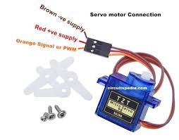
        

## -ວິທີການໃຊ້ງານ
ເພື່ອໃຫ້ເຊີໂວມໍເຕີເຮັດວຽກໄດ້, ມັນຕ້ອງຖືກໃຊ້ເປັນສ່ວນໜຶ່ງຂອງ**ລະບົບເຊີໂວໄດຣ໌ (Servo Drive System)**, ຊຶ່ງປະກອບມີອົງປະກອບຫຼັກຄື:

1. **ຕົວຄວບຄຸມ (Controller):** ເຮັດໜ້າທີ່ຮັບຄຳສັ່ງຈາກຜູ້ໃຊ້ (ເຊັ່ນ: PLC ຫຼືຄອມພິວເຕີ) ແລະ ສົ່ງຄຳສັ່ງນັ້ນໄປໃຫ້ Servo Driver ວ່າຕ້ອງການໃຫ້ມໍເຕີເຄື່ອນທີ່ດ້ວຍຄວາມໄວ, ຕຳແໜ່ງ, ຫຼື ແຮງບິດເທົ່າໃດ.
    
2. **ເຊີໂວ ໄດຣ໌ເວີ (Servo Driver) ຫຼື ວົງຈອນຄວບຄຸມ:** ຮັບສັນຍານຄຳສັ່ງຈາກ Controller ແລ້ວແປງສັນຍານນັ້ນໃຫ້ເປັນພະລັງງານໄຟຟ້າເພື່ອຂັບເຄື່ອນເຊີໂວມໍເຕີ. ມັນຍັງຮັບສັນຍານປ້ອນກັບຈາກ Encoder ຂອງມໍເຕີມາປຽບທຽບກັບຄຳສັ່ງທີ່ໄດ້ຮັບເພື່ອເຮັດການປັບແກ້ຢ່າງຕໍ່ເນື່ອງ.
    
3. **ເຊີໂວມໍເຕີ (Servo Motor):** ເຮັດໜ້າທີ່ຂັບເຄື່ອນອຸປະກອນ ຫຼື ເຄື່ອງຈັກຕາມຄຳສັ່ງທີ່ໄດ້ຮັບຈາກ Servo Driver.
    

**ການໃຊ້ງານທົ່ວໄປ:**

- **ຫຸ່ນຍົນ (Robotics):** ໃຊ້ໃນການຄວບຄຸມຂໍ້ຕໍ່ຕ່າງໆຂອງແຂນຫຸ່ນຍົນເພື່ອໃຫ້ເຄື່ອນທີ່ໄດ້ຢ່າງຊັດເຈນ.
    
- **ເຄື່ອງຈັກ CNC (CNC Machinery):** ໃຊ້ຄວບຄຸມການເຄື່ອນທີ່ຂອງເຄື່ອງມືຕັດ ຫຼື ຕຽງເຄື່ອງຈັກດ້ວຍຄວາມລະອຽດສູງ.
    
- **ລະບົບອັດຕະໂນມັດໃນໂຮງງານ (Industrial Automation):** ໃຊ້ໃນລະບົບສາຍພານ, ເຄື່ອງຫຸ້ມຫໍ່, ແລະເຄື່ອງຈັກອື່ນໆທີ່ຕ້ອງການການຄວບຄຸມຕຳແໜ່ງທີ່ຊັດເຈນແລະວ່ອງໄວ.
## Stepper motor 
ສະເຕັບເປີ້ມໍເຕີ ແມ່ນມໍເຕີໄຟຟ້າກະແສກົງ (DC) ແບບທີ່ບໍ່ມີແປງຖ່ານ (**Brushless**) ທີ່ໝູນໃນລັກສະນະຂອງ**ຂັ້ນຕອນ (Steps)** ເປັນມຸມນ້ອຍໆ ແລະ ຊັດເຈນ.

- **ການຄວບຄຸມຕຳແໜ່ງແບບວົງເປີດ (Open-Loop Control):** ຈຸດເດັ່ນຂອງ Stepper Motor ແມ່ນມັນສາມາດເຄື່ອນທີ່ໄປຍັງຕຳແໜ່ງໃດໜຶ່ງໄດ້ຢ່າງຊັດເຈນ ໂດຍບໍ່ຈຳເປັນຕ້ອງມີເຊັນເຊີປ້ອນກັບ (Encoder) ຄືກັບ Servo Motor. ການຄວບຄຸມຕຳແໜ່ງແມ່ນເຮັດໄດ້ໂດຍການ**ນັບຈຳນວນພັລສ໌**ທີ່ສົ່ງໄປຫາ Driver ຂອງມໍເຕີ.

- **ຫຼັກການເຮັດວຽກ:** ມັນປະກອບດ້ວຍຂົດລວດແມ່ເຫຼັກໄຟຟ້າ (Electromagnets) ທີ່ຈັດລຽງຢູ່ອ້ອມຮອບແກນມໍເຕີ (Rotor). ເມື່ອວົງຈອນຂັບ (Driver) ປ່ຽນການຈ່າຍໄຟໃຫ້ກັບຂົດລວດຕາມລຳດັບ, ມັນຈະສ້າງສະໜາມແມ່ເຫຼັກທີ່ດຶງດູດແກນມໍເຕີໃຫ້ໝູນໄປ**ເທື່ອລະຂັ້ນ (One Step)**, ໂດຍທົ່ວໄປແມ່ນ $1.8^\circ$ ຕໍ່ຂັ້ນສຳລັບມໍເຕີ 200 Steps/Revolution.
    

---

### ວິທີການໃຊ້ງານ

ເພື່ອໃຊ້ງານ Stepper Motor, ທ່ານຈະຕ້ອງການອົງປະກອບຫຼັກ 3 ຢ່າງ:

1. **ຕົວຄວບຄຸມ (Controller):** ແມ່ນສ່ວນທີ່ເປັນສະໝອງຂອງລະບົບ (ເຊັ່ນ: Microcontroller ເຊັ່ນ Arduino, PLC, ຫຼື Computer) ເຊິ່ງຈະສ້າງ**ສັນຍານພັລສ໌ (Pulse Signal)** ເພື່ອບອກໃຫ້ມໍເຕີເຄື່ອນທີ່.
    
    - **ຈຳນວນພັລສ໌** = ກໍານົດ**ໄລຍະທາງ** ຫຼື ມຸມທີ່ໝູນ.
        
    - **ຄວາມຖີ່ຂອງພັລສ໌** = ກໍານົດ**ຄວາມໄວ**ໃນການໝູນ.
        
2. **ວົງຈອນຂັບ (Driver Circuit):** ເປັນຕົວເຊື່ອມຕໍ່ລະຫວ່າງ Controller ແລະ Motor. ມັນຮັບສັນຍານພັລສ໌ແຮງດັນຕ່ຳຈາກ Controller ແລ້ວແປງເປັນສັນຍານໄຟຟ້າແຮງສູງຂຶ້ນພຽງພໍເພື່ອ**ຈ່າຍກະແສໄຟຟ້າຕາມລໍາດັບ**ໃຫ້ກັບຂົດລວດຂອງມໍເຕີ, ເຮັດໃຫ້ເກີດການໝູນເທື່ອລະຂັ້ນ.
    
3. **ສະເຕັບເປີ້ມໍເຕີ (Stepper Motor):** ເຮັດໜ້າທີ່ໝູນເພື່ອຂັບເຄື່ອນອຸປະກອນຕາມຄໍາສັ່ງ.
    

#### 📝 **ຄຳສັ່ງຫຼັກຂອງ Driver:**

- **STEP (ພັລສ໌):** ທຸກໆຄັ້ງທີ່ STEP pin ໄດ້ຮັບສັນຍານພັລສ໌, ມໍເຕີຈະໝູນໄປ 1 ຂັ້ນ (Step) ຫຼື 1 ໄມໂຄຣສະເຕັບ (Microstep).
    
- **DIR (ທິດທາງ):** ຕັ້ງຄ່າແຮງດັນສູງ/ຕ່ຳ (High/Low) ເພື່ອກຳນົດ**ທິດທາງ**ການໝູນ (ຕາມເຂັມໂມງ ຫຼື ທວນເຂັມໂມງ).
## -Stepper motor driver board
**Stepper Motor Driver Board** ແມ່ນແຜ່ນວົງຈອນອີເລັກໂທຣນິກທີ່ອອກແບບມາເພື່ອ**ຄວບຄຸມການເຄື່ອນໄຫວທີ່ຊັດເຈນ**ຂອງ Stepper Motor. ມັນເຮັດໜ້າທີ່ເປັນຕົວແປພາສາ ແລະ ເພີ່ມກຳລັງ (Amplifier) ຢູ່ລະຫວ່າງຕົວຄວບຄຸມ (ເຊັ່ນ: Arduino ຫຼື Microcontroller) ແລະ ມໍເຕີ.

- **ການແປພາສາ:** ຕົວຄວບຄຸມຈະສົ່ງສັນຍານດີຈິຕອລທີ່ມີແຮງດັນຕ່ຳ (**5V Logic**) ເປັນສັນຍານພັລສ໌ (Pulse) ງ່າຍໆໄປຫາ Driver. Driver ຈະແປສັນຍານນີ້ໃຫ້ເປັນລຳດັບການເປີດ/ປິດຂົດລວດ (Winding Sequence) ທີ່ຖືກຕ້ອງຂອງມໍເຕີ.
    
- **ການເພີ່ມກຳລັງ (Current Drive):** Driver ຈະສະໜອງ**ກະແສໄຟຟ້າແຮງສູງ** (ເຊັ່ນ: 1A, 2A, ຫຼືຫຼາຍກວ່ານັ້ນ) ແລະ **ແຮງດັນສູງ** (ເຊັ່ນ: 12V, 24V, 45V) ໃຫ້ແກ່ມໍເຕີ ເຊິ່ງຕົວຄວບຄຸມບໍ່ສາມາດສະໜອງໄດ້ເອງ.
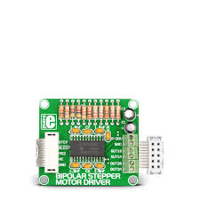
### ວິທີການໃຊ້ງານ Stepper Motor Driver Board

ການໃຊ້ງານ Driver Board ໂດຍທົ່ວໄປແມ່ນຕ້ອງການການເຊື່ອມຕໍ່ຫຼັກ 3 ສ່ວນ:

#### 1. ການເຊື່ອມຕໍ່ໄຟຟ້າ (Power Connections)

- **VCC/VDD (Logic Power):** ຕໍ່ກັບແຫຼ່ງຈ່າຍໄຟຟ້າແຮງດັນຕ່ຳ (ເຊັ່ນ: 5V) ເພື່ອສະໜອງພະລັງງານໃຫ້ກັບວົງຈອນຂອງ Driver ເອງ.
    
- **VMOT/VIN (Motor Power):** ຕໍ່ກັບແຫຼ່ງຈ່າຍໄຟຟ້າແຮງດັນສູງ (ເຊັ່ນ: 8V – 45V) ເພື່ອສະໜອງພະລັງງານໃຫ້ກັບ**ມໍເຕີ**ໂດຍກົງ. (ຄວນກວດເບິ່ງສະເປັກຂອງ Driver ແລະ Motor)
    
- **GND (Ground):** ເປັນສາຍດິນທີ່ຕໍ່ກັບທັງ Logic Power ແລະ Motor Power.
    

#### 2. ການເຊື່ອມຕໍ່ຄວບຄຸມ (Control Connections)

Driver ສ່ວນໃຫຍ່ທີ່ໃຊ້ໃນໂຄງການ DIY (ເຊັ່ນ: A4988, DRV8825, TB6600) ຈະໃຊ້ວິທີຄວບຄຸມແບບ **"STEP/DIR"** ໂດຍໃຊ້ສາຍພຽງ 2 ສາຍຈາກ Microcontroller:

- **STEP (STP):** ຕໍ່ກັບຂາ Output ຂອງຕົວຄວບຄຸມ. **ທຸກໆ 1 ພັລສ໌** (ການປ່ຽນແປງແຮງດັນຈາກຕ່ຳໄປສູງ) ທີ່ສົ່ງໄປຫາຂານີ້, ມໍເຕີຈະໝູນໄປ 1 ຂັ້ນ (Step).
    
- **DIR (Direction):** ຕໍ່ກັບຂາ Output ຂອງຕົວຄວບຄຸມ. ຕັ້ງແຮງດັນໃຫ້ສູງ (High) ຫຼື ຕ່ຳ (Low) ເພື່ອກຳນົດ**ທິດທາງ**ການໝູນ (ຕາມເຂັມໂມງ ຫຼື ທວນເຂັມໂມງ).
    
- **Enable (EN):** ບາງ Driver ຈະມີຂານີ້ເພື່ອເປີດ ຫຼື ປິດ Driver. ປົກກະຕິແລ້ວຕ້ອງຕັ້ງໃຫ້ **Low** ເພື່ອເປີດໃຊ້ງານ.
    

#### 3. ການເຊື່ອມຕໍ່ມໍເຕີ (Motor Connections)

- **A1, A2, B1, B2 (ສຳລັບ Bipolar Motor):** ຕໍ່ສາຍຈາກຂົດລວດຂອງ Stepper Motor ເຂົ້າກັບ Driver. ຄວນອ້າງອີງໃສ່ຄູ່ມືຂອງ Driver ແລະ Motor ເພື່ອໃຫ້ແນ່ໃຈວ່າຕໍ່ຖືກຄູ່ (Phase) ແລະ ຖືກຂົ້ວ.
### ⚙️ ການຕັ້ງຄ່າທີ່ສຳຄັນ:

1. **ການກຳນົດກະແສໄຟຟ້າ (Current Limiting):**
    
    - ເປັນຂັ້ນຕອນທີ່**ສຳຄັນທີ່ສຸດ** ເພື່ອປ້ອງກັນບໍ່ໃຫ້ມໍເຕີ ຫຼື Driver ເສຍຫາຍຈາກການຮ້ອນເກີນໄປ. ຕ້ອງໃຊ້ Trimmer Potentiometer (ຄືລູກບິດນ້ອຍໆ) ຢູ່ເທິງ Driver Board ປັບເພື່ອຈຳກັດກະແສໄຟຟ້າບໍ່ໃຫ້ເກີນກວ່າອັດຕາທີ່ມໍເຕີກຳນົດ.
        
2. **Microstepping (ການແບ່ງຂັ້ນນ້ອຍ):**
    
    - Driver ສ່ວນຫຼາຍມີຂາ **MS1, MS2, MS3** ເພື່ອຕັ້ງຄ່າການແບ່ງຂັ້ນ (ເຊັ່ນ: 1/2, 1/4, 1/16) ເພື່ອໃຫ້ການເຄື່ອນໄຫວ**ລຽບນຽນຂຶ້ນ** ແລະ **ຊັດເຈນຂຶ້ນ**, ເຊິ່ງມີຜົນເຮັດໃຫ້ມໍເຕີຕ້ອງໃຊ້ພັລສ໌ຫຼາຍຂຶ້ນຕໍ່ການໝູນ 1 ຮອບ.
### -🧠 ICs & Modules
## -Real-time Clock Module DS1302
    **Real-time Clock (RTC) Module DS1302** ແມ່ນອຸປະກອນທີ່ໃຊ້ໃນວົງຈອນອີເລັກໂທຣນິກ ເພື່ອ**ຮັກສາການນັບເວລາ** (ວັນທີ, ເວລາ, ປີ, ວັນໃນອາທິດ) ໃຫ້ຖືກຕ້ອງແມ້ໃນເວລາທີ່ລະບົບຕົ້ນຕໍບໍ່ມີໄຟຟ້າ.

- **ໜ້າທີ່ຫຼັກ:** ມັນຄືໂມງນ້ອຍໆທີ່ມີແບັດເຕີຣີສຳຮອງ (Backup Battery) ຂອງຕົນເອງ, ຊຶ່ງເປັນເຫດຜົນທີ່ມັນຍັງສາມາດຮັກສາເວລາຍ່າງຕໍ່ໄປໄດ້ເຖິງແມ່ນວ່າຈະປິດໄຟຟ້າຫຼັກຂອງໂຄງການແລ້ວກໍຕາມ.
    
- **ການນຳໃຊ້:** ຖືກນຳໃຊ້ຢ່າງກວ້າງຂວາງໃນໂຄງການທີ່ຕ້ອງການຄວາມຖືກຕ້ອງຂອງເວລາ, ເຊັ່ນ: ລະບົບບັນທຶກຂໍ້ມູນ (Data Loggers), ໂມງປຸກ (Alarm Clocks), ແລະ ລະບົບຄວບຄຸມອັດຕະໂນມັດທີ່ເຮັດວຽກຕາມຕາຕະລາງເວລາ.
    
---

## ວິທີການໃຊ້ງານ Real-time Clock Module DS1302

DS1302 ເປັນ RTC ທີ່ໃຊ້ການສື່ສານແບບ **3-Wire Serial Interface** ເພື່ອຕິດຕໍ່ກັບ Microcontroller (ເຊັ່ນ: Arduino).
### 1. ການເຊື່ອມຕໍ່ສາຍໄຟ (Wiring Connections)

ທ່ານຈະຕ້ອງເຊື່ອມຕໍ່ສາຍຫຼັກໆ 5 ສາຍລະຫວ່າງ DS1302 Module ກັບ Microcontroller ຂອງທ່ານ:

|**Pin ຂອງ DS1302**|**ໜ້າທີ່**|**ເຊື່ອມຕໍ່ກັບ (ຕົວຢ່າງ: Arduino)**|
|---|---|---|
|**VCC**|ແຮງດັນໄຟຟ້າ (5V)|ຂາ 5V ຂອງ Microcontroller|
|**GND**|ສາຍດິນ|ຂາ GND ຂອງ Microcontroller|
|**CLK (SCLK)**|ສັນຍານໂມງ (Clock)|Digital Pin ໃດໜຶ່ງ (ເຊັ່ນ: D5)|
|**DAT (I/O)**|ສາຍຂໍ້ມູນເຂົ້າ/ອອກ (Data)|Digital Pin ໃດໜຶ່ງ (ເຊັ່ນ: D4)|
|**RST (CE)**|ຣີເຊັດ / ເລືອກຊິບ (Chip Enable)|Digital Pin ໃດໜຶ່ງ (ເຊັ່ນ: D3)|

**ໝາຍເຫດສຳຄັນ:**

- **ແບັດເຕີຣີ (Battery):** ຕ້ອງໃສ່ແບັດເຕີຣີແບບ Lithium CR2032 ເພື່ອໃຫ້ RTC ສາມາດຮັກສາເວລາຍ່າງຕໍ່ໄປໄດ້.
    
- **ການປ້ອງກັນ:** ບາງໂມດູນ DS1302 ອາດຈະມີການຕໍ່ໄຟຜ່ານຕົວຕ້ານທານ (Resistor) ເພື່ອປ້ອງກັນ IC.
    

---

### 2. ຫຼັກການຂຽນໂປຣແກຣມ (Programming Logic)

ການຄວບຄຸມ DS1302 ໂດຍປົກກະຕິແມ່ນຕ້ອງໃຊ້ Library ທີ່ຖືກອອກແບບມາສະເພາະສຳລັບຊິບນີ້ ເພື່ອເຮັດໃຫ້ການສື່ສານງ່າຍຂຶ້ນ.

#### 1. ການຕັ້ງຄ່າເວລາ (Setting the Time)

- ທ່ານຕ້ອງ**ຕັ້ງເວລາເບື້ອງຕົ້ນ**ໃສ່ໂມດູນ RTC ເທື່ອໜຶ່ງ.
    
- ໂຄງການຈະສົ່ງຂໍ້ມູນເວລາປະຈຸບັນ (ປີ, ເດືອນ, ວັນທີ, ຊົ່ວໂມງ, ນາທີ, ວິນາທີ) ໄປບັນທຶກໄວ້ໃນ IC ຂອງ DS1302.
    
- ເມື່ອຕັ້ງຄ່າສຳເລັດແລ້ວ, ທ່ານສາມາດເອົາຄຳສັ່ງຕັ້ງຄ່າເວລານີ້ອອກໄດ້ ເພາະ RTC ຈະຍັງນັບເວລາຕໍ່ໄປເອງ.
    

#### 2. ການອ່ານຄ່າເວລາ (Reading the Time)

- ໃນທຸກໆຮອບຂອງໂປຣແກຣມ, ທ່ານສາມາດສັ່ງໃຫ້ Microcontroller **ອ່ານຄ່າ** ປັດຈຸບັນຈາກ DS1302 ຜ່ານສາຍ DAT.
    
- RTC ຈະສົ່ງຂໍ້ມູນເວລາທີ່ຖືກອັບເດດມາໃຫ້ Microcontroller ນຳໄປໃຊ້ງານ (ເຊັ່ນ: ສະແດງຜົນອອກໜ້າຈໍ LCD ຫຼື ໃຊ້ໃນການຕັດສິນໃຈຂອງໂປຣແກຣມ).
### ຕົວຢ່າງ (ສຳລັບຜູ້ໃຊ້ Arduino)

ຖ້າທ່ານໃຊ້ **Arduino**, ທ່ານສາມາດໃຊ້ Library ເຊັ່ນ: `DS1302RTC` ຫຼື ທີ່ຄ້າຍຄືກັນ. ຫຼັກການໃນການໃຊ້ຈະມີຄື:

1. **Define Pins:** ກຳນົດວ່າຂາ **RST**, **DAT**, ແລະ **CLK** ຂອງ DS1302 ຕໍ່ກັບຂາໃດຂອງ Arduino.
    
2. **Set Time (ໃນ `setup()`):** ໃຊ້ຟັງຊັນຂອງ Library ເພື່ອຕັ້ງເວລາ (ຖ້າຫາກຍັງບໍ່ໄດ້ຕັ້ງຄ່າ).

## -​74HC595 Chip 
**74HC595 Chip** ແມ່ນໜຶ່ງໃນ **Shift Register ICs (ໄອຊີລີຈິດເຕີປ່ຽນ) ທີ່ນິຍົມໃຊ້ຫຼາຍທີ່ສຸດ** ໃນໂລກອີເລັກໂທຣນິກ. ມັນມີໜ້າທີ່ຫຼັກຄື:

- **ການປ່ຽນຂໍ້ມູນ Serial ໃຫ້ເປັນ Parallel (Serial-to-Parallel Conversion):** ມັນສາມາດຮັບຂໍ້ມູນແບບຕິດຕໍ່ກັນ (Sequential Data - ໃຊ້ສາຍພຽງ 3 ສາຍ) ແລະ ແປງມັນອອກເປັນຂໍ້ມູນແບບຂະໜານກັນ (Parallel Data - ໃຊ້ສູງເຖິງ 8 ສາຍ), ເຊິ່ງຊ່ວຍໃຫ້ທ່ານສາມາດຄວບຄຸມອຸປະກອນ Output ໄດ້ຫຼາຍຂຶ້ນ.
    
- **ການປະຢັດຂາ (Pin Saving):** ມັນຊ່ວຍໃຫ້ Microcontroller ຂອງທ່ານ (ເຊັ່ນ: Arduino) ສາມາດຄວບຄຸມອຸປະກອນ Output ໄດ້ເຖິງ 8 ໂຕ ໂດຍໃຊ້ພຽງແຕ່ **3 ຂາ Digital** ເທົ່ານັ້ນ. ຖ້າທ່ານໃຊ້ 74HC595 ຫຼາຍໂຕຕໍ່ກັນ (Cascading), ທ່ານສາມາດເພີ່ມ Output ໄດ້ອີກ 8 ໂຕຕໍ່ Chip ຕໍ່ໄປ, ແຕ່ກໍຍັງໃຊ້ພຽງ 3 ຂາຄວບຄຸມເທົ່ານັ້ນ.
ມັນເໝາະສົມທີ່ສຸດສຳລັບການຂັບໄຟ LED ຫຼາຍໆດອກ, ຈໍສະແດງຜົນ 7-Segment, ຫຼືອຸປະກອນ Output ອື່ນໆ.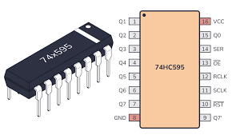
---

## ວິທີການໃຊ້ງານ 74HC595 Shift Register

ການໃຊ້ງານ 74HC595 ປະກອບດ້ວຍການເຊື່ອມຕໍ່ ແລະ ຂະບວນການສົ່ງຂໍ້ມູນ 3 ຂັ້ນຕອນທີ່ສຳຄັນ:

### 1. ການເຊື່ອມຕໍ່ພື້ນຖານ (Wiring & Pinout)

74HC595 ມີ 16 ຂາ, ແຕ່ສຳລັບການຄວບຄຸມພື້ນຖານ, ທ່ານຈະເຊື່ອມຕໍ່ຫຼັກໆຕາມນີ້:

|**Pin ຂອງ 74HC595**|**ໜ້າທີ່**|**ເຊື່ອມຕໍ່ກັບ (ຕົວຢ່າງ: Arduino)**|
|---|---|---|
|**VCC (Pin 16)**|ແຮງດັນໄຟຟ້າ|+5V|
|**GND (Pin 8)**|ສາຍດິນ|GND|
|**DS (Data Serial, Pin 14)**|ສາຍຂໍ້ມູນ|Digital Pin (ເຊັ່ນ: D11)|
|**SHCP (Shift Register Clock, Pin 11)**|ສັນຍານໂມງລີຈິດເຕີປ່ຽນ|Digital Pin (ເຊັ່ນ: D13)|
|**STCP (Storage Register Clock, Pin 12)**|ສັນຍານໂມງເກັບຂໍ້ມູນ|Digital Pin (ເຊັ່ນ: D12)|
|**Q0 - Q7 (Pins 15, 1-7)**|8 ຂາ Output ຂະໜານ|ຕໍ່ກັບ LED/ອຸປະກອນ Output ຂອງທ່ານ|
|**MR (Master Reset, Pin 10)**|ຣີເຊັດ|ຕໍ່ກັບ **+5V** (ເພາະຕ້ອງໃຫ້ເປັນ HIGH ເພື່ອປ້ອງກັນການຣີເຊັດ)|
|**OE (Output Enable, Pin 13)**|ເປີດ/ປິດ Output|ຕໍ່ກັບ **GND** (ເພາະຕ້ອງໃຫ້ເປັນ LOW ເພື່ອເປີດໃຊ້ງານ Output)|

---

### 2. ຂະບວນການສົ່ງຂໍ້ມູນ (The 3-Step Data Transmission)

ການສົ່ງຂໍ້ມູນໄປຫາ 74HC595 ແມ່ນເຮັດໃນລໍາດັບທີ່ຊັດເຈນດັ່ງນີ້:

#### 1. ສົ່ງຂໍ້ມູນ (Data Shifting)

- ທ່ານຈະໃຊ້ສາຍ **DS** (Data Serial) ເພື່ອສົ່ງຂໍ້ມູນແບບຕິດຕໍ່ກັນ 1 ບິດ (Bit) ຕໍ່ຄັ້ງ.
- ສຳລັບແຕ່ລະບິດ, ທ່ານຕ້ອງສົ່ງສັນຍານ **Clock Pulse** ໃຫ້ກັບຂາ **SHCP** (Shift Register Clock). ທຸກໆຄັ້ງທີ່ SHCP ປ່ຽນຈາກ LOW ໄປ HIGH, ຂໍ້ມູນ 1 ບິດທີ່ຢູ່ເທິງສາຍ DS ຈະຖືກຍ້າຍ (Shift) ເຂົ້າໄປໃນ Shift Register ພາຍໃນ Chip.
- ທ່ານຈະເຮັດຂະບວນການນີ້ຊ້ຳໆຈົນຄົບ 8 ບິດ.

#### 2. ເກັບຂໍ້ມູນ (Data Storing)

- ຫຼັງຈາກທີ່ 8 ບິດຖືກສົ່ງເຂົ້າ Shift Register ແລ້ວ, ຂໍ້ມູນນີ້ຍັງບໍ່ທັນປາກົດຢູ່ໃນ Output (Q0-Q7).
- ທ່ານຕ້ອງສົ່ງສັນຍານ **Clock Pulse** ໃຫ້ກັບຂາ **STCP** (Storage Register Clock).
#### 3. ສະແດງຜົນ (Output Display)

- ທັນທີທີ່ STCP ໄດ້ຮັບ Clock Pulse, ຂໍ້ມູນ 8 ບິດທີ່ຖືກຍ້າຍເຂົ້າມາຈະຖືກ **ຍົກຍ້າຍ** (Latch) ໄປທີ່ Storage Register ແລະ ສະແດງອອກທາງ **Q0-Q7 Output Pins**.
- **ຂໍ້ມູນປ່ຽນພ້ອມກັນ:** ນີ້ຄືຂໍ້ດີຂອງມັນ—ທຸກໆ Output ຈະປ່ຽນແປງສະຖານະໄປຕາມຂໍ້ມູນໃໝ່ພ້ອມໆກັນ.

> ຕົວຢ່າງ: ຖ້າທ່ານຕ້ອງການເປີດ LED ດອກທີ 1 ແລະ ດອກທີ 5, ທ່ານຈະສົ່ງ String ຂອງ Bit ທີ່ເປັນ `00010001` ເຂົ້າໄປ (ແລ້ວສົ່ງ Clock Pulse ໄປທີ່ STCP).
### 3. ການນໍາໃຊ້ກັບ Arduino (Using with Arduino)
ສຳລັບ Arduino, ຂະບວນການສັບຊ້ອນຂ້າງເທິງແມ່ນງ່າຍຂຶ້ນຫຼາຍ ໂດຍການໃຊ້ຄໍາສັ່ງທີ່ມີຢູ່ໃນຕົວ (Built-in Function) ຊື່ວ່າ shiftOut()